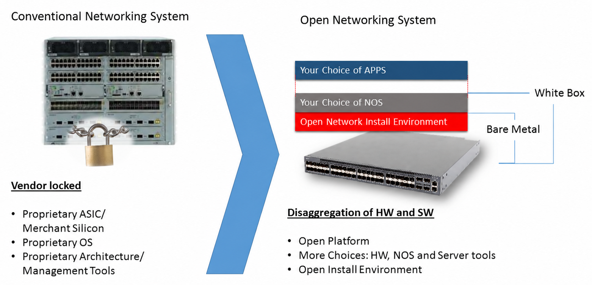

# What is SONiC?

## Background: Switches, ASICs, and Network Operating Systems

A **network switch** is a device that connects computers and other network equipment and forwards data packets between them. In a data center, switches connect servers, storage systems, and other switches, and each switch may handle billions of packets per second.

A general-purpose CPU is far too slow for this job. Instead, modern switches contain a specialized chip called an **ASIC** (Application-Specific Integrated Circuit), also called the **NPU** (Network Processing Unit). The ASIC is built for one task: looking up where each packet should go and sending it out the correct port. It does this at **line rate** (the full speed of the port, with no slowdown) and with very low delay. Common examples are Broadcom's Tomahawk and Trident families and NVIDIA's Spectrum family.

The ASIC is fast, but it cannot decide anything by itself. Software must fill its forwarding tables, run routing protocols to learn the network, apply the operator's configuration, and report status. This software is the **Network Operating System (NOS)**. It runs on a regular CPU inside the switch, next to the ASIC.

Each ASIC vendor also ships an **SDK** (Software Development Kit): a library that the NOS calls to program that vendor's chip. Every vendor's SDK is different and usually proprietary.

## Whitebox Switches and Disaggregation

Traditionally, vendors such as Cisco, Juniper, and Arista sell the switch hardware and their own proprietary NOS as a single product. The software only runs on that vendor's hardware, and the hardware only runs that vendor's software. If you want a different NOS, you have to buy different switches.

A **whitebox switch** is generic switch hardware sold without a locked-in NOS. The buyer chooses which NOS to install. The name refers to a plain, unbranded box: the hardware is a commodity, and the value comes from the software you put on it. Whitebox switches are built by **ODMs** (Original Design Manufacturers) such as Edgecore, Celestica, and Quanta.

Separating the hardware from the software this way is called **disaggregation**. It is the foundation that makes SONiC possible.



The diagram compares the two models.

**Left side: vendor-locked.** The switch is a sealed unit. The hardware, the operating system, and the management tools all come from one vendor, and none of them can be replaced independently.

**Right side: open networking.** The switch is split into independent layers. From bottom to top:

- **Bare metal** is the physical switch: chassis, ports, fans, power supplies, and the ASIC. Like a new PC with no operating system, it is fully functional hardware that cannot do anything useful until software is installed.

- **ONIE** (Open Network Install Environment) is a small installer that comes pre-installed on whitebox switches. When a switch boots without a NOS, ONIE finds a NOS image on the network (or on a USB drive), downloads it, and installs it. This is similar to network (PXE) booting on servers. Because the process is automatic, operators can deploy thousands of switches without touching each one.

- **Your choice of NOS** sits on top of ONIE. Because ONIE is vendor-neutral, it can install SONiC or any other compatible NOS, and you can replace the NOS later without changing the hardware.

- **Your choice of apps** is the top layer. Once the NOS is running, you can add your own software, such as monitoring agents, automation scripts, or telemetry collectors. On a Linux-based NOS, these are ordinary Linux programs.

Because each layer is independent, you can upgrade the NOS without replacing the hardware, change applications without reinstalling the NOS, or move your software to another vendor's hardware.

## What is SONiC?

**SONiC** (Software for Open Networking in the Cloud) is an open-source network operating system that runs on Debian Linux. Anyone can read, modify, and contribute to its source code.

Microsoft created SONiC to run the network in its Azure data centers. It was open-sourced in 2016 through the Open Compute Project (OCP). In 2022, governance moved to the **SONiC Foundation**, part of the Linux Foundation. Today, many companies run SONiC in production and contribute to it, including cloud providers, switch vendors, and ASIC vendors.

SONiC was designed for hyperscale data centers with tens of thousands of switches, and it runs on whitebox hardware from many vendors. Two design choices make this possible: platform abstraction for hardware independence, and containers for modularity. The next two sections explain each one.

### Platform Abstraction

A single SONiC image must run on switches from many different manufacturers. Each switch has a different ASIC for forwarding packets, and different platform hardware — fans, power supplies, optics, temperature sensors, LEDs — with vendor-specific interfaces. SONiC handles this by defining two abstraction layers: **SAI** for the forwarding ASIC, and the **Platform API** for everything else on the board.

#### SAI: One API for Every ASIC

Every ASIC vendor has its own proprietary SDK. If a NOS talked to each SDK directly, its developers would have to write and maintain separate code for every chip they support.

SONiC solves this with **SAI** (Switch Abstraction Interface), a standard, vendor-neutral API for programming switch ASICs. SONiC programs the hardware only through SAI. Each ASIC vendor (Broadcom, NVIDIA, Marvell, and others) provides a **SAI implementation** for its chip, which translates SAI calls into calls to its own SDK.

```
        SONiC
          │
          │  SAI API (same for every vendor)
          v
┌───────────────────┬───────────────────┬───────────────────┐
│ Broadcom SAI      │ NVIDIA SAI        │ Marvell SAI       │  ← provided by each ASIC vendor
│ + Broadcom SDK    │ + NVIDIA SDK      │ + Marvell SDK     │
└─────────┬─────────┴─────────┬─────────┴─────────┬─────────┘
          v                   v                   v
    Broadcom ASIC        NVIDIA ASIC        Marvell ASIC
```

This has several benefits:

- The same SONiC software runs on ASICs from different vendors without changes.
- Supporting a new ASIC is mainly the ASIC vendor's job. They write a SAI implementation, and SONiC can use the chip.
- The SAI **specification** (the API definition) is open source, so anyone can see exactly what the NOS asks the hardware to do. Note that many vendor **implementations** of SAI are still shipped as closed-source binaries.

#### Platform API: One API for Every Platform

SAI abstracts the forwarding chip, but a switch is more than just an ASIC. It has fans, power supplies, temperature sensors, transceivers (optics), LEDs, and system EEPROMs — and every platform vendor wires these differently.

The **Platform API** is a Python abstraction layer that gives SONiC a uniform interface to all of these peripherals. Each platform vendor provides a **platform plugin** (installed under `/usr/share/sonic/platform/`) that implements the API for their specific hardware. SONiC's platform monitoring daemons call the Platform API; the plugin translates those calls into the actual hardware access method (sysfs, I²C, IPMI, etc.).

```
        SONiC (PMON daemons)
          │
          │  Platform API (same for every vendor)
          v
┌───────────────────┬───────────────────┬───────────────────┐
│ Accton plugin     │ Dell plugin       │ Mellanox plugin   │  ← provided by each platform vendor
└─────────┬─────────┴─────────┬─────────┴─────────┬─────────┘
          v                   v                   v
   /sys, I²C, IPMI      /sys, I²C, IPMI     /sys, I²C, IPMI
```

Together, SAI and the Platform API mean that SONiC's application code never talks to vendor-specific interfaces directly. The vendor boundary is pushed to the edges — plugin libraries that each hardware maker provides — and the rest of the system stays portable.

### Containers: Modular Services

A **container** (SONiC uses Docker) is a lightweight, isolated environment that packages a program together with everything it needs to run. Containers on the same machine share the Linux kernel but have their own files and processes.

SONiC runs each major subsystem in its own container. For example, the `database` container holds the state shared by all other containers, `swss` turns configuration into instructions for the ASIC, `syncd` programs the ASIC through SAI, and `bgp` runs the routing protocols. Because of this split, you can restart, upgrade, or remove one subsystem without rebuilding the whole system. With SONiC's warm-restart feature, some containers can even restart without interrupting traffic. Later documents cover each container in detail.

> For a deeper look at why SONiC uses containers and the trade-offs involved, see [SONiC Container Architecture](03_sonic_container.md).

### Key Features

SONiC includes the features expected of a data center switch, including:

- **Routing**: BGP (Border Gateway Protocol) and static routes, provided by the open-source FRRouting (FRR) suite, with ECMP (spreading traffic across multiple equal-cost paths)
- **Layer 2 switching**: VLANs and link aggregation (LAG/LACP, which bundles several physical links into one logical link)
- **Overlays**: VXLAN and EVPN for building virtual networks across a data center
- **Traffic control**: ACLs (Access Control Lists, for filtering traffic) and QoS (Quality of Service, for prioritizing traffic)
- **Neighbor discovery**: LLDP (Link Layer Discovery Protocol), which discovers directly connected devices
- **Monitoring and management**: SNMP, gNMI streaming telemetry, a command-line interface (CLI), and a REST API

### SONiC vs. a Traditional NOS

| Aspect              | Traditional NOS                           | SONiC                                             |
|---------------------|-------------------------------------------|---------------------------------------------------|
| **Source code**     | Proprietary                               | Open source                                       |
| **Hardware**        | Runs only on the vendor's own hardware    | Runs on 100+ whitebox platforms from many vendors, through SAI |
| **Structure**       | Tightly integrated system from one vendor | Separate containers, one per subsystem |
| **Upgrades**        | Usually a full system image upgrade       | Full image upgrade, or restart and upgrade individual containers |
| **Extensibility**   | Features come from the vendor's roadmap   | Anyone can contribute features, or add custom containers |
| **Troubleshooting** | Vendor-specific tools                     | Standard Linux tools (`systemctl`, `tcpdump`, `strace`) plus the SONiC CLI |

## What Does a SONiC Switch Look Like?

When you log in to a SONiC switch, you see a regular Debian Linux system:

```
admin@sonic:~$ uname -a
Linux sonic 6.1.0-29-2-amd64 #1 SMP PREEMPT_DYNAMIC Debian 6.1.123-1 (2025-01-02) x86_64 GNU/Linux

admin@sonic:~$ ls /etc/sonic/
asic_config_checksum  copp_cfg.json       fast-reboot_order        minigraph.xml  sonic-environment  warm-reboot_order
config_db.json        default_users.json  frr                      old_config     sonic_release
constants.yml         dhcp_relay_reconcile generated_services.conf  snmp.yml       sonic_version.yml

admin@sonic:~$ docker ps
CONTAINER ID   IMAGE                                NAMES
2c2b59ef23ee   docker-database:latest               database
1f009481e694   docker-orchagent:latest              swss
b992c1f1a452   docker-syncd-brcm:latest             syncd
e7da81d69f1a   docker-fpm-frr:latest                bgp
3f1cf5cdfa89   docker-teamd:latest                  teamd
cc43eaa31167   docker-lldp:latest                   lldp
ce7de5233ee7   docker-snmp:latest                   snmp
23c8fc520baf   docker-platform-monitor:latest       pmon
585f48ddfb7c   docker-sonic-mgmt-framework:latest   mgmt-framework
b5811ac01561   docker-sonic-gnmi:latest             gnmi
7f4dcef75ade   docker-router-advertiser:latest      radv
20555103e4f3   docker-eventd:latest                 eventd
```

What this output shows:

- **The operating system is Debian.** This switch runs Debian 12 (Bookworm) with a Linux 6.1 kernel.

- **SONiC's configuration lives in `/etc/sonic/`.** The most important file is `config_db.json`, the main switch configuration. Other files include `minigraph.xml` (an older XML format that describes the switch's role and network topology), `frr/` (routing configuration), and files used during reboots and service startup.

- **Each subsystem runs in its own container.** The `docker ps` output shows the containers described in [Containers: Modular Services](#containers-modular-services).

- **Standard Linux networking is still available.** Each switch port appears as a regular Linux network interface (for example, `Ethernet0`), and tools such as `ip route` work as usual.

## Why Debian?

SONiC is not a Linux distribution. It is a set of networking software that runs on top of Debian. The official SONiC FAQ puts it this way:

> "SONiC is Linux-based, but is not a distribution by itself. Today, SONiC runs on Debian."

Debian is a server-grade Linux distribution, widely regarded as one of the most stable and reliable operating systems available. It powers millions of servers in data centers and cloud environments worldwide. By building on Debian, SONiC inherits a mature, battle-tested foundation rather than starting from scratch — the same reliability that makes Debian a trusted choice for production servers also makes it a strong base for a network operating system.

Here is specifically why Debian is a good fit for a switch:

| Factor | What Debian offers | Why it matters for a switch |
|--------|--------------------|-----------------------------|
| **Stability** | One of the most stable Linux distributions; used in production servers, embedded systems, and critical infrastructure worldwide | Switches must not break because of OS updates |
| **Long-term support** | About five years of security updates per release, including LTS | Switches often stay in service for 5–10 years |
| **Packages** | A very large package collection, installed with `apt` | Tools and libraries are easy to add |
| **Open governance** | Run by a community, not a single company | No vendor lock-in at the OS level |
| **Kernel flexibility** | Custom kernels and patches are easy to build | Switch platforms need extra drivers that are not in the standard Linux kernel |
| **Small footprint** | Can be trimmed to a minimal image | Switches have limited storage, often 16–32 GB |
| **Docker support** | Docker is well supported and packaged | SONiC's container-based design depends on it |
| **Networking ecosystem** | Many networking projects, such as FRR and lldpd, are developed and packaged for Debian | SONiC can reuse them with little extra work |

### Why Not Other Distributions?

**Ubuntu** is based on Debian, so it would be technically possible. However, it adds Canonical-specific components (such as netplan for network configuration and snap packages) that SONiC does not need and that can interfere with SONiC's own interface management. Building on Debian directly avoids that extra layer.

**CentOS / RHEL** are a poor fit for several reasons. Full RHEL requires a paid subscription. CentOS has since become CentOS Stream, a rolling preview of future RHEL releases, which is not suitable as a stable base for long-lived devices. In addition, most open-source networking software is developed primarily for Debian-based systems.

**Alpine Linux** uses `musl` as its C standard library instead of the more common `glibc`. Many networking libraries and vendor SDKs are built only for `glibc`, so they do not run on Alpine without extra work. Alpine is excellent for small containers, but it is not a practical host OS for a full NOS.

**Yocto** is a framework for building custom embedded Linux images. It produces very small images, but every package must be built from source, often for a different CPU architecture (cross-compiling), and there is no `apt` on the device for quick debugging. SONiC prefers developer productivity and a familiar environment over the smallest possible image.

### Debian Versions Used by SONiC

SONiC moves to each new Debian stable release, usually within a year or two of its publication, so that switches keep receiving security updates.

| Approximate period | Debian version | Codename |
|--------------------|----------------|----------|
| 2016–2018          | Debian 8       | Jessie   |
| 2018–2020          | Debian 9       | Stretch  |
| 2020–2021          | Debian 10      | Buster   |
| 2021–2023          | Debian 11      | Bullseye |
| 2023 onward        | Debian 12      | Bookworm |

## Other Open Network Operating Systems

SONiC is not the only project that separates switch software from switch hardware. The table below lists notable projects in chronological order. It uses three criteria:

- **Whitebox**: Runs on third-party whitebox hardware.
- **Open source**: The NOS source code is publicly available.
- **Open ASIC API**: The open interface the NOS uses to program the ASIC, instead of calling a vendor's proprietary SDK directly. Besides SAI, there are two other open options:
  - **Switchdev** is a Linux kernel framework. It lets the ASIC driver present the switch to Linux as ordinary network devices, so standard Linux tools can configure the hardware.
  - **P4Runtime** is an API for switches whose forwarding pipeline is defined in the P4 programming language.

A dash (—) in the Open ASIC API column means the NOS uses vendor SDKs directly, or (for software routers) forwards packets in software instead of on an ASIC.

| NOS                    | Year | Creator / Backer                     | Whitebox | Open Source | Open ASIC API | Target | Status |
|------------------------|------|--------------------------------------|:--------:|:-----------:|:-------------:|--------|--------|
| **Vyatta**             | 2006 | Vyatta Inc.                          | —        | ✓           | —             | Software router on x86 servers | Open-source edition discontinued after Brocade acquired Vyatta (2012) |
| **PicOS**              | 2009 | Pica8                                | ✓        | —           | —             | Enterprise and campus switches | Active |
| **Cumulus Linux**      | 2013 | Cumulus Networks                     | ✓        | —           | —             | Data center switches           | Active, owned by NVIDIA since 2020 |
| **VyOS**               | 2013 | Community (fork of Vyatta)           | —         | ✓          | —             | Software router on x86 servers | Active |
| **Open Network Linux** | 2014 | Big Switch Networks / OCP            | ✓        | ✓           | —             | Base Linux for whitebox switches (no forwarding software) | Maintenance mode |
| **FBOSS**              | 2014 | Meta                                 | —         | ✓          | SAI           | Meta-designed switches         | Active, built for Meta's own use |
| **OcNOS**              | 2015 | IP Infusion                          | ✓         | —          | —             | Whitebox switches and service provider routers | Active, strong in service provider networks |
| **OpenSwitch (OPX)**   | 2015 | HPE, later Dell → Linux Foundation   | ✓         | ✓          | SAI          | Whitebox switches (mostly Dell) | Inactive |
| **SONiC**              | 2016 | Microsoft → Linux Foundation         | ✓         | ✓          | SAI          | Cloud and data center switches  | Active, in production at Microsoft, Alibaba, and many others |
| **DANOS**              | 2018 | AT&T → Linux Foundation              | ✓         | ✓          | —            | Service provider routers        | Inactive |
| **Stratum**            | 2019 | Google → Open Networking Foundation  | ✓         | ✓          | P4Runtime    | Minimal switch OS for software-defined networking | Low activity |
| **DentOS**             | 2019 | Amazon and others → Linux Foundation | ✓         | ✓          | Switchdev    | Enterprise and edge switches | Active |

Several patterns stand out:

- **Large cloud operators started major projects.** Microsoft (SONiC), Meta (FBOSS), Google (Stratum), and Amazon (DentOS) each backed an open NOS. SONiC has seen the widest adoption outside the company that created it.

- **Commercial NOS products serve buyers who want vendor support.** PicOS, Cumulus Linux, and OcNOS run on whitebox hardware but are sold and supported as commercial products.

- **Many open-source projects stalled.** OpenSwitch, DANOS, and Stratum struggled to build lasting communities despite strong corporate backing. One reason SONiC succeeded is that Microsoft runs it in production at large scale, so the code is proven in real networks.

Commercial whitebox NOSes such as PicOS and OcNOS show the alternative to SAI: the NOS vendor integrates each ASIC vendor's SDK directly and keeps that code private. This works, but the NOS vendor must do the integration work for every new ASIC, and customers cannot see how the NOS programs the hardware. With SAI, the ASIC vendor provides the integration through a single, public API.

## Where to Learn More

- SONiC Wiki: https://github.com/sonic-net/SONiC/wiki
- SONiC Foundation: https://sonicfoundation.dev/
- SAI specification: https://github.com/opencomputeproject/SAI

---

**Next**: [Architecture Overview →](02_architecture_overview.md)
