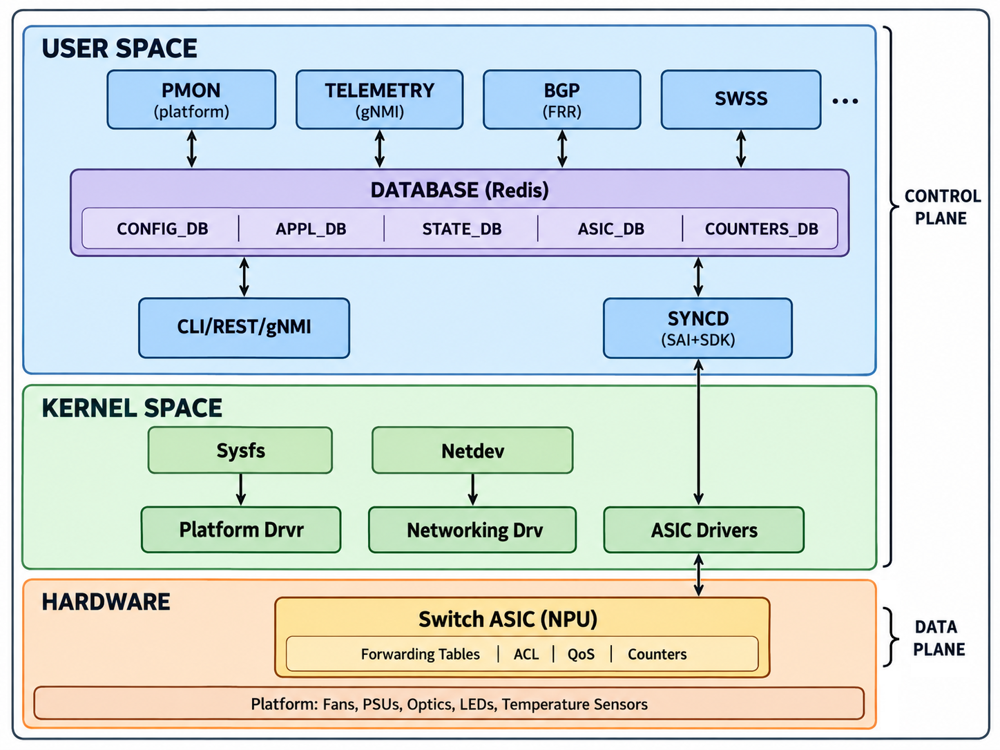
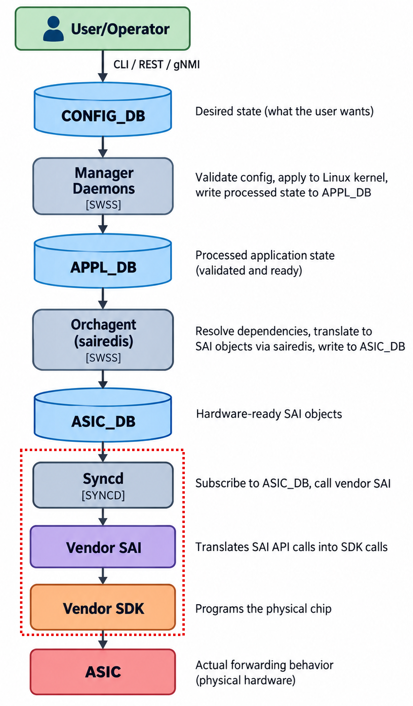

# Architecture Overview

This document provides a high-level view of how SONiC's components fit together.

## Prerequisite Concepts

### System Layers

A Linux-based network switch is organized into three layers:

- **User space**: Where application software runs. All SONiC containers, Redis databases, management tools, and networking daemons live here. User-space programs cannot access hardware directly — they must go through the kernel.

- **Kernel space**: The Linux kernel manages hardware resources, network interfaces, routing tables, and provides services (like **Netlink**, a messaging interface for communication between the kernel and user-space programs) that user-space programs rely on. It acts as the intermediary between software and hardware.

- **Hardware**: The physical components — most importantly the switch ASIC (also called the NPU, or Network Processing Unit), the specialized packet-forwarding chip described in [What is SONiC?](01_what_is_sonic.md). Platform peripherals like fans, power supplies, optics, and temperature sensors are also part of this layer.

These layers form a stack: user-space programs request actions, the kernel mediates access, and hardware executes the work.

### Control Plane vs Data Plane

These two terms describe how a network device divides its responsibilities:

- **Control plane**: The software that *decides* how traffic should be handled. It runs routing protocols, processes configuration, and computes forwarding decisions. In SONiC, the control plane runs entirely on the switch CPU in user space — for example, BGP decides where to send traffic, and other daemons validate configuration and translate those decisions into hardware instructions.

- **Data plane**: The hardware that *moves* packets at line rate (the full speed of every port, with no slowdown) based on the control plane's decisions. In SONiC, the data plane is the switch ASIC, which performs forwarding lookups and packet switching without CPU involvement.

The relationship is straightforward: the control plane programs the data plane. SONiC's entire architecture — the databases, orchestration daemons, and hardware abstraction layers described in the rest of this document — exists to carry user intent from the control plane into the data plane as efficiently and reliably as possible.

> For a deeper treatment including RIB, FIB, and how SONiC maps to traditional routing concepts, see [The BGP Container and FRR](14_bgp_container.md).

## The Big Picture

With that context, here is how a SONiC device is structured:

All SONiC containers run in user space. No container communicates with another directly — all structured communication goes through the database container, which runs a Redis in-memory key-value store organized into multiple databases (CONFIG_DB, APPL_DB, ASIC_DB, STATE_DB, COUNTERS_DB). When one container writes state to a Redis table, any container subscribed to that table is notified and reads the update. This decoupled, event-driven design is explained in detail in [Container Communication](09_container_communication.md).

> Each database is covered in detail in [Core Redis Databases](08_redis_databases.md).

### Kernel-space Components

- **Sysfs** — the `/sys` filesystem interface that exposes hardware attributes (temperatures, fan speeds, transceiver info) to user-space containers.

- **Platform Drivers** — kernel modules for platform-specific hardware (fans, PSUs, LEDs, sensors). The PMON container reads from these via sysfs.

- **Netdev** — the kernel's network device abstraction. Each switch port appears as a Linux network interface (e.g., `Ethernet0`) managed through netdev.

- **Networking Drivers** — kernel modules that create and manage network interfaces, handle packet I/O for CPU-bound traffic, and provide the **Netlink** interface that containers use to learn about network events.

- **ASIC Drivers** — kernel modules provided by the ASIC vendor that enable communication between the Linux kernel and the switch ASIC. For example, Broadcom's KNET (Kernel NETwork) driver creates Linux network interfaces that correspond to physical ASIC ports, allowing CPU-bound traffic (such as protocol packets) to travel between the ASIC and user-space daemons.

Although containers communicate with each other exclusively through Redis, they also interact directly with the Linux kernel when needed. This communication is bidirectional:

- **Kernel → Container** (listening): Containers subscribe to **Netlink** events to learn about network changes. For example, `neighsyncd` (in the SWSS container) listens for ARP/NDP neighbor entries discovered by the kernel and writes them to APPL_DB so the ASIC can be programmed with the correct MAC addresses.

- **Container → Kernel** (writing): Containers can also push state into the kernel. For example, FRR's `zebra` daemon (in the BGP container) installs its best routes into the kernel routing table, and manager daemons bring Linux interfaces up or down in response to CONFIG_DB changes.

This container-to-kernel interaction is covered in more detail in [Container Communication](09_container_communication.md).

## The Programming Pipeline

The most important data flow in SONiC is the pipeline that transforms user intent into hardware behavior. It spans the database, SWSS, and SYNCD containers, crossing container boundaries at each stage:

The three databases in this diagram all live in the **database container**. The processing steps between them run in different containers, as labeled. Each stage has a clear responsibility:

1. **CONFIG_DB** stores the operator's intent exactly as entered. The CLI, REST API, or gNMI writes here.

2. **APPL_DB** holds processed application state, ready for hardware programming. It is populated by two kinds of producers: **manager daemons** (in the SWSS container) that validate and transform CONFIG_DB entries, and **sync daemons** (in various containers) that feed in protocol and kernel state — for example, `fpmsyncd` (in the BGP container) pushes learned routes to APPL_DB without going through CONFIG_DB at all.

3. **ASIC_DB** holds the complete desired ASIC state in vendor-agnostic SAI format. It is written by **orchagent** (in the SWSS container) through the **sairedis** library. Orchagent reads from APPL_DB, resolves cross-feature dependencies (e.g., a route depends on a next-hop, which depends on a port being active), and translates application state into SAI objects. Sairedis serializes these SAI API calls into Redis entries in ASIC_DB, rather than calling hardware directly.

4. **ASIC** — the physical hardware. **Syncd** (in the SYNCD container) subscribes to ASIC_DB for changes. When it detects a new or modified entry, it calls the **vendor SAI implementation** — the chip maker's library that translates SAI API calls into **vendor SDK** calls — which in turn programs the forwarding tables, ACLs, and queues in the physical chip.

### Upward State Flow

State also flows **upward** through the system, providing feedback about what the hardware is actually doing:

- **COUNTERS_DB**: Syncd periodically polls hardware counters (packet counts, byte counts, error counts, queue depths) and writes them to COUNTERS_DB. Monitoring tools — the CLI (`show interfaces counters`), SNMP, and the telemetry container — read from this database to report on hardware activity.

- **STATE_DB**: Various daemons write operational state to STATE_DB — port initialization status, transceiver information, fan and temperature readings. Manager daemons use this information to resolve dependencies before programming hardware. For example, a VLAN manager will not assign a port to a VLAN until that port's STATE_DB entry confirms it has been initialized.

This bidirectional flow — intent flowing downward and feedback flowing upward — is what makes the system observable and self-consistent.

## Host-Level Components

Not everything runs inside containers. Some components run directly on the Linux host:

| Component                 | Role                                                      |
|---------------------------|-----------------------------------------------------------|
| **systemd services**      | Manage container lifecycle — start, stop, restart, and enforce dependency ordering between containers |
| **sonic-cfggen**          | Configuration generator that renders Jinja2 templates using data from CONFIG_DB |
| **CLI (sonic-utilities)** | The Click-based command-line interface that operators use to configure and inspect the switch |
| **docker_image_ctl.j2**   | Template script that controls container creation, startup, and shutdown |

These host-level components are the glue that holds the containerized system together. They handle bootstrapping (getting containers started in the right order) and provide the primary operator-facing interface.

Containers also share certain resources with the host. They all mount the Redis socket directory as a shared volume, and most containers run in the host's network namespace (`--net=host`). Both of these mechanisms are explained in [Container Communication](09_container_communication.md). This tight integration between host and containers is what allows SONiC to function as a cohesive system rather than a collection of isolated services.

---

**Previous**: [← What is SONiC?](01_what_is_sonic.md) · **Next**: [SONiC Container Architecture →](03_sonic_container.md)
