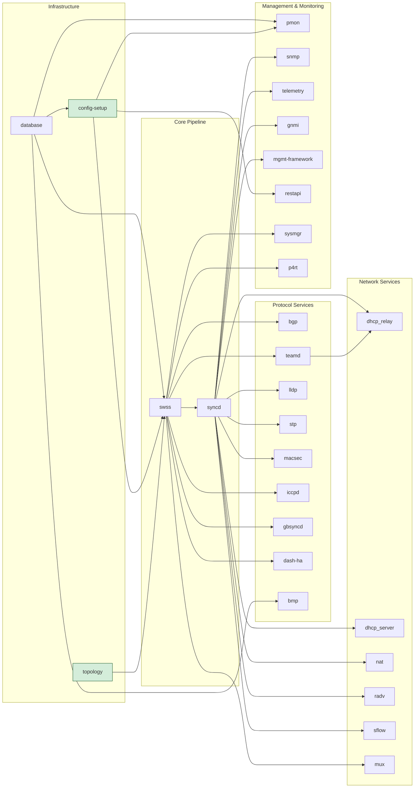
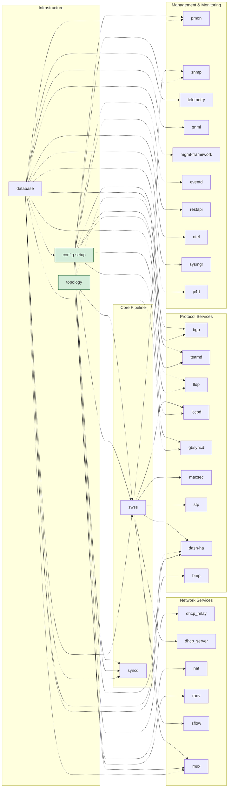

# Container Run Time: How the Host Manages Containers

This document covers the host-side machinery that manages SONiC containers — how systemd starts them, how the two layers of shell scripts create and control them, and how the FEATURE table lets operators enable, disable, and configure automatic restarts. For how container images are built, see [Container Build Time](05_container_build_time.md). What happens *inside* a running container is covered in [Inside a Running Container](07_inside_a_running_container.md).

## 1. How systemd Manages Containers

Once SONiC is installed on a switch, all container images are pre-loaded into Docker. But something has to decide *when* to start each one, in what order, and what to do when one dies. That job belongs to **systemd**, the standard Linux service manager.

### Why systemd Rather Than Docker Alone

Docker can start containers, but it does not provide the orchestration a network operating system needs:

- **Dependency ordering** — the database container must be fully up before anything else starts; syncd must not start before swss.
- **Automatic restart** — bring a container back if it exits unexpectedly.
- **Rate limiting** — stop retrying after repeated rapid failures, instead of looping forever.
- **A single interface** — containers and plain host processes (rsyslog, the CLI's helper daemons, platform services) are all managed with the same commands.

Because every container is wrapped in a systemd unit, operators use ordinary Linux tooling:

```bash
sudo systemctl start swss        # Start the SWSS container
sudo systemctl stop bgp          # Stop the BGP container
systemctl status database        # Check the database container
```

### Anatomy of a Service Unit

A systemd unit file is a plain-text configuration file written in **INI format** — the same `[Section]` / `Key=Value` syntax used in many Linux configuration files. It is organized into three sections:

| Section     | Purpose                                     |
|-------------|---------------------------------------------|
| `[Unit]`    | **What this service is and how it relates to others.** Contains the human-readable description, ordering directives (`After=`, `Before=`), and dependency directives (`Requires=`, `BindsTo=`, `Wants=`). This section is common to all unit types — services, targets, timers, etc. |
| `[Service]` | **How to run the service.** Contains the actual commands to start, stop, and monitor the process (`ExecStart=`, `ExecStop=`), the user to run as, environment variables, and restart behavior. This section is specific to service units. |
| `[Install]` | **When to activate this service.** Contains directives like `WantedBy=` that tell systemd which target should pull this unit in when it is enabled. This section is only read by `systemctl enable` / `systemctl disable` — it has no effect at runtime. |

Here is the SWSS unit, rendered for a single-ASIC switch:

```ini
[Unit]
Description=switch state service

After=database.service
After=config-setup.service
After=sonic.target

Requires=database.service
Requires=config-setup.service
BindsTo=sonic.target

StartLimitIntervalSec=1200
StartLimitBurst=3

[Service]
User=root
Environment=sonic_asic_platform=vs
ExecStartPre=/usr/local/bin/swss.sh start
ExecStart=/usr/local/bin/swss.sh wait
ExecStop=/usr/local/bin/swss.sh stop
RestartSec=30

[Install]
WantedBy=sonic.target
```

| Directive                                          | What It Does |
|----------------------------------------------------|------------------------------------------------------------|
| `After=`                                           | Ordering — SWSS starts only after all listed units (`database.service`, `config-setup.service`, `sonic.target`) have finished starting. Without this, systemd could start them in parallel. |
| `Requires=`                                        | Hard dependency — if any listed unit (`database.service`, `config-setup.service`) fails or is stopped, SWSS is stopped too. `config-setup` loads and migrates the configuration into CONFIG_DB; SWSS must not start against an empty database. |
| `BindsTo=sonic.target`                             | A stronger form of `Requires=`. Ties SWSS to the SONiC service group — if the target is stopped or restarts, SWSS is stopped too. |
| `StartLimitBurst=3` / `StartLimitIntervalSec=1200` | Allow at most 3 start attempts within 1200 seconds, after which the unit is marked failed and no further restarts are attempted. |
| `RestartSec=30`                                    | Wait 30 seconds between restart attempts. |
| `Environment=sonic_asic_platform=vs`               | The ASIC vendor family this image was built for (`broadcom`, `mellanox`, `vs` for the virtual switch, and so on). Scripts branch on it to run vendor-specific steps. |
| `WantedBy=sonic.target`                            | Makes SWSS start automatically as part of the SONiC service group. |

Two things about this unit are worth pausing on.

**There is no `Restart=` directive.** Most SONiC units deliberately omit it, because restart policy is not a build-time constant. It is supplied at run time from the FEATURE table, described later in this document.

**`ExecStartPre` starts the container; `ExecStart` waits on it.** This is the pattern used by nearly every SONiC container unit, and it is the key to how systemd tracks container health:

```
ExecStartPre  → swss.sh start   → creates and starts the Docker container, then returns
ExecStart     → swss.sh wait    → blocks for as long as the container keeps running
ExecStop      → swss.sh stop    → stops the container gracefully
```

Because `ExecStart` blocks, systemd considers the unit active exactly as long as the container is alive. The moment the container exits — for any reason, including a crash inside it — the blocking `wait` returns, `ExecStart` finishes, and systemd applies its restart policy. Without this trick systemd would consider the unit "finished" the instant `docker start` returned and would never notice the container dying.

For most containers, the `wait` step watches only that one container. But `swss.sh` is an exception. Its `wait` watches multiple containers at once, creating a cross-container failure coupling that is invisible to systemd. This is covered in detail in [Script-Level Failure Coupling](#script-level-failure-coupling).

### The Two Scripts Behind Every Container

The unit file above references `/usr/local/bin/swss.sh` for all three operations. But SONiC actually has *two* layers of shell script per container:

| Script | Path | Origin | Responsibility |
|--------|------|--------|----------------|
| **Service script** | `/usr/local/bin/<name>.sh` | Hand-written, in `files/scripts/` | SONiC-specific orchestration: wait for Redis, flush stale database state, start and stop peer containers, handle warm/fast boot |
| **Container control script** | `/usr/bin/<name>.sh` | Generated from `docker_image_ctl.j2` | Pure Docker mechanics: `docker create`, `docker start`, `docker wait`, `docker stop` |

Note that the two files have the *same name* and differ only by directory, which is easy to misread. The service script always calls the control script; never the reverse.

Not every container needs the extra orchestration layer. Containers with cross-container dependencies or boot-mode logic (`database`, `swss`, `syncd`, `bgp`, `teamd`, `lldp`, `snmp`, `telemetry`, and a few more) have a service script. Simpler containers such as `pmon` skip it, and their unit files invoke `/usr/bin/pmon.sh` directly.

### Service Groups: `multi-user.target` and `sonic.target`

systemd organizes units into **targets** — named groups that act as synchronization points. A target runs nothing itself; it is a handle for controlling a set of units at once. SONiC uses two targets to separate infrastructure from application services.

#### multi-user.target

This is the standard Linux target for general system services. SONiC places two critical services here so they start early — as part of ordinary system startup, before any SONiC container:

- **`database`** — starts the Redis container. Every other SONiC service needs Redis, so this must be up first.
- **`config-setup`** — handles configuration initialization and migration. On a normal boot the database container itself loads `config_db.json` into Redis; `config-setup` runs afterward to apply any migration hooks. On first boot to a new image (or when no configuration exists), `config-setup` generates the initial configuration from minigraph, ZTP, or factory defaults and loads it into Redis. This is a one-shot host service, not a container.

By the time systemd reaches `sonic.target`, Redis is running and CONFIG_DB is loaded.

#### sonic.target

This is SONiC's own target. Every service in this group declares `BindsTo=sonic.target` — their lifecycles are coupled to the target. If `sonic.target` is stopped, all of them are stopped. If it is restarted, all of them are restarted.

```bash
sudo systemctl restart sonic.target   # Restart every SONiC container
```

This is exactly what `config reload` does internally: stop `sonic.target`, reload configuration into Redis, then restart `sonic.target`.

The `database` container is deliberately **not** in this group: it must survive a `sonic.target` restart so that Redis remains available while containers re-initialize.

### Dependency Graph

In systemd, `After=` and `Before=` are the two directives that control **startup ordering**. When a service declares `After=database.service`, systemd guarantees it will not start until the database service is up. `Before=` is the mirror image — it tells systemd "start me before that other service." Neither directive pulls a service in or controls what happens on failure — they purely define sequence.

SONiC has around 30 container services, each declaring its ordering constraints in a `.service.j2` template inside the build system. If you extract every `After=` and `Before=` relationship from these templates and draw them as a graph, you get the picture below.

The green nodes (`config-setup` and `topology`) are host-side services, not containers — as described in the previous section. They sit at the root of the tree, meaning no SONiC container can begin starting until the host completes its setup. If something goes wrong at this level (e.g., a corrupt `config_db.json` stalls `config-setup`), no container will start.

An arrow from A to B means B declares `After=A` (or A declares `Before=B`) — B will not start until A is running. To keep the graph readable, most transitive edges are omitted (e.g., `database → snmp` is not drawn because it is implied through `database → … → swss → syncd → snmp`).



**Layered startup.** The graph has a clear left-to-right structure — services start in waves, not all at once. Wave 1 is `database`, which belongs to `multi-user.target` and must be available before anything else. Wave 2 is `config-setup` and `topology`, which load the switch configuration and determine the topology. Wave 3 is `swss`, the orchestration brain. Wave 4 is `syncd`, `bgp`, `teamd`, and other services that need the orchestrator running. Wave 5 is the remaining services (`lldp`, `snmp`, `telemetry`, etc.) that need the full pipeline — including the ASIC connection — before they can do useful work.

**Two fan-out hubs.** Look at where the arrows concentrate. `swss` is the first hub — around nine services wait for it before they can start. `syncd` is the second hub — another twelve services wait for it. These two nodes are the **critical-path bottlenecks**: if either one takes a long time to initialize, every service downstream is delayed. No amount of parallelism elsewhere can compensate.

**Parallelism within a tier.** Once a hub finishes starting, all its dependents launch **simultaneously**. For example, the moment `swss` is ready, systemd starts `syncd`, `bgp`, `teamd`, `iccpd`, and others all in parallel — it does not wait for one to finish before starting the next. This is how SONiC keeps boot time manageable despite having around 30 services.

**The longest chain determines boot time.** The critical startup path through the graph is `database → config-setup → swss → syncd → (lldp | snmp | telemetry | …)` — five sequential hops. Total boot time is dominated by the sum of these five startup durations. Adding more services at the same depth (e.g., adding another service after `syncd`) does not increase boot time because they run in parallel. Only adding a new sequential hop would.

**Most services depend on infrastructure only transitively.** Only a handful of services (`swss`, `pmon`, `bmp`, `restapi`) have direct arrows from the infrastructure tier. Every other service inherits that dependency indirectly through `swss → syncd`. In practice, this means you rarely need to think about `database` or `config-setup` when reasoning about a specific service — just know that "swss and syncd must be up first."

**syncd gates the monitoring world.** All management and monitoring services (`snmp`, `telemetry`, `gnmi`, `mgmt-framework`) wait for `syncd`, not just `swss`. The same is true for network services (`nat`, `dhcp_relay`, `sflow`, etc.) and even `stp`. This makes sense: these services need to read hardware state — port counters, interface status, ASIC health — which is only available once `syncd` has established the connection to the ASIC through the vendor SAI.


### Failure Propagation

The dependency graph above shows **startup ordering** — what starts before what. But there is a separate question: **when a service crashes, what else gets pulled down with it?**

Ordering (`After=` / `Before=`) does not answer this. systemd has a separate family of directives specifically for **dependency management** — they control whether units are pulled in, and what happens when one of them fails or stops.

#### Dependency Management Directives

| **Directive** | **Description** |
|---------------|-----------------|
| `Requires=`   | **Must have.** If the required unit fails to start, this unit won't start either. systemd will try to start the required unit automatically. |
| `Requisite=`  | **Must already be running.** Like `Requires=`, but systemd will NOT try to start it — if it's not already active right now, this unit fails immediately. |
| `BindsTo=`    | **Live and die together.** Like `Requires=`, but even stricter — if the bound unit stops (for any reason), this unit is stopped too. Their lifecycles are tightly coupled. |
| `Wants=`      | **Nice to have.** systemd will try to start the wanted unit, but if it fails, this unit starts anyway. Use this for optional dependencies. |
| `Upholds=`    | **Keep it alive.** If the listed unit stops or is not running, systemd will continuously try to restart it. Think of it as a persistent `Wants=` that keeps retrying. |

Each of these has a **reverse** form — instead of "I depend on X", the reverse says "X depends on me." They are typically placed in the `[Install]` section and take effect when a unit is enabled via `systemctl enable`.

| **Directive**  | **Description** |
|----------------|-----------------|
| `RequiredBy=`  | Indicates units that require this unit to be active to start themselves. |
| `RequisiteOf=` | Indicates units that will fail if this unit cannot start. |
| `WantedBy=`    | Indicates units that want this unit to be active but will not fail if it isn't. |
| `BoundBy=`     | Indicates units that will stop or restart when this unit stops or restarts. |
| `UpheldBy=`    | Indicates units that help maintain or keep this unit running. |

In SONiC, the service templates use `Requires=` and `Requisite=` for hard dependencies between containers, and every container declares `BindsTo=sonic.target` to tie its lifecycle to the target group. `Wants=` is used sparingly (only `database` uses `Wants=database-chassis.service` for an optional chassis dependency).

#### Which Directives Cause Failure Propagation?

Not all dependency management directives are **fate-coupling** directives. Only three propagate failure — meaning if the dependency dies, the dependent is pulled down with it:

| Directive    | If dependency stops ... |
|--------------|-------------------------|
| `Requires=`  | Dependent is stopped.   |
| `Requisite=` | Dependent is stopped (and won't auto-start the dependency). |
| `BindsTo=`   | Dependent is stopped; if dependency restarts, dependent restarts too. |

The graph below visualizes these fate-coupling relationships. A dashed arrow from B to A means "A declares `Requires=B` or `Requisite=B`" — if B dies, A is pulled down. Only relationships between SONiC services are shown.



The key takeaway: **`database` is the single point of failure.** If the database container crashes, nearly every other service is pulled down through `Requires=`. This is by design — without Redis, no container can function, so there is no point in keeping them running.

The second critical node is **`swss`**. Eight services are directly coupled to it: `iccpd`, `macsec`, `mux`, `stp`, `dash-ha`, and `dhcp_server` declare `Requires=swss`, while `sflow` and `snmp` declare `Requisite=swss` (same fate-coupling, but systemd won't try to start swss on their behalf — it must already be running). All eight are stopped if SWSS crashes.

Notice that **`syncd` has no outgoing arrows.** If the syncd container crashes, no other service is affected — not even swss, which sits directly upstream of it. That is what systemd believes. But on a real switch, syncd crashing triggers a restart of swss *and* every service swss manages — a much larger blast radius than the graph suggests. This coupling exists, but it lives in a shell script, not in a `.service` file, so systemd cannot see it. The next section explains how it works.

#### Script-Level Failure Coupling

The systemd graph above is not the complete picture. There is a second failure-propagation path that is entirely invisible to systemd — it lives inside `swss.sh`, the service script for the SWSS container. This path is what makes syncd's death take down swss (and everything else) even though no systemd directive connects them.

**This mechanism is unique to swss.** Every other container's `wait()` function runs a plain single-container wait — if syncd's service script (`syncd.sh`) detects that swss has died, it does not react; only swss watches across container boundaries. This is a deliberate design choice: swss is the orchestration hub, so it owns the group lifecycle.

**Why not use `BindsTo=` instead?** If `swss.service` declared `BindsTo=syncd.service`, systemd would stop swss when syncd died — achieving the same effect without any script logic. But systemd would then restart them as independent units, potentially in parallel and in the wrong order. By keeping the coupling in `swss.sh`, SONiC controls the exact sequence: stop dependents first, then stop the peer, then start the peer, then start dependents. The script also handles warm-boot and fast-boot cases where the stop/restart behavior must be different.


### The FEATURE Table: Turning Containers On and Off

Not every container is needed in every deployment, and not every operator wants automatic restarts. SONiC keeps these decisions in a **FEATURE table** in CONFIG_DB, so they are configuration rather than image content.

Useful fields on each entry:

| Field | Meaning |
|-------|---------|
| `state` | `enabled` or `disabled` — whether this container should run at all. |
| `auto_restart` | `enabled` or `disabled` — whether the container is restarted automatically after a critical failure. |
| `delayed` | If set, the feature is started through a systemd `.timer` unit rather than immediately at boot. |
| `has_global_scope` / `has_per_asic_scope` | On multi-ASIC platforms (see note below), whether the feature runs once for the host, once per ASIC, or both. |
| `high_mem_alert` | Whether high-memory-usage alerting is enabled for this container. |

**A note on multi-ASIC platforms.** Most switches contain a single forwarding ASIC, but some chassis-based or high-density platforms contain multiple ASICs managed by one SONiC instance. On such a platform, containers like `swss` and `syncd` must run once *per ASIC* (e.g., `swss0`, `swss1`), each in its own Linux network namespace — because each ASIC has its own set of ports and forwarding tables. Other containers like `snmp` only need to run once for the entire device. The `has_global_scope` and `has_per_asic_scope` fields control this behavior. If you are working with a single-ASIC device, you can ignore these fields.

Operators change these through the CLI:

```bash
show feature status                          # Current state of every feature
show feature autorestart                     # Just the auto-restart settings

sudo config feature state snmp disabled      # Stop running the SNMP container
sudo config feature autorestart swss enabled # Restart SWSS automatically on failure
```

A host daemon called **`featured`** subscribes to this table and translates changes into systemd actions. It is the piece that makes a Redis value have an effect on a running system:

- **`state` changes.** Setting a feature to `enabled` runs `systemctl unmask`, `enable`, then `start`. Setting it to `disabled` runs `systemctl stop`, `disable`, then `mask`. Masking is stronger than disabling: a masked unit cannot be started even by a dependency or an explicit command, which is what makes the "off" state stick.

- **`auto_restart` changes.** `featured` writes a systemd drop-in file at `/etc/systemd/system/<name>.service.d/auto_restart.conf` containing either `Restart=always` or `Restart=no`, then runs `systemctl daemon-reload`. This is the missing `Restart=` directive from the unit file shown earlier. A drop-in is a small fragment systemd merges on top of the original unit, so the shipped unit file is never modified.


## 2. The Container Control Script

When the service script reaches the point of actually launching the container, it calls `/usr/bin/<name>.sh` — the script generated from `docker_image_ctl.j2`. That script accepts four operations: `start`, `wait`, `stop`, and `kill`.

Its most interesting logic is in `start`, which has to distinguish first boot from every subsequent boot:

```bash
# Simplified from /usr/bin/swss.sh
start() {
    if docker inspect swss >/dev/null 2>&1 && [ "$existing_hwsku_mount" = "$MOUNTPATH" ]; then
        preStartAction              # per-container setup that must happen before launch
        docker start swss           # Container already exists — just start it
        postStartAction             # per-container setup that needs the container running
        exit $?
    fi

    docker rm -f swss 2>/dev/null   # Exists but was created for a different HWSKU

    docker create --name swss \
        --net=host \
        -v /var/run/redis:/var/run/redis:rw \
        -v /usr/share/sonic/device/$PLATFORM/$HWSKU:/usr/share/sonic/hwsku:ro \
        --env "PLATFORM"=$PLATFORM \
        --env "CONTAINER_NAME"=swss \
        --log-opt max-size=2M --log-opt max-file=5 \
        docker-orchagent:latest

    preStartAction
    docker start swss
    postStartAction
}
```

### create Versus start

`docker create` builds the container instance from the image and fixes its volume mounts, network mode, and environment variables. Those settings cannot be changed afterwards, which is why creation happens only once. `docker start` then boots that already-configured instance, and is much faster because it skips creation.

The script recreates the container in two situations. The obvious one is that no container with that name exists — first boot after installing a new SONiC image, since each installed image carries its own Docker state. The subtler one is that a container exists but was created with a *different HWSKU* mount path. HWSKU ("hardware SKU") identifies the specific port layout and hardware profile of the switch. Because the HWSKU directory is baked in at create time, changing HWSKU requires tearing the container down and building a new one — the script detects this by comparing the existing mount against the current configuration.

### What the create Options Do

| Option | Why it is there |
|--------|-----------------|
| `--net=host` | The container shares the host's network namespace, so it sees `Ethernet0`, `PortChannel1`, and every other interface directly. Networking daemons need this to manage interfaces and receive Netlink events. |
| `-v /var/run/redis:/var/run/redis:rw` | Mounts the host directory holding the Redis Unix sockets (`redis.sock`) and `sonic-db/database_config.json`. This is how a container reaches Redis running in a *different* container, without any network hop. |
| `-v .../$PLATFORM/$HWSKU:/usr/share/sonic/hwsku:ro` | Exposes this switch's hardware profile — port configuration, buffer profiles, SAI settings — read-only. |
| `--env PLATFORM=...`, `--env CONTAINER_NAME=...` | Identify the hardware platform and the container's own name. The platform string (for example `x86_64-broadcom_td3-r0`, or `vs` for the virtual switch) selects platform-specific drivers and config files; the container name is used to tag log messages. |
| `--log-opt max-size=2M --log-opt max-file=5` | Caps Docker's own log capture so a chatty container cannot fill the disk. |

Vendor and container specifics are layered on top of these. The syncd container gets ASIC device nodes and shared memory; pmon gets I²C, CPLD, and other hardware devices; the BGP container gets a writable `/etc/frr`.

### The preStartAction and postStartAction Hooks

The template defines two per-container hooks. They are how one generic script serves thirty different containers:

- **`preStartAction`** runs after the container is created but before it starts. The database container uses it to place a saved Redis dump into the container for a warm reboot; the SNMP container uses it to publish the chassis serial number into STATE_DB.
- **`postStartAction`** runs once the container is up. The database container waits here until Redis answers `PING`, loads `config_db.json`, runs the database schema migrator, and sets the `CONFIG_DB_INITIALIZED` flag — which is precisely the flag every other container's service script waits for.

### stop and kill

`stop` asks Docker to shut the container down gracefully, giving processes time to flush state. Some containers get a longer grace period: teamd is allowed 60 seconds so port-channels can be torn down cleanly. `kill` terminates immediately and is reserved for warm and fast reboot, where the goal is to freeze state rather than unwind it.

### What About Container State?

A common question from beginners: if a container is destroyed and recreated, does it lose its data? The short answer is **no** — all important state lives in Redis, which runs in a separate container with its own persistent storage. When a container restarts, its entrypoint regenerates configuration files from the current contents of Redis (as the [next document](07_inside_a_running_container.md) describes). This is exactly why SONiC uses a database-centric design: containers are disposable, but the state they depend on persists in Redis across restarts.

---

**Previous**: [← Container Build Time](05_container_build_time.md) · **Next**: [Inside a Running Container →](07_inside_a_running_container.md)
