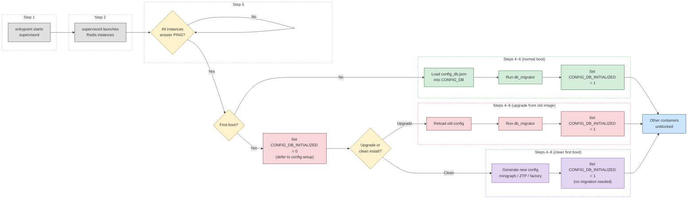

# The Database Container

The database container is the first container to start on a SONiC device and the last one any other container can do without. Its sole job is to run and manage the Redis instances that serve as the central data bus for the entire system. It implements no networking logic — it simply provides the infrastructure that every other container depends on to store state, communicate, and coordinate.

> **Prerequisite**: This document assumes familiarity with Redis basics (key-value store, data types, pub/sub). For a complete Redis tutorial, refer to: [sonic-lab-redis](https://github.com/ManiAm/sonic-lab-redis)

## What the Database Container Does

1. Starts one or more Redis server instances.
2. Exposes these instances to all other containers via Unix sockets (and optionally TCP).
3. Loads saved configuration (`config_db.json`) into Redis and signals readiness to the rest of the system.
4. Manages database persistence for warm and fast reboot scenarios.

The following sections explain each of these responsibilities in detail — starting with the building blocks (instances, databases, keys, and configuration), then describing how the container starts and how to interact with it.

## Redis Instances

The database container can run one or more Redis server instances in parallel. Each instance is an independent process with its own memory, its own persistence settings, and its own Unix domain socket file.

When multiple instances are in use, you can see them by listing the Redis processes inside the database container:

```bash
admin@sonic:~$ docker exec -it database ps aux | grep redis
redis  ... redis-server *:6379     # redis   — CONFIG_DB, LOGLEVEL_DB, STATE_DB, ...
redis  ... redis-server *:6378     # redis1  — APPL_DB
redis  ... redis-server *:6377     # redis2  — ASIC_DB
redis  ... redis-server *:6376     # redis3  — COUNTERS_DB, PFC_WD_DB, FLEX_COUNTER_DB
```

### Why Use Multiple Instances?

A single instance works, but it has fundamental limitations: all databases share a single event loop, a single memory pool, and a single configuration. The [Why Use Multiple Instances?](https://github.com/ManiAm/sonic-lab-redis/blob/master/docs/01_redis.md#why-use-multiple-instances) section of the Redis companion project explains these trade-offs in general terms. Here is how each one matters in SONiC specifically:

- **Performance isolation.** COUNTERS_DB receives high-frequency writes every few seconds as hardware counters are polled. Running it on its own instance prevents those writes from adding latency to CONFIG_DB reads or APPL_DB updates, which are on the critical path for programming the ASIC.

- **Independent configuration.** Each instance can have different memory limits, different persistence policies, and different eviction behavior. For example, COUNTERS_DB needs no persistence, while APPL_DB and ASIC_DB need AOF enabled for [warm reboot](#persistence-and-warm-reboot).

- **Lua script isolation.** Redis executes Lua scripts atomically — no other command can run on the same instance while a script is in progress. Several IPC patterns in SONiC rely on Lua scripts for atomicity (see [IPC Mechanisms](10_ipc_mechanisms.md)). Keeping unrelated databases on separate instances means a long-running Lua script on one instance does not block operations on another.

## Logical Databases

Each Redis instance hosts one or more **logical databases**. A logical database is a numbered namespace within a Redis instance — keys in database 0 are separate from keys in database 4, even though both live on the same server process. SONiC assigns human-readable names to these namespaces.

The table below is the complete list of every logical database defined in SONiC, grouped by category. The next document — [Core Redis Databases](08_redis_databases.md) — takes the core databases from this list and explains each one in depth: what it stores, who writes to it, who reads from it, and how it fits into the data pipeline.

| DB ID | Name               | Group       | Purpose |
|-------|--------------------|-------------|---------|
| 0     | APPL_DB            | Core        | Processed application state, ready for hardware programming |
| 1     | ASIC_DB            | Core        | Hardware-ready SAI objects for syncd |
| 2     | COUNTERS_DB        | Core        | Interface, queue, and buffer counters from hardware |
| 3     | LOGLEVEL_DB        | Core        | Dynamic log level settings per daemon |
| 4     | CONFIG_DB          | Core        | User configuration — the source of truth for operator intent |
| 5     | PFC_WD_DB          | Core        | Priority Flow Control watchdog data |
| 5     | FLEX_COUNTER_DB    | Core        | Flexible counter configuration and polling control |
| 6     | STATE_DB           | Core        | Operational state and cross-module dependency resolution |
| 7     | SNMP_OVERLAY_DB    | Specialized | SNMP-specific overlay data |
| 8     | RESTAPI_DB         | Specialized | REST API / management framework state |
| 14    | APPL_STATE_DB      | Specialized | Application-specific runtime state |
| 9     | GB_ASIC_DB         | Gearbox     | Gearbox ASIC state (multi-ASIC systems) |
| 10    | GB_COUNTERS_DB     | Gearbox     | Gearbox counters |
| 11    | GB_FLEX_COUNTER_DB | Gearbox     | Gearbox flex counter control |
| 12    | CHASSIS_APP_DB     | Chassis     | Chassis-level application state (modular systems) |
| 13    | CHASSIS_STATE_DB   | Chassis     | Chassis-level operational state |

**Not all databases exist on every device.** The core set is present on every SONiC system. The rest depend on the platform and features in use. The Gearbox databases only appear on systems with a Gearbox PHY ASIC. The chassis databases only appear on modular chassis platforms. SNMP_OVERLAY_DB, RESTAPI_DB, and APPL_STATE_DB exist on most builds but may be empty if the corresponding feature is not active.

**PFC_WD_DB and FLEX_COUNTER_DB share database ID 5.** This means they are two names for the same Redis namespace — any key written under one name is visible under the other. The two names exist because SONiC historically used this namespace for PFC watchdog data (`PFC_WD_DB`) and later added flexible counter configuration to the same namespace (`FLEX_COUNTER_DB`). Rather than migrate PFC_WD_DB to a new ID (which would break backward compatibility), SONiC added a second alias. In practice, application code accesses the namespace by whichever name matches the feature it implements — PFC watchdog code uses `PFC_WD_DB`, and counter management code uses `FLEX_COUNTER_DB` — but both reach the same underlying database.

## Key Structure and Separators

### Why SONiC Needs Structure on Top of Redis

Redis is a flat key-value store. Each entry is a single **key** (a plain string) mapped to a **value** (which can be a string, a hash, a list, or other data types). Redis has no built-in concept of tables, rows, or columns.

SONiC manages thousands of structured objects — ports, VLANs, routes, neighbors, ACL rules — and needs a consistent way to organize, find, and subscribe to related entries. Using ad-hoc key names like `port_ethernet0_config` would make that impossible. SONiC solves this by encoding structure directly into the Redis key string. Every key follows a consistent pattern:

```
TABLE_NAME <separator> KEY <separator> SUB_KEY
```

### The Three Parts of a SONiC Redis Key

| Part                   | What it represents                                               | Example                        |
|------------------------|------------------------------------------------------------------|--------------------------------|
| **Table name**         | Groups related entries by feature or data type                   | `PORT`, `VLAN_MEMBER`, `INTERFACE` |
| **Key**                | Identifies a specific entry within the table                     | `Ethernet0`, `Vlan100` |
| **Sub-key** (optional) | Narrows to a specific relationship or attribute within the entry | `Ethernet4` (a member of a VLAN), `10.0.0.2/31` (an IP on an interface) |

These parts are joined by a **separator character** — a single character that SONiC uses to glue them together into one Redis key string.

Here is a concrete example from CONFIG_DB, which uses `|` as its separator:

```
VLAN_MEMBER|Vlan100|Ethernet4  → { "tagging_mode": "untagged" }
   │          │       │             │
   │          │       └── sub-key   └── value (Redis hash with field-value pairs)
   │          └── key
   └── table name
```

This single Redis key tells you: in the `VLAN_MEMBER` table, for `Vlan100`, the member `Ethernet4` has tagging mode `untagged`.

More examples:

```
CONFIG_DB (separator = |):
    PORT|Ethernet0                      → { "admin_status": "up", "speed": "100000" }
    VLAN_MEMBER|Vlan100|Ethernet0       → { "tagging_mode": "untagged" }
    INTERFACE|Ethernet0|10.0.0.2/31     → {}

APPL_DB (separator = :):
    PORT_TABLE:Ethernet0                → { "admin_status": "up", "mtu": "9100" }
    ROUTE_TABLE:10.0.0.0/24             → { "nexthop": "10.0.0.1" }
```

This convention gives SONiC the ability to treat Redis like a structured database — daemons can list all entries in a table (by scanning keys that start with `PORT|`), subscribe to changes in a specific table, or look up a specific entry by constructing its full key.

### Why Different Databases Use Different Separators

Here is the separator used by each primary database:

| Database        | Separator |
|-----------------|-----------|
| APPL_DB         | `:`       |
| ASIC_DB         | `:`       |
| COUNTERS_DB     | `:`       |
| LOGLEVEL_DB     | `:`       |
| PFC_WD_DB       | `:`       |
| CONFIG_DB       | `\|`      |
| STATE_DB        | `\|`      |

CONFIG_DB uses `|` because it is persisted to disk as JSON (`/etc/sonic/config_db.json`). JSON uses `:` to separate keys from values (e.g., `"name": "value"`). If CONFIG_DB also used `:` as its separator, a key like `INTERFACE:Ethernet0:10.0.0.2/31` would create ambiguity when parsing the JSON file — colons in the key would be confused with JSON syntax. Using `|` avoids this collision entirely.

STATE_DB adopts the same `|` separator for consistency — it shares the same key structure conventions as CONFIG_DB, and its data can also be exported and manipulated as JSON using the same tooling (`sonic-cfggen`, `sonic-db-dump`). Using `|` keeps JSON round-tripping safe for this database as well.

Databases that are never serialized to JSON (like APPL_DB, ASIC_DB, and COUNTERS_DB) use the more conventional `:`.

The separator for each database is not hardcoded in application code. It is defined in `database_config.json`, and the `swsscommon` library reads it from there, so applications never need to know which separator a database uses.

## The database_config.json File

Now that instances, logical databases, and key separators have been introduced individually, this section shows how all three are tied together in a single configuration file.

`database_config.json` is the central configuration file for the database container. It defines:

- Which Redis **instances** exist, along with their Unix socket paths (or TCP endpoints).
- Which **logical database** maps to which instance.
- The **key separator** for each database.
- Whether **persistence** is enabled for each instance (used for warm reboot).

The file is generated from a Jinja2 template and placed at `/var/run/redis/sonic-db/database_config.json`. Here is a simplified example:

```json
{
    "INSTANCES": {
        "redis": {
            "hostname": "127.0.0.1",
            "port": 6379,
            "unix_socket_path": "/var/run/redis/sonic-db/redis.sock"
        },
        "redis2": {
            "hostname": "127.0.0.1",
            "port": 6380,
            "unix_socket_path": "/var/run/redis/sonic-db/redis2.sock"
        }
    },
    "DATABASES": {
        "APPL_DB": {
            "id": 0,
            "separator": ":",
            "instance": "redis"
        },
        "CONFIG_DB": {
            "id": 4,
            "separator": "|",
            "instance": "redis"
        },
        "COUNTERS_DB": {
            "id": 2,
            "separator": ":",
            "instance": "redis2"
        }
    }
}
```

Every SONiC component that needs to connect to Redis — whether through the `swsscommon` library, `sonic-db-cli`, or `redis-cli` with a wrapper — reads this file to find the correct instance and separator. This means the database layout can change between builds or platforms without modifying any application code.

The number of instances and how databases are distributed across them is a build-time decision. Different SONiC platforms can define different layouts by providing different templates.

### How the Layout Is Selected at Startup

The database container's init script (`docker-database-init.sh`) determines which layout to use by checking for specific files on disk, in order of priority:

```bash
if [ -f /etc/sonic/database_config.json ]; then
    # Operator-provided config — use it directly
    cp /etc/sonic/database_config.json /var/run/redis/sonic-db/database_config.json
elif [ -f /etc/sonic/enable_multidb ]; then
    # Multi-instance layout
    jinjanate multi_database_config.json.j2 > /var/run/redis/sonic-db/database_config.json
else
    # Default: single-instance layout
    jinjanate database_config.json.j2 > /var/run/redis/sonic-db/database_config.json
fi
```

The script follows a three-step priority:

1. **Operator-provided file (`/etc/sonic/database_config.json`).** If this file exists, the operator has written a complete configuration by hand. The script copies it directly — no template rendering, no generation. This is the highest-priority override, useful when neither the single nor the multi-instance template matches the operator's needs.

2. **Multi-instance flag (`/etc/sonic/enable_multidb`).** If the operator-provided file does not exist, the script checks for this **flag file**. It is an empty file whose mere presence signals "use multi-instance mode." The file's contents do not matter — only whether it exists. When present, the script renders the `multi_database_config.json.j2` template to generate a multi-instance configuration.

3. **Default: single instance.** If neither file exists, the script renders the `database_config.json.j2` template, which places all databases on a single Redis instance. This is the out-of-the-box behavior on most SONiC deployments.

### How Instances Are Configured

Once the layout is selected, the database container needs to launch the correct number of Redis server processes. All instances share a **single Redis configuration file** (`/etc/redis/redis.conf`) for common settings such as memory policy, eviction behavior, and timeouts. What makes each instance unique are the **command-line overrides** appended after the config file path in the supervisord entry. Redis applies command-line flags after the config file, so they override any conflicting values. Here is a simplified example:

```ini
[program:redis]
command=/usr/bin/redis-server /etc/redis/redis.conf
    --bind 127.0.0.1 --port 6379
    --unixsocket /var/run/redis/redis.sock
    --dir /var/lib/redis

[program:redis1]
command=/usr/bin/redis-server /etc/redis/redis.conf
    --bind 127.0.0.1 --port 6378
    --unixsocket /var/run/redis/redis1.sock
    --dir /var/lib/redis1
```

Each instance differs in four things:

| Override       | What it differentiates                        |
|----------------|-----------------------------------------------|
| `--port`       | Each instance listens on a different TCP port |
| `--unixsocket` | Each instance creates a different socket file |
| `--pidfile`    | Each instance writes a different PID file     |
| `--dir`        | Each instance persists data (RDB/AOF) to a different directory |

The supervisord config itself is rendered at startup from a Jinja2 template (`supervisord.conf.j2`), as described in [Inside a Running Container](06_inside_a_running_container.md). The template iterates over the instances defined in `database_config.json` to generate one `[program:redis*]` entry per instance — so the number of `redis-server` processes launched is driven entirely by the config file. Adding or removing an instance is a configuration change, not a code change.

## Startup and Readiness

With the structure of the database container established — its Redis instances, logical databases, key conventions, and configuration file — this section describes how the container starts and signals readiness to the rest of the system.

The database container occupies a special position in SONiC's startup sequence. As described in [Container Run Time](05_container_run_time.md), most containers belong to the `sonic.target` service group. The database container does not — its systemd unit is tied to `multi-user.target` and depends only on `docker.service`, so it starts as part of ordinary Linux system startup, well before any SONiC container.

Every other container's systemd unit declares `Requires=database.service` and `After=database.service`. This means no container can start until the database container is running.

### The Two-Stage Readiness Gate

But "running" is not the same as "ready." Starting Redis takes a moment, and loading configuration into it takes another. The database container signals that it is fully prepared by setting a key inside CONFIG_DB (database ID 4):

```
CONFIG_DB_INITIALIZED = 1
```

Each container's service script polls for this key before proceeding. Until it appears, the service script blocks — even though systemd has already started the container's unit. This two-stage gate (systemd dependency ordering plus the initialization flag) ensures that no container ever connects to an empty or half-loaded Redis.

### Startup Sequence

The full startup of the database container proceeds through these steps. Steps 1–2 happen inside the container. Steps 3–6 are triggered by the container control script's `postStartAction` hook on the host, which executes commands against the database container. For details on how `postStartAction` fits into the container control script, see [Container Run Time](05_container_run_time.md).

1. The entrypoint script starts `supervisord`.

2. `supervisord` launches one or more Redis server processes.

3. The `postStartAction` hook waits until every Redis instance answers `PING`.

4. On a normal boot, the hook loads `/etc/sonic/config_db.json` into CONFIG_DB using `sonic-cfggen --write-to-db`. On first boot to a new image, the hook sets `CONFIG_DB_INITIALIZED = 0` and defers to the `config-setup` host service.

5. The [database schema migrator](#database-schema-migration) runs, upgrading any entries from older SONiC versions to the current format. On a clean first boot (no prior configuration), this step is skipped because the freshly generated configuration has nothing to migrate.

6. `CONFIG_DB_INITIALIZED` is set to `1`, unblocking every waiting container. On normal boot, the `postStartAction` hook sets this flag. On first boot, `config-setup` sets it after completing initialization or migration.



### Database Schema Migration

The structure of data in CONFIG_DB can change between SONiC versions. A table might gain a new mandatory field, a field might be renamed, or the format of a value might change. If the configuration currently loaded in Redis was written by an older version, the new version's software might not understand it.

The **database schema migrator** (`db_migrator.py`) solves this. It automatically transforms old-format data into the current version's expected format so that no other container ever sees stale or incompatible entries.

**How it works:**

1. CONFIG_DB stores a schema version number in a key called `VERSIONS|DATABASE` (for example, `version_202205`).

2. The migrator compares that stored version against the current SONiC release's expected schema version.

3. If they differ, it runs a chain of transformation functions — one per version step — that modify the data in place. For example, upgrading from `version_202205` to `version_202311` might first apply a `202205 → 202211` migration (adding defaults for newly introduced fields), then a `202211 → 202311` migration (renaming a field or adjusting a value format).

4. After all transformations complete, the migrator updates `VERSIONS|DATABASE` to the current version.

The migrator sits between config loading and the `CONFIG_DB_INITIALIZED` flag, so that by the time any container reads CONFIG_DB, the data is already in the format the current software expects. It runs in two of the three startup paths:

- **Normal boot** — the `postStartAction` hook loads `config_db.json`, then runs the migrator before setting the flag.
- **Upgrade from old image** — `config-setup` reloads the old configuration, then calls `do_db_migration()` before setting the flag.

On a **clean first boot** (no prior configuration), the migrator is skipped entirely — a freshly generated configuration already matches the current schema.

## Persistence and Warm Reboot

By default, Redis databases are **in-memory only**. If the database container restarts, all data is lost and must be repopulated by the system during initialization. This is acceptable for a cold reboot, where every container reinitializes from scratch.

For **warm reboot** — where the goal is to restart software without disrupting traffic — SONiC enables Redis persistence on selected databases using Redis's AOF (Append Only File) mechanism. AOF works by logging every write operation to a file on disk. The sequence is:

1. Before shutdown, the database container ensures all pending writes are flushed to the AOF file.
2. On restart, Redis replays the AOF to reconstruct the previous in-memory state.
3. Other containers reconnect and find their data intact — no full re-initialization needed.

Not every database needs persistence. CONFIG_DB is always recoverable from `/etc/sonic/config_db.json` on disk. COUNTERS_DB holds transient statistics that the hardware will repopulate within seconds. Persistence is most valuable for APPL_DB and ASIC_DB, where losing state would force a full reprogramming of the ASIC and a traffic-disrupting reconvergence.

## Accessing the Database

### redis-cli

[`redis-cli`](https://github.com/ManiAm/sonic-lab-redis/blob/master/docs/01_redis.md#redis-cli) is the command-line interface for interacting with a Redis server. It is available inside every SONiC container and on the host. Since all containers share the Redis Unix sockets (as described in [Container Communication](09_container_communication.md)), you can run `redis-cli` from anywhere on the system. To use `redis-cli`, you need two pieces of information:

- **Which instance** the database lives on — specified by port (`-p`) or Unix socket (`-s`).
- **Which logical database** within that instance — specified by its numeric ID (`-n`).

If you omit `-p` and `-s`, `redis-cli` connects to `127.0.0.1:6379` by default — which is the primary Redis instance (`redis`). So for databases on that instance (CONFIG_DB, STATE_DB, LOGLEVEL_DB), you only need `-n`:

```bash
redis-cli -n 4        # CONFIG_DB — on the default instance (port 6379)
redis-cli -n 6        # STATE_DB  — also on the default instance
```

For databases on other instances, you must specify the correct port (or socket):

```bash
# ASIC_DB — instance redis2 (port 6377), logical id 1
redis-cli -p 6377 -n 1
redis-cli -p 6377 -n 1 KEYS 'ASIC_STATE:SAI_OBJECT_TYPE_ARS*'

# COUNTERS_DB — instance redis3 (port 6376), logical id 2
redis-cli -p 6376 -n 2
redis-cli -p 6376 -n 2 HGETALL "COUNTERS:oid:0x1000000000012"

# FLEX_COUNTER_DB — also on redis3, logical id 5
redis-cli -p 6376 -n 5

# Unix socket instead of port (equivalent to -p 6376)
redis-cli -s /var/run/redis/redis3.sock -n 2
```

The downside of `redis-cli` is that you must know the correct instance and numeric ID for every database. Connecting to the wrong instance does not produce an error — it silently returns an empty result, which can be confusing.

### sonic-db-cli

SONiC provides a higher-level tool called `sonic-db-cli` that eliminates these problems. It reads `database_config.json` at startup — the same file that defines which database lives on which instance, its numeric ID, and the socket path. This means you refer to databases **by name** instead of by instance and number:

```bash
sonic-db-cli CONFIG_DB keys '*'
sonic-db-cli APPL_DB HGETALL "PORT_TABLE:Ethernet0"
sonic-db-cli COUNTERS_DB HGETALL "COUNTERS:oid:0x1000000000012"
```

`sonic-db-cli` resolves the correct instance, socket, and database ID automatically. You never need to remember that CONFIG_DB is database 4 on port 6379, or that COUNTERS_DB is database 2 on port 6376. If the database layout changes — for example, when switching from single-instance to multi-instance mode — the same `sonic-db-cli` commands continue to work without modification.

---

**Previous**: [← Inside a Running Container](06_inside_a_running_container.md) · **Next**: [Core Redis Databases →](08_redis_databases.md)
