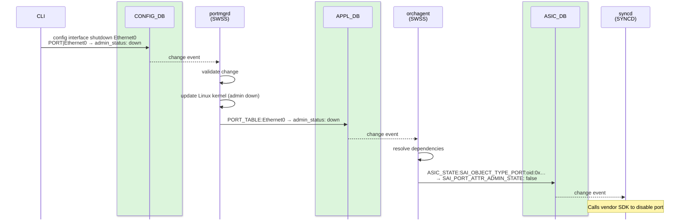

# Core Redis Databases in SONiC

We introduced all of SONiC's logical databases in a [single reference table](08_database_container.md#logical-databases). This document takes the **core** databases from that list — the ones present on every SONiC system and central to the data pipeline — and explains each one in depth: what it stores, who writes to it, who reads from it, and how data flows between them.

The core databases form a pipeline that transforms user intent into hardware behavior. The [Architecture Overview](02_architecture_overview.md#the-orchestration-pipeline) illustrates this visually — in short: CONFIG_DB (what the user wants) → APPL_DB (what the control plane computed) → ASIC_DB (what the hardware should do).

STATE_DB and COUNTERS_DB sit outside this downward pipeline but form the **upward flow** — feedback from the hardware back to the control plane (see [Upward State Flow](02_architecture_overview.md#upward-state-flow)):

## CONFIG_DB

**Purpose**: Stores all user-generated configuration. This is the **source of truth** for what the operator intends the switch to look like.

**Who writes**: CLI (`config` commands), REST API, gNMI, and the `config_db.json` file loaded at boot.

**Who reads**: Manager daemons in the SWSS container (`portmgrd`, `intfmgrd`, `vlanmgrd`, etc.).

**Persistence**: CONFIG_DB can be saved to `/etc/sonic/config_db.json` on disk, but this does **not** happen automatically. The operator must explicitly run `config save` to write the current CONFIG_DB contents to the file. Until then, any changes made at runtime exist only in Redis memory — a reboot without saving will lose them. At startup, the database container loads this file back into CONFIG_DB (see [The Database Container — Startup and Readiness](08_database_container.md#startup-and-readiness)), so the saved file represents the configuration the switch will boot with.

**Key format**: `TABLE_NAME|KEY|SUB_KEY` (separator: `|`)

**Example entries**:

```
PORT|Ethernet0                      → { "admin_status": "up", "speed": "100000", "mtu": "9100" }
VLAN|Vlan100                        → { "vlanid": "100" }
VLAN_MEMBER|Vlan100|Ethernet4       → { "tagging_mode": "untagged" }
BGP_NEIGHBOR|10.0.0.1               → { "asn": "65001", "name": "spine1" }
INTERFACE|Ethernet0|10.0.0.2/31     → {}
```

> Why does CONFIG_DB use `|` instead of the more conventional `:`? Because CONFIG_DB is persisted to disk as JSON, and JSON uses `:` to separate keys from values. Using `|` avoids ambiguity when parsing the file. For the full explanation of separators across all databases, see [The Database Container — Key Structure and Separators](08_database_container.md#key-structure-and-separators).

**Key characteristics**:

- Data here is the **desired state** — what the system should look like, not what it currently looks like.

- Changes to CONFIG_DB trigger events that manager daemons pick up and process. The specific notification mechanism (key-space notifications via `SubscriberStateTable`) is covered in [IPC Mechanisms — Pattern 1](11_ipc_mechanisms.md#pattern-1-subscriberstatetable-key-space-notifications).

- A YANG check runs in the program that writes CONFIG_DB. Redis itself has no schema. RESTCONF, gNMI, KLISH, `config apply-patch`, and `config replace` check before writing. `config interface`, `config vlan`, `config load`, `sonic-cfggen --write-to-db`, and a direct Redis write store the fields as given. The full comparison is in [Configuration Management — YANG Validation](20_configuration_management.md#yang-validation).

## APPL_DB

**Purpose**: Stores processed application state — the output of control plane computation. Data in APPL_DB has been validated, transformed, and is ready for orchagent to consume.

**Who writes**: Two kinds of producers feed APPL_DB:
- **Manager daemons** (in the SWSS container) — transform CONFIG_DB entries. For example, `portmgrd` reads port configuration from CONFIG_DB, validates it, applies changes to the Linux kernel, and writes the result to APPL_DB.
- **Sync daemons** — bring external state into SONiC. For example, `fpmsyncd` (in the BGP container) takes routes computed by the FRR routing suite and writes them directly to APPL_DB, bypassing CONFIG_DB entirely.

**Who reads**: `orchagent` (the orchestration daemon in the SWSS container) is the main consumer.

**Key format**: `TABLE_NAME:KEY` (separator: `:`)

**Example entries**:

```
PORT_TABLE:Ethernet0               → { "admin_status": "up", "mtu": "9100", "speed": "100000" }
ROUTE_TABLE:10.1.0.0/24            → { "nexthop": "10.0.0.1", "ifname": "Ethernet0" }
NEIGH_TABLE:Ethernet0:10.0.0.1     → { "family": "IPv4", "neigh": "aa:bb:cc:dd:ee:ff" }
LAG_TABLE:PortChannel1             → { "admin_status": "up", "mtu": "9100" }
```

**Key characteristics**:

- This is the **south-bound entry point** for all applications that want to program the hardware. If an application needs the ASIC to do something, it writes to APPL_DB.

- APPL_DB data is already validated and ready for orchagent to translate into hardware instructions.

- Multiple producers can write to APPL_DB independently — routes from BGP, neighbors from the kernel, port state from configuration — all land here for orchagent to consume.

## ASIC_DB

**Purpose**: Stores the desired ASIC state in SAI (Switch Abstraction Interface) format. SAI is a vendor-agnostic API that describes hardware objects — ports, routes, ACL rules, queues — in a standardized way, regardless of which ASIC vendor the switch uses. ASIC_DB is the bridge between SONiC's vendor-agnostic control plane and the vendor-specific hardware.

**Who writes**: `orchagent` (through the `sairedis` library). Orchagent translates the application-friendly entries from APPL_DB into SAI object format and writes them here.

**Who reads**: `syncd` (the ASIC programming daemon in the SYNCD container), which takes SAI objects from ASIC_DB and calls the vendor SDK to program the physical hardware.

**Key format**: `ASIC_STATE:SAI_OBJECT_TYPE_*:oid:0x...` (separator: `:`)

**Example entries**:

```
ASIC_STATE:SAI_OBJECT_TYPE_ROUTE_ENTRY:{"dest":"10.1.0.0/24","switch_id":"...","vr":"..."}
    → { "SAI_ROUTE_ENTRY_ATTR_NEXT_HOP_ID": "oid:0x400000000064" }

ASIC_STATE:SAI_OBJECT_TYPE_PORT:oid:0x1000000000003
    → { "SAI_PORT_ATTR_ADMIN_STATE": "true", "SAI_PORT_ATTR_SPEED": "100000" }
```

**Key characteristics**:

- Data is in SAI object format — vendor-agnostic but hardware-oriented. A route is not described as "next hop 10.0.0.1 via Ethernet0" (as it would appear in APPL_DB) but as "next hop object ID 0x400000000064" — a reference to a SAI object that orchagent created earlier.

- Each entry represents a hardware object: a port, a route, a next-hop group, an ACL rule, a queue, and so on.

- Objects are identified by **OIDs** (Object IDs) — opaque 64-bit identifiers that orchagent assigns and syncd uses to track objects in the ASIC.

- After syncd programs the ASIC, it updates ASIC_DB with the response status, creating a feedback loop.

## STATE_DB

**Purpose**: Stores operational state and resolves cross-module dependencies. While CONFIG_DB holds what the system *should* look like and APPL_DB holds what the control plane *computed*, STATE_DB holds what the system *actually reports* about itself.

**Who writes**: Various daemons that observe the system's condition — `portsyncd` (port initialization status), `xcvrd` (transceiver information), and platform monitoring daemons in PMON (fan, PSU, and thermal data).

**Who reads**: Manager daemons and orchagent check STATE_DB to confirm that prerequisites are met before processing. Applications that need to verify hardware readiness also read from STATE_DB.

**Key format**: `TABLE_NAME|KEY` (separator: `|`)

**Example entries**:

```
PORT_TABLE|Ethernet0               → { "state": "ok" }
TRANSCEIVER_INFO|Ethernet0         → { "type": "QSFP28", "vendor": "...", "serial": "..." }
TRANSCEIVER_DOM_SENSOR|Ethernet0   → { "temperature": "35.5", "rx_power": "-1.2" }
FAN_INFO|fan1                      → { "speed": "6000", "status": "OK" }
```

**Key characteristics**:

- Used to **resolve dependencies** between features. A feature cannot use a resource that has not been initialized yet. Manager daemons check STATE_DB to confirm readiness before writing to APPL_DB.

- Contains hardware-reported operational data — transceiver type, optical power levels, fan speeds, and temperatures.

- Does not represent desired state. It represents **actual system state** as reported by the hardware and operating system.

**Dependency resolution example**:

Suppose the user has configured Ethernet0 as a member of Vlan100. The VLAN manager daemon (`vlanmgrd`) cannot add a port to a VLAN until that port is fully initialized. Here is how STATE_DB helps:

```
1. portsyncd detects that Ethernet0 has been initialized in the kernel
2. portsyncd writes to STATE_DB:  PORT_TABLE|Ethernet0 → { "state": "ok" }
3. vlanmgrd picks up the VLAN configuration from CONFIG_DB
4. Before acting, vlanmgrd checks STATE_DB: is Ethernet0 in state "ok"?
5. If yes → proceed to add the port to the VLAN and write to APPL_DB
6. If no  → wait and retry later
```

Without STATE_DB, `vlanmgrd` might try to configure a VLAN on a port that does not exist yet in the kernel, causing a failure.

## COUNTERS_DB

**Purpose**: Stores counters and statistics collected from the hardware. This is the primary source of operational telemetry data.

**Who writes**: `syncd`, through the **FlexCounter** mechanism. FlexCounter is a configurable polling system — it defines which hardware counters to read and how often. Syncd uses FlexCounter to periodically poll the ASIC for counter values and write them to COUNTERS_DB.

**Who reads**: The CLI (`show interfaces counters`), the telemetry container (for streaming to external collectors), and SNMP.

**Key format**: `COUNTERS:oid:0x...` or `COUNTERS:Ethernet0` (separator: `:`)

**Example entries**:

```
COUNTERS:oid:0x1000000000003
    → { "SAI_PORT_STAT_IF_IN_OCTETS": "123456789",
        "SAI_PORT_STAT_IF_OUT_OCTETS": "987654321",
        "SAI_PORT_STAT_IF_IN_ERRORS": "0" }
```

**Key characteristics**:

- Updated periodically at a configurable interval, typically every 1–10 seconds.

- Both read-heavy and write-heavy. In multi-instance deployments, COUNTERS_DB runs on its own Redis instance to prevent counter polling from adding latency to databases on the critical path like CONFIG_DB and APPL_DB. See [The Database Container — Why Use Multiple Instances?](08_database_container.md#why-use-multiple-instances) for details.

- Does not affect forwarding behavior — purely observational. Counters reflect what has already happened; changing a counter value in Redis has no effect on the ASIC.

## LOGLEVEL_DB

**Purpose**: Stores dynamic log level settings for SONiC daemons. Allows operators to increase or decrease logging verbosity at runtime without restarting any process.

**Example entries**:

```
ORCHAGENT_LOGLEVEL    → { "LOGLEVEL": "NOTICE" }
PORTSYNCD_LOGLEVEL    → { "LOGLEVEL": "INFO" }
```

**How operators use it**:

```bash
swssloglevel -l DEBUG -c orchagent
```

This command updates LOGLEVEL_DB. The target daemon detects the change and adjusts its logging immediately — no restart required. This is particularly useful during troubleshooting, when you need detailed logs from a specific daemon without disrupting the rest of the system.

## Data Flow Example: Configuring a Port

To see how these databases work together in practice, let's trace what happens when an operator shuts down a port:

```bash
admin@sonic:~$ config interface shutdown Ethernet0
```



The step-by-step details:

1. **CONFIG_DB** is updated:
   ```
   PORT|Ethernet0 → { "admin_status": "down", ... }
   ```

2. **portmgrd** (in the SWSS container) receives the CONFIG_DB change event:
   - Validates the change.
   - Updates the Linux kernel interface (brings it admin down).
   - Writes to **APPL_DB**:
     ```
     PORT_TABLE:Ethernet0 → { "admin_status": "down", ... }
     ```

3. **orchagent** receives the APPL_DB update:
   - Processes the port state change.
   - Calls the SAI API to set the port admin state to down.
   - This writes to **ASIC_DB**:
     ```
     ASIC_STATE:SAI_OBJECT_TYPE_PORT:oid:0x... → { "SAI_PORT_ATTR_ADMIN_STATE": "false" }
     ```

4. **syncd** receives the ASIC_DB update:
   - Calls the vendor SAI implementation, which in turn calls the vendor SDK to disable the port in hardware.
   - The physical port LED turns off.

5. Hardware counters stop incrementing for this port in **COUNTERS_DB**.

Each step in this flow uses a specific IPC pattern to deliver the notification between producer and consumer. For the exact patterns used at each stage (and how to debug when data gets stuck), see [IPC Mechanisms — Practical Example](11_ipc_mechanisms.md#practical-example-port-shutdown-flow).

## Summary Table

| Database    | ID | What It Stores                   | Written By                       | Read By                              |
|-------------|----|----------------------------------|----------------------------------|--------------------------------------|
| CONFIG_DB   | 4  | User intent / configuration      | CLI, REST, gNMI                  | Manager daemons                      |
| APPL_DB     | 0  | Processed application state      | Managers, sync daemons, fpmsyncd | Orchagent                            |
| ASIC_DB     | 1  | Hardware-ready SAI objects       | Orchagent (via sairedis)         | Syncd                                |
| STATE_DB    | 6  | Operational state / dependencies | Various daemons                  | Manager daemons, orchagent, applications |
| COUNTERS_DB | 2  | Hardware counters / statistics   | Syncd (FlexCounter)              | CLI, telemetry, SNMP                 |
| LOGLEVEL_DB | 3  | Dynamic log levels               | Operator tools                   | All daemons                          |

---

**Previous**: [← The Database Container](08_database_container.md) · **Next**: [Container Communication →](10_container_communication.md)
