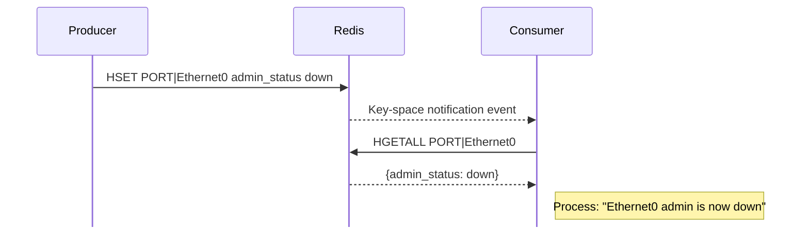
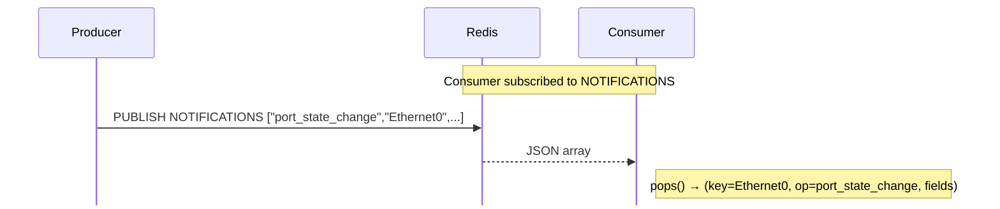
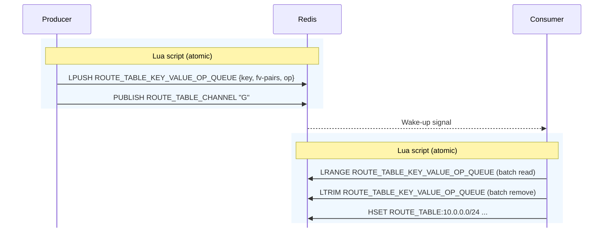
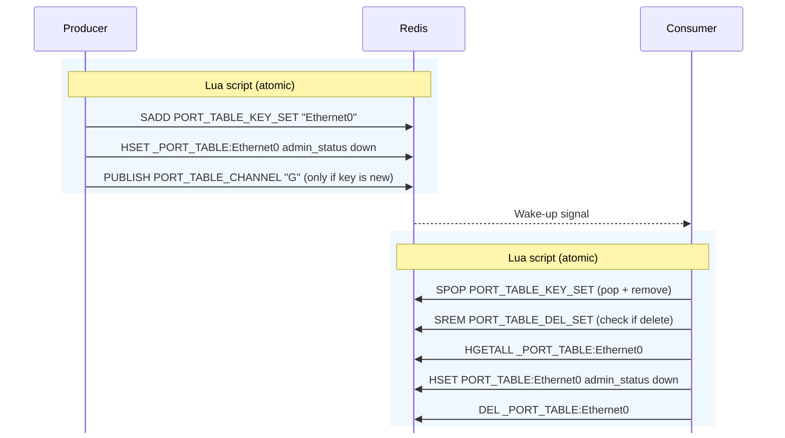
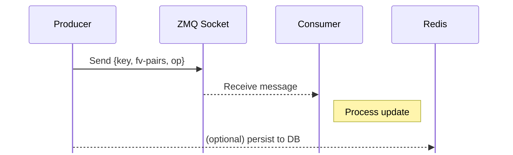
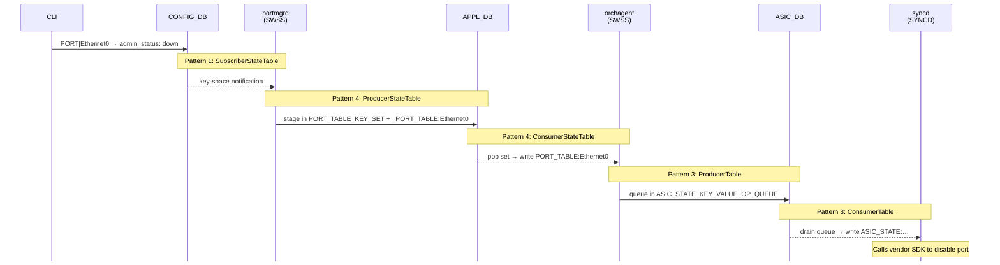

# Inter-Process Communication (IPC) Mechanisms

Inter-process communication (IPC) refers to the methods that separate programs use to exchange data. In SONiC, each container runs its own set of daemons, and those daemons coordinate by reading from and writing to Redis. [Container Communication](09_container_communication.md) established three key facts:

1. All container-to-container communication goes through Redis.

2. Raw Redis access works for simple reads and writes but falls short for daemons that must stay continuously in sync — it suffers from lost updates, churn, half-written objects, and the burden of locating the correct database.

3. A shared library called `swsscommon` solves these problems by providing reliable communication patterns on top of Redis.

This document picks up where that left off. It covers the **five distinct IPC patterns** that `swsscommon` provides, each suited to different use cases.

| # | Pattern | Typical use |
|---|---------|-------------|
| 1 | [SubscriberStateTable](#pattern-1-subscriberstatetable-key-space-notifications) | CONFIG_DB and STATE_DB changes |
| 2 | [NotificationProducer / NotificationConsumer](#pattern-2-notificationconsumer--notificationproducer) | Small events from syncd to orchagent |
| 3 | [ProducerTable / ConsumerTable](#pattern-3-producertable--consumertable-queue-based) | Ordered updates from orchagent to syncd (ASIC_DB) |
| 4 | [ProducerStateTable / ConsumerStateTable](#pattern-4-producerstatetable--consumerstatetable-hash-based) | Current state from application daemons to orchagent (APPL_DB) |
| 5 | [ZmqProducerStateTable / ZmqConsumerStateTable](#pattern-5-zmqproducerstatetable--zmqconsumerstatetable-zmq-based) | High-rate updates, such as bulk routes |

Understanding these patterns helps you answer a critical debugging question: *"I changed something in Redis — why didn't the system react?"* The answer almost always comes down to which IPC pattern is in use and whether the consumer is listening.

> **Prerequisite**: Understanding of Redis pub/sub and basic data types. See: [sonic-lab-redis](https://github.com/ManiAm/sonic-lab-redis)

## The Software Stack

Before examining the five patterns, it helps to see the layers they are built on. Recall from [The Image Hierarchy](04_container_build_time.md#the-image-hierarchy) that all containers inherit from `docker-config-engine`, which includes `swsscommon` — so every container has these libraries available out of the box:

```
┌─────────────────────────────────────────────────────────────────────────────────────────────┐
│  Application Code (orchagent, managers, etc.)                                               │
├─────────────────────────────────────────────────────────────────────────────────────────────┤
│  IPC classes                                                                                │  ← swsscommon
├─────────────────────────────────────────────────────────────────────────────────────────────┤
│  DB Abstraction (DBConnector, RedisSelect, RedisPipeline, RedisTransactioner, RedisContext) │  ← swsscommon
├─────────────────────────────────────────────────────────────────────────────────────────────┤
│  Client Library (hiredis - C/C++ Redis client)                                              │
├─────────────────────────────────────────────────────────────────────────────────────────────┤
│  Redis Server                                                                               │
└─────────────────────────────────────────────────────────────────────────────────────────────┘
```

### Key Layers

The following descriptions walk from the lowest layer (Redis) upward through the stack:

- **Redis**: The open-source in-memory data store that serves as the central data bus.

- **hiredis**: An open-source C client library that implements the Redis protocol for reading from and writing to a Redis server. It supports both synchronous and asynchronous operations. SONiC uses hiredis because its core daemons are written in C/C++, but Redis client libraries exist for many other programming languages — Python (`redis-py`), Go (`go-redis`), Java (`Jedis`, `Lettuce`), Node.js (`ioredis`), Rust (`redis-rs`), and more. For a complete list, see [Redis Client Libraries](https://github.com/ManiAm/sonic-lab-redis/blob/master/docs/13_redis_client_libs.md).

- **RedisContext**: A `swsscommon` class that wraps and maintains the underlying connection to Redis (the `redisContext` handle from hiredis). It handles connection setup and teardown — when a `RedisContext` object is destroyed, the connection is automatically closed. This is the most basic building block; every higher-level class depends on it.

- **DBConnector**: A `swsscommon` class that wraps `RedisContext` to connect to a specific Redis database. It provides methods for individual Redis commands such as `SET`, `GET`, `DEL`, `HSET`, `HGET`, and so on.

- **RedisTransactioner**: A `swsscommon` class that builds on `DBConnector` to wrap Redis transaction operations (`MULTI` / `EXEC`). It allows multiple commands to be queued and executed as a single atomic batch, ensuring that either all commands succeed together or none take effect.

- **RedisPipeline**: A `swsscommon` class that builds on `DBConnector` to provide an asynchronous interface for executing Redis commands. Instead of sending commands one at a time and waiting for each reply, it batches multiple commands and sends them in a single round trip. It also supports loading and executing Lua scripts inside Redis.

- **RedisSelect**: A `swsscommon` class that builds on `DBConnector` and implements the `Selectable` interface to support an `epoll`-based event notification mechanism. It blocks the calling thread until one of its monitored message queues has data to process, preventing busy-wait polling.


### The Table Concept

Redis has no native concept of a table. SONiC encodes structure into the Redis key string using a **table name**, a **key**, and optional **sub-keys** joined by a separator character. This convention is covered in detail in [Key Structure and Separators](07_database_container.md#key-structure-and-separators).

Beyond grouping related Redis keys, the table name also serves as:

- A **container** in the YANG schema for CONFIG_DB.
- An **Orch handler** in orchagent for APPL_DB.

## The Common Message Format

Every pattern's consumer returns the same C++ value from `pops()`: a **`KeyOpFieldsValuesTuple`**. The tuple has three parts, in this order:

- **Key** — which object changed (for example, `"Ethernet0"` or `"10.0.0.0/24"`).

- **Operation** — what to do with it. For key-space and state-table consumers this is `SET` (create or update) or `DEL` (remove). A notification or an ASIC-queue message carries the operation string the producer sent, which may be a name such as `port_state_change` or a hardware operation such as `create`.

- **Field-value pairs** — the attributes of that object (for example, `admin_status=down`).

What travels through Redis or ZeroMQ is not always this tuple. Each pattern below shows its own transport. `pops()` is where they meet.

## Pattern 1: SubscriberStateTable (Key-Space Notifications)

**Mechanism**: Uses Redis built-in [key-space notifications](https://github.com/ManiAm/sonic-lab-redis/blob/master/docs/07_redis_pub_sub.md#keyspace-notifications) — a feature where Redis automatically broadcasts an event whenever a key is created, modified, or deleted. This requires no extra code on the producer side; the notification happens as a side effect of any standard write command.

**How it works**:

1. A producer performs any write operation (`SET`, `HSET`, `DEL`) on a key in Redis.

2. Redis detects the write and automatically generates a key-space notification event for that key.

3. A subscriber that has registered interest in that table's key pattern receives the event. Its `pops()` call reads the hash and returns a [`KeyOpFieldsValuesTuple`](#the-common-message-format): the key, `SET`, and the fields now stored. A delete returns the key, `DEL`, and an empty field list.



**Used for**: Monitoring changes to CONFIG_DB and STATE_DB.

**Advantages**:
- Simple — relies entirely on built-in Redis functionality.
- No serialization required — the producer writes standard Redis fields, and the consumer reads them directly.
- Multiple subscribers can independently listen to the same events, making it well-suited for one-to-many notification patterns.

**Disadvantages**:
- **Missed events are not replayed**: Redis does not store the notification. Events that fire while the subscriber is down are gone. When the subscriber starts, the first `pops()` still returns one `SET` tuple for each key already in the table.

**SONiC class**: [`SubscriberStateTable`](https://github.com/sonic-net/sonic-swss-common/blob/master/common/subscriberstatetable.h) (in `swsscommon`)

## Pattern 2: NotificationConsumer / NotificationProducer

**Mechanism**: Uses Redis [`PUBLISH` / `SUBSCRIBE`](https://github.com/ManiAm/sonic-lab-redis/blob/master/docs/07_redis_pub_sub.md) commands directly. Unlike Pattern 1 where Redis generates events automatically, here the producer explicitly publishes a message on a named channel, and any subscriber on that channel receives it.

**How it works**:

1. The producer builds a JSON array — operation, data string, then field-value pairs — and calls Redis `PUBLISH` on a named channel. `NotificationProducer::send()` inserts the operation and data string as the first pair, so the array looks like `["port_state_change", "Ethernet0", ...]`.

2. The subscriber, which has an active `SUBSCRIBE` on that channel, receives the JSON array.

3. `pops()` returns a [`KeyOpFieldsValuesTuple`](#the-common-message-format). The data string is in the key position, followed by the operation and the remaining field-value pairs.



**Used for**: Asynchronous notifications from syncd to orchagent — port link-down events (from the ASIC), MAC learn events (FDB notifications), and BFD session state changes.

**Advantages**:
- Well-suited for small, event-driven notifications where the message itself carries all necessary data.
- No intermediate storage in Redis — the message travels directly from publisher to subscriber.

**Disadvantages**:
- **Serialization overhead**: Data must be converted to JSON by the producer and parsed back by the consumer. This adds CPU cost and makes the pattern unsuitable for large payloads.
- **Events are lost if the subscriber is down**: Redis does not keep the published message. There is no startup read of a table, because the notification was never stored as a key.

**SONiC classes**: [`NotificationProducer`](https://github.com/sonic-net/sonic-swss-common/blob/master/common/notificationproducer.h), [`NotificationConsumer`](https://github.com/sonic-net/sonic-swss-common/blob/master/common/notificationconsumer.h)

## Atomicity and Lua Scripts

The first two patterns each involve a single Redis command, so atomicity is not a concern. The remaining patterns stage data in temporary Redis structures and then move it to the real table — a multi-step process that requires multiple commands to execute as one indivisible operation. To see why, consider a consumer that must:

1. **Read** entries from a temporary staging area (e.g., a queue or a set).
2. **Remove** those entries from the staging area.
3. **Write** the data to the real table (e.g., `ASIC_STATE`).

If these are three separate Redis commands, there is a window between steps 2 and 3 where the data has been removed from the staging area but has not yet been written to the real table. During that window:

- Any client reading the real table sees **stale data** — the update has vanished from both the staging area and the table.
- If the consumer crashes between steps 2 and 3, the data is **lost permanently** — it was already removed from the staging area but never made it to the real table.

The same class of problem exists on the producer side. If a producer stages data and then sends a wake-up signal, but the signal never fires (e.g., a network glitch drops the second command), data sits in the staging area with no wake-up, and the consumer never processes it.

### The solution: Lua scripts

Redis provides several ways to achieve atomicity — [transactions](https://github.com/ManiAm/sonic-lab-redis/blob/master/docs/09_redis_transaction.md) (`MULTI`/`EXEC`) and [Lua scripting](https://github.com/ManiAm/sonic-lab-redis/blob/master/docs/10_redis_lua.md). SONiC uses Lua scripts because they offer something transactions cannot: **conditional logic**. A Lua script can read a value, make a decision based on it, and write a result — all atomically. Transactions can only batch a fixed sequence of commands.

When Redis executes a Lua script, it runs as a **single atomic operation** — no other client can read or write while the script is running. `swsscommon` wraps all multi-step producer and consumer logic inside Lua scripts, ensuring that data moves from the temporary staging area to the real table in one indivisible step. No client ever sees an intermediate state.

## Pattern 3: ProducerTable / ConsumerTable (Queue-Based)

**Mechanism**: Data is staged in a temporary Redis [list](https://github.com/ManiAm/sonic-lab-redis/blob/master/docs/02_redis_data_types.md#list) that acts as a message queue. The producer adds entries to the queue and sends a wake-up signal to the consumer via [pub/sub](https://github.com/ManiAm/sonic-lab-redis/blob/master/docs/07_redis_pub_sub.md).

**How it works**:

1. The producer writes a [`KeyOpFieldsValuesTuple`](#the-common-message-format) to a **temporary queue** in Redis (implemented as a Redis list) using `LPUSH`. The key, field-value pairs, and operation are JSON-serialized into a single queue entry. In the same atomic Lua script, the producer calls `PUBLISH` with a single character `"G"` on the table's channel. This message carries no data — it only serves to wake up the consumer.

2. The consumer receives the `"G"` signal and executes a Lua script that batch-reads entries from the queue (`LRANGE`), trims them off (`LTRIM`), and writes each entry to the real table (`HSET`) — all atomically.



**Used for**: Communication from orchagent to syncd via ASIC_DB.

**Key details**:
- The staging area is a Redis **list**, which enforces FIFO (first in, first out) ordering — the first message pushed is the first one popped.
- The queue key is formed by appending `_KEY_VALUE_OP_QUEUE` to the table name, for example: `ASIC_STATE_KEY_VALUE_OP_QUEUE`.

**Advantages**:
- **Maintains ordering**: Messages are processed in the exact order they were sent. This is essential for ASIC programming, where the order of create/modify/delete operations matters.
- **Data persists in the queue**: If the consumer is temporarily busy or restarting, messages wait in the Redis list rather than being lost.
- **Bulk processing**: The consumer can drain up to 128 entries from the queue at once (the `DEFAULT_POP_BATCH_SIZE`), amortizing the per-message overhead.

**Disadvantages**:
- JSON serialization and deserialization add CPU overhead.
- Each queue serves **one table only** — multiple tables require multiple producer/consumer pairs.
- Only **one consumer** can read from a given queue (since `LRANGE` + `LTRIM` is destructive — once entries are trimmed, they are gone).

**SONiC classes**: [`ProducerTable`](https://github.com/sonic-net/sonic-swss-common/blob/master/common/producertable.h), [`ConsumerTable`](https://github.com/sonic-net/sonic-swss-common/blob/master/common/consumertable.h)

**Lua scripts**: The producer bundles `LPUSH` + `PUBLISH` in [`producertable.cpp`](https://github.com/sonic-net/sonic-swss-common/blob/master/common/producertable.cpp). The consumer bundles read + trim + write-to-real-table in [`consumer_table_pops.lua`](https://github.com/sonic-net/sonic-swss-common/blob/master/common/consumer_table_pops.lua).

> If you see a non-empty queue in ASIC_DB (e.g., `ASIC_STATE_KEY_VALUE_OP_QUEUE`), it means syncd has pending messages it has not yet processed. This is a symptom of syncd being stuck or overloaded.

## Pattern 4: ProducerStateTable / ConsumerStateTable (Hash-Based)

**Mechanism**: Data is staged using a combination of two Redis data structures — a [set](https://github.com/ManiAm/sonic-lab-redis/blob/master/docs/02_redis_data_types.md#set) to track which keys have changed, and [hashes](https://github.com/ManiAm/sonic-lab-redis/blob/master/docs/02_redis_data_types.md#hash) to hold the staged field-value data for each key. The producer sends a wake-up signal to the consumer via [pub/sub](https://github.com/ManiAm/sonic-lab-redis/blob/master/docs/07_redis_pub_sub.md) after staging is complete.

**How it works**:

1. The producer executes a Lua script that adds the key name to a temporary **key set** (`SADD`) and writes the field-value pairs to a temporary **hash** (`HSET`) prefixed with an underscore. If the key is **newly added** to the set (i.e., `SADD` returns 1), the script also calls `PUBLISH` to wake up the consumer. If the key was already in the set, no publish is needed — the consumer already knows about it from a prior signal.

2. The consumer executes a Lua script that pops pending key names from the key set (`SPOP` — which reads and removes in one step). For each key, it first checks a separate **del set** — if the key was marked for deletion by the producer, the script removes the existing entry from the real table (`DEL`). It then retrieves the field-value pairs from the corresponding temporary hash (`HGETALL`), writes them to the actual table (`HSET`), and deletes the temporary hash (`DEL`). If the temporary hash is empty (i.e., the key was a delete), `pops()` returns `DEL_COMMAND` as the operation.



**Used for**: Communication from application daemons — both manager daemons and sync daemons — to APPL_DB, where orchagent consumes the updates.

**Key details**:
- Uses a Redis **SET** for tracking changed keys and Redis **HASHes** for staging data, rather than a list. Each table has its own distinctly named key set and temp hashes.
- The key set name is formed by appending `_KEY_SET` to the table name, for example: `PORT_TABLE_KEY_SET`. A separate del set (`PORT_TABLE_DEL_SET`) tracks keys that were deleted. The temporary hashes use an underscore prefix, for example: `_PORT_TABLE:Ethernet0`.
- A Redis set stores each member only once, and writing to a hash overwrites any previous value for the same field. If multiple updates arrive for the same key before the consumer processes them, only the latest field-values survive.

**Advantages**:
- **Natural deduplication**: Because the staging structures collapse repeated writes to the same key, a thousand rapid changes produce one unit of work for the consumer. This is the pattern that solves the [churn problem](09_container_communication.md#where-raw-redis-falls-short) described in the previous document.
- **Supports multiple tables** from multiple producers simultaneously — each table has its own key set and temp hashes, so they coexist without interference.
- Less JSON serialization compared to Pattern 3, since field-value pairs are stored natively in Redis hashes.

**Disadvantages**:
- **No ordering guarantee**: If a port goes up, down, up, down in rapid succession and the consumer has not yet processed any of these updates, only the last state is kept. The consumer never sees the intermediate states. If ordering matters, the application layer must handle it explicitly.

**SONiC classes**: [`ProducerStateTable`](https://github.com/sonic-net/sonic-swss-common/blob/master/common/producerstatetable.h), [`ConsumerStateTable`](https://github.com/sonic-net/sonic-swss-common/blob/master/common/consumerstatetable.h)

**Lua scripts**: The producer bundles `SADD` + `HSET` + `PUBLISH` in [`producerstatetable.cpp`](https://github.com/sonic-net/sonic-swss-common/blob/master/common/producerstatetable.cpp). The consumer bundles pop-from-set + read-temp-hashes + write-to-real-table + cleanup in [`consumer_state_table_pops.lua`](https://github.com/sonic-net/sonic-swss-common/blob/master/common/consumer_state_table_pops.lua).

> If you see entries with underscore prefixes in APPL_DB (e.g., `_PORT_TABLE:Ethernet0`), orchagent has pending messages to process. This typically indicates orchagent is stuck or overloaded — and often correlates with `orchagent: task_timeout` syslog messages.

## Pattern 5: ZmqProducerStateTable / ZmqConsumerStateTable (ZMQ-Based)

**Mechanism**: A high-performance variant of Pattern 4 that replaces the Redis pub/sub wake-up signal with [ZeroMQ](https://zeromq.org/) (ZMQ) messaging. The producer sends data directly to the consumer over a ZMQ socket, bypassing Redis for the notification path entirely.

**How it works**:

1. The producer serializes a [`KeyOpFieldsValuesTuple`](#the-common-message-format) into a ZMQ message and sends it directly to the consumer over a ZMQ socket.

2. The consumer receives the ZMQ message, deserializes it, and processes the update.

3. Optionally, the producer also writes the data to Redis for persistence (controlled by the `dbPersistence` flag), so that other tools and daemons can still read the current state from the database.



**Used for**: Performance-critical paths where Redis round-trip latency is too high — for example, bulk route updates from `fpmsyncd` to orchagent.

**Key details**:
- The notification travels over a ZMQ socket (TCP), not through Redis. This removes Redis as a bottleneck on the notification path.
- `ZmqProducerStateTable` extends `ProducerStateTable`, so it inherits the same set+hash staging semantics when DB persistence is enabled.
- `ZmqConsumerStateTable` implements `Selectable`, so it integrates with the same `Select` event loop used by all other patterns.

**Advantages**:
- **Lower latency**: The producer sends data directly to the consumer without a Redis intermediary, reducing per-message overhead.
- **Higher throughput**: Batched sends and receives over ZMQ are more efficient than Redis pub/sub for large volumes of updates.
- **Same API**: Extends the Pattern 4 classes, so application code requires minimal changes to adopt it.

**Disadvantages**:
- **Additional dependency**: Requires a ZMQ server and client to be set up alongside Redis.
- **Point-to-point**: Unlike Redis pub/sub, ZMQ messages go to a single consumer — no native fan-out to multiple subscribers.

**SONiC classes**: [`ZmqProducerStateTable`](https://github.com/sonic-net/sonic-swss-common/blob/master/common/zmqproducerstatetable.h), [`ZmqConsumerStateTable`](https://github.com/sonic-net/sonic-swss-common/blob/master/common/zmqconsumerstatetable.h)

## Comparison Summary

| Pattern | Staging | Ordering | Fan-Out | Multi-Table | Primary Use Case |
|---------|---------|----------|---------|-------------|------------------|
| SubscriberStateTable | None (fire-and-forget) | N/A | Yes | Yes | CONFIG_DB / STATE_DB → manager daemons |
| NotificationConsumer | None (fire-and-forget) | N/A | Yes | N/A | Syncd → orchagent (small ASIC events) |
| ProducerTable / ConsumerTable | Redis list (queued until consumed) | Guaranteed | No | No (one per table) | Orchagent → syncd (ASIC_DB) |
| ProducerStateTable / ConsumerStateTable | Redis set + hashes (staged until consumed) | Not guaranteed | No | Yes | App daemons → orchagent (APPL_DB) |
| ZmqProducerStateTable / ZmqConsumerStateTable | ZMQ socket (+ optional Redis persistence) | Not guaranteed | No | Yes | High-throughput paths (e.g., bulk route updates) |

**Column definitions**:

- **Staging**: How data moves from producer to consumer, and whether it survives if the consumer is temporarily unavailable. Patterns 1–2 have no intermediate storage — events are fire-and-forget. Patterns 3–4 stage data in Redis, where it waits until the consumer processes it. Pattern 5 sends via ZMQ (which does not persist), but can optionally write to Redis for durability.

- **Ordering**: Whether messages are delivered to the consumer in the order the producer sent them. Only Pattern 3 (queue-based) guarantees this.

- **Fan-Out**: Whether multiple consumers can independently receive the same data. Patterns 1–2 use broadcast mechanisms (key-space notifications, pub/sub), so any number of consumers can listen. Patterns 3–5 use destructive reads, so only one consumer can process each message.

- **Multi-Table**: Whether a single consumer instance can handle updates from multiple tables through this pattern. Pattern 4 supports this natively — orchagent processes PORT_TABLE, ROUTE_TABLE, and others in one pass. Pattern 3 requires a separate queue per table.

## Practical Example: Port Shutdown Flow

When you run `config interface shutdown Ethernet0`, the command travels through the entire pipeline, crossing multiple IPC patterns along the way. This is the same flow shown in [Data Flow Example: Configuring a Port](08_redis_databases.md#data-flow-example-configuring-a-port), but here the emphasis is on the IPC pattern at each hop rather than the databases:



This example illustrates two important points. First, a single user action can traverse multiple IPC patterns end to end — Pattern 1 at the top, Pattern 4 in the middle, and Pattern 3 at the bottom. Second, understanding these patterns is crucial for debugging: when something is not working, checking for pending entries in Redis — underscore-prefixed temp hashes (e.g., `_PORT_TABLE:Ethernet0`) or non-empty queues (e.g., `ASIC_STATE_KEY_VALUE_OP_QUEUE`) — tells you exactly where in the pipeline things are stuck.

---

**Previous**: [← Container Communication](09_container_communication.md) · **Next**: [The SWSS Container →](11_swss_container.md)
