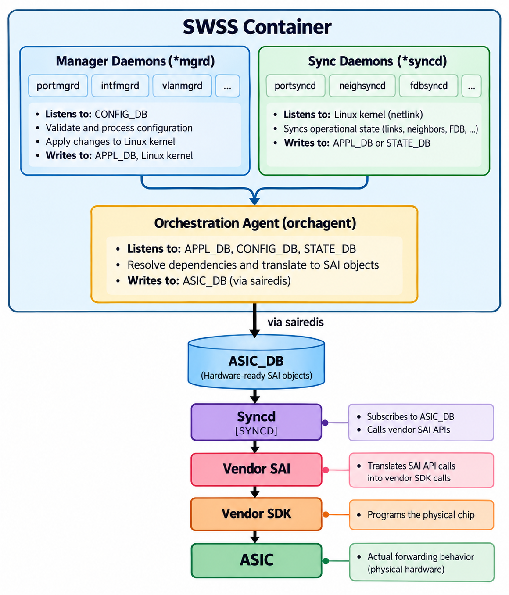

# The SWSS Container (Switch State Service)

The SWSS (Switch State Service) container is the **heart of SONiC's control plane**. It hosts the processes that bridge between applications (routing, configuration) and the hardware (ASIC). If the database container is SONiC's backbone, SWSS is its brain.

> **Prerequisites**: [Core Redis Databases](08_redis_databases.md) (CONFIG_DB, APPL_DB, ASIC_DB roles) and [IPC Mechanisms](10_ipc_mechanisms.md) (the five messaging patterns). This document references Pattern 1 (SubscriberStateTable) and Pattern 4 (ProducerStateTable) by name.

## What's Inside SWSS

The SWSS container runs three categories of processes:

Manager daemons and sync daemons are **independent entry points** that both feed orchagent:

- **Manager daemons** fire when CONFIG_DB changes (operator-driven). They validate the configuration, apply it to the Linux kernel, and write processed state to APPL_DB.

- **Sync daemons** fire when the kernel or a control-plane daemon produces an event (protocol-driven). They translate real-time system events — learned routes, resolved neighbors, discovered MACs — into APPL_DB entries.

- **Orchagent** is the central consumer. APPL_DB is its primary input (fed by both manager and sync daemons), but its individual Orch modules also subscribe directly to CONFIG_DB tables and STATE_DB tables. It resolves cross-feature dependencies and programs the ASIC via sairedis.

There is no fixed ordering between manager daemons and sync daemons — they run concurrently and serve different triggers.

## Manager Daemons (*mgrd)

Manager daemons handle **CONFIG_DB updates** and transform them into operational state. Their naming convention is `*mgrd` (manager daemon). Each daemon subscribes to specific CONFIG_DB tables (via SubscriberStateTable), validates the incoming configuration, applies it to the Linux kernel, and pushes the processed result to APPL_DB (via ProducerStateTable) for orchagent to consume.

| Daemon       | CONFIG_DB Tables                                            | What It Does                               |
|--------------|-------------------------------------------------------------|--------------------------------------------|
| `portmgrd`   | PORT                                                        | Configures port admin state, MTU, speed in kernel + APPL_DB |
| `intfmgrd`   | INTERFACE, LOOPBACK_INTERFACE                               | Configures IP addresses on interfaces |
| `vlanmgrd`   | VLAN, VLAN_MEMBER                                           | Creates VLAN devices in kernel, updates APPL_DB |
| `buffmgrd`   | BUFFER_POOL, BUFFER_PROFILE, BUFFER_PG                      | Configures buffer pool, profile, and priority group settings |
| `vrfmgrd`    | VRF                                                         | Creates VRF devices in the kernel |
| `coppmgrd`   | COPP_TRAP, COPP_GROUP, FEATURE                              | Configures control-plane policing (CoPP) trap groups and rates |
| `nbrmgrd`    | NEIGH                                                       | Manages static neighbor entries |
| `teammgrd`   | LAG, LAG_MEMBER                                             | Manages LAG (port-channel) interfaces and member ports |
| `tunnelmgrd` | TUNNEL, LOOPBACK_INTERFACE                                  | Configures IP-in-IP and other tunnel interfaces |
| `vxlanmgrd`  | VNET, VXLAN_TUNNEL, VXLAN_TUNNEL_MAP, VXLAN_EVPN_NVO        | Configures VxLAN tunnels and EVPN NVO mappings |
| `natmgrd`    | STATIC_NAT, STATIC_NAPT, NAT_POOL, NAT_BINDINGS, NAT_GLOBAL | Configures static and dynamic NAT/NAPT rules |
| `sflowmgrd`  | SFLOW, SFLOW_SESSION, PORT                                  | Configures sFlow sampling and collector sessions |
| `macsecmgrd` | MACSEC_PROFILE, PORT                                        | Configures MACsec encryption profiles on ports |
| `fabricmgrd` | FABRIC_MONITOR_DATA, FABRIC_MONITOR_PORT                    | Monitors fabric links (chassis systems) |
| `stpmgrd`    | STP_GLOBAL, STP_VLAN, STP_VLAN_PORT, STP_PORT               | Configures Spanning Tree Protocol parameters |

## Sync Daemons (*syncd in SWSS)

> **Note**: Don't confuse these with the `syncd` process in the Syncd container (covered in [SAI and Syncd](13_sai_and_syncd.md)). The naming is unfortunately similar.

Sync daemons handle **events from the Linux kernel or control-plane daemons**, translating real-time system state into database entries. Each daemon listens to a specific event source — typically a netlink socket for kernel events or a protocol-specific socket such as the FPM socket from FRR's zebra — parses incoming messages into key-value records, and publishes them to APPL_DB or STATE_DB.

Sync daemons that run **inside the SWSS container**:

| Daemon       | What It Listens To                          | What It Writes |
|--------------|---------------------------------------------|----------------|
| `portsyncd`  | Port netlink events, CONFIG_DB (PORT table) | `APPL_DB` (PORT_TABLE), STATE_DB |
| `neighsyncd` | ARP/NDP neighbor netlink events             | `APPL_DB` (NEIGH_TABLE) |
| `fdbsyncd`   | EVPN VxLAN FDB/VNI netlink and state events | `APPL_DB` (VXLAN_FDB_TABLE, VXLAN_REMOTE_VNI_TABLE) |
| `gearsyncd`  | Gearbox PHY config (gearbox_config.json)    | `APPL_DB` (GEARBOX_TABLE) |

Sync daemons that follow the same pattern but run in **other feature containers**:

| Daemon       | What It Listens To           | Container |  What It Writes |
|--------------|------------------------------|-----------|-----------------|
| `fpmsyncd`   | FRR/zebra FPM socket         | BGP       | `APPL_DB` (ROUTE_TABLE, LABEL_ROUTE_TABLE, SRV6 tables) |
| `teamsyncd`  | LAG member state via libteam | teamd     | `APPL_DB` (LAG_TABLE, LAG_MEMBER_TABLE) |
| `lldp_syncd` | LLDP daemon state            | LLDP      | `APPL_DB` (LLDP_ENTRY_TABLE) |
| `natsyncd`   | NAT conntrack netlink events | NAT       | `APPL_DB` (NAT_TABLE, NAPT_TABLE) |
| `mclagsyncd` | MCLAG peer state via ICCPd   | iccpd     | `APPL_DB` (MCLAG_FDB_TABLE, INTF_TABLE), STATE_DB |

## Orchagent (The Orchestration Agent)

Orchagent is the **single most critical process** in SONiC. It is built from independent modules called `Orchs`, each responsible for a specific feature (ports, routes, ACLs, QoS, etc.). APPL_DB is the primary input — carrying processed configuration from manager daemons and learned state from sync daemons — but many Orchs also subscribe directly to CONFIG_DB and STATE_DB. Orchagent resolves dependencies between network objects, translates the combined intent into SAI (Switch Abstraction Interface) calls, and pushes the resulting SAI objects into ASIC_DB for syncd to program the hardware.

Orchagent is covered in full detail in [Orchagent Deep Dive](12_orchagent.md).

## The SWSS Container Start Sequence

When SWSS starts:

1. Depends on the database container (must be running first).
2. The entrypoint script starts supervisord.
3. supervisord starts all manager daemons, sync daemons, and orchagent.
4. portsyncd reads the PORT table from CONFIG_DB and publishes it to APPL_DB.
5. orchagent waits for portsyncd to signal that all ports are initialized.
6. Once ports are ready, orchagent begins processing all other APPL_DB events.

## Summary

| Component       | Reads From                    | Writes To             | Input                    | Output |
|-----------------|-------------------------------|-----------------------|--------------------------|--------|
| Manager daemons | CONFIG_DB                     | APPL_DB, Linux kernel | User configuration       | Processed state + kernel config |
| Sync daemons    | Linux kernel (netlink)        | APPL_DB, STATE_DB     | Netlink events           | Application-ready state |
| Orchagent       | APPL_DB, CONFIG_DB, STATE_DB  | ASIC_DB               | Processed + direct state | SAI objects for hardware |

---

**Previous**: [← IPC Mechanisms](10_ipc_mechanisms.md) · **Next**: [Orchagent Deep Dive →](12_orchagent.md)
