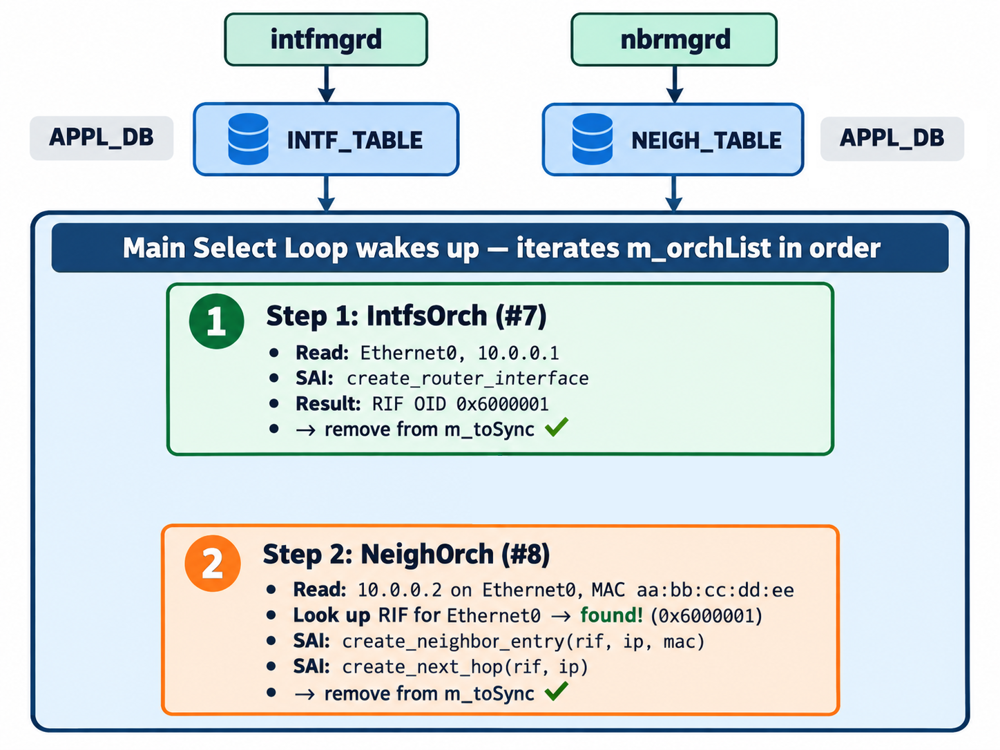

# Orchagent Deep Dive

> **Prerequisite**: [The SWSS Container](11_swss_container.md) — understand the three process categories (managers, sync daemons, orchagent) and how they interact.

Orchagent is the most critical and complex process in SONiC. As shown in the [SWSS container diagram](11_swss_container.md#whats-inside-swss), it sits at the convergence point of both manager daemons and sync daemons — consuming intent from APPL_DB, CONFIG_DB, and STATE_DB, resolving cross-feature dependencies, and programming the ASIC by writing to ASIC_DB through the sairedis library.

## How an Orch Works

Orchagent is built from multiple independent modules called **Orchs**. Each Orch handles one specific feature or network object type. Before listing them all, it is important to understand the pattern they share — every Orch follows the same four-step lifecycle.

### 1. Registration

At startup, each Orch registers:
- Which **database** to listen to (APPL_DB, CONFIG_DB, etc.)
- Which **table(s)** to subscribe to
- Which **IPC pattern** to use — [ConsumerStateTable](10_ipc_mechanisms.md#pattern-4-producerstatetable--consumerstatetable-hash-based) for APPL_DB, [SubscriberStateTable](10_ipc_mechanisms.md#pattern-1-subscriberstatetable-key-space-notifications) for CONFIG_DB

```cpp
// Simplified example from orch.cpp
RouteOrch::RouteOrch(DBConnector *db, string tableName)
    : Orch(db, tableName)  // tableName = "ROUTE_TABLE"
{
    // Now subscribed to APPL_DB:ROUTE_TABLE events
}
```

### 2. Consumer Abstraction

The Orch base class wraps the IPC mechanism into a **Consumer** object. The Consumer handles all Redis interaction details — connecting, subscribing, reading data, and deserializing — so the Orch itself never deals with raw Redis commands.

### 3. Task Queue (m_toSync)

When new messages arrive, the Consumer places them in a **task queue** called `m_toSync`. Each entry is a [`KeyOpFieldsValuesTuple`](10_ipc_mechanisms.md#the-common-message-format) — the common message format shared by every IPC consumer in `swsscommon`.

The queue is a `std::multimap<std::string, KeyOpFieldsValuesTuple>`, keyed by the table entry key. A multimap (rather than a plain map) allows multiple operations on the same key to coexist — for example, a `DEL` followed by a `SET` on the same route.

Each tuple contains three fields:

- **Key**: The table entry key (e.g., `10.0.0.0/24` for a route)
- **Operation**: `SET` (create/update) or `DEL` (delete)
- **Field-value pairs**: The attributes (e.g., `nexthop=10.0.0.1, ifname=Ethernet0`)

### 4. doTask() — The Processing Loop

Each Orch implements a `doTask()` method that processes entries from the queue:

```cpp
void RouteOrch::doTask(Consumer &consumer)
{
    auto it = consumer.m_toSync.begin();
    while (it != consumer.m_toSync.end())
    {
        KeyOpFieldsValuesTuple t = it->second;
        string key = kfvKey(t);
        string op = kfvOp(t);
        auto fields = kfvFieldsValues(t);

        if (op == SET_COMMAND)
        {
            if (addRoute(key, fields))
            {
                it = consumer.m_toSync.erase(it);  // Success: remove from queue
            }
            else
            {
                it++;  // Retry later (dependency not met yet)
            }
        }
        else if (op == DEL_COMMAND)
        {
            removeRoute(key);
            it = consumer.m_toSync.erase(it);
        }
    }
}
```

**Key behavior**:
- If processing succeeds → the entry is removed from the queue.
- If processing fails (e.g., a dependency is not ready) → the entry stays in the queue for retry on the next iteration.
- This retry mechanism is how orchagent handles ordering issues — if a route arrives before its next-hop interface exists, the entry remains queued until the dependency is resolved.

## The Main Select Loop

All Orchs are registered in an **ordered list** (`m_orchList`) inside `OrchDaemon`. Orchagent's main function runs a single-threaded event loop that iterates this list on every pass:

```
forever:
    wait for a Redis notification (any subscribed table changed)
    for each Orch in m_orchList (in priority order):
        if this Orch has pending work:
            call orch->doTask()
```

All Orchs share this single thread — changes are applied sequentially, which avoids race conditions but means ordering matters. Each Orch must complete its `doTask()` quickly to avoid starving the others. The loop blocks until Redis signals that at least one subscribed table has new data, then gives every Orch with pending work a chance to run, in `m_orchList` order.

**The order of `m_orchList` matters.** If Orch A depends on objects created by Orch B, then B must appear before A in the list. For example, `PortsOrch` runs before `IntfsOrch` because you cannot create a router interface on a port that does not exist yet. The full dependency chain for L3 forwarding is:

```
SwitchOrch → PortsOrch → IntfsOrch → NeighOrch → NhgOrch → RouteOrch
```

Each Orch depends on SAI objects created by the ones to its left. If any link is missing, the downstream Orchs queue their work in `m_toSync` and retry on the next iteration (as described in [doTask()](#4-dotask--the-processing-loop) above).

### Worked Example: Two Orchs, One Loop Pass

An operator assigns IP `10.0.0.1/31` to `Ethernet0` and configures static neighbor `10.0.0.2` on the same interface. Two manager daemons react and write to APPL_DB at roughly the same time:

- **intfmgrd** writes to `INTF_TABLE` (consumed by IntfsOrch — position 7 in `m_orchList`)
- **nbrmgrd** writes to `NEIGH_TABLE` (consumed by NeighOrch — position 8 in `m_orchList`)

The select loop wakes up and both Orchs have pending work. Here is what happens:



Both succeed in a **single loop pass** because IntfsOrch (position 7) ran before NeighOrch (position 8) and created the RIF that the neighbor entry requires.

**What if the order were reversed?** If NeighOrch ran first, it would look up the RIF for `Ethernet0`, find nothing, and leave the entry in `m_toSync`. IntfsOrch would then create the RIF. On the *next* loop pass, NeighOrch would retry and succeed — but that extra iteration adds unnecessary latency. The correct `m_orchList` order avoids this by guaranteeing dependencies are satisfied first.

> **Key takeaway**: A single Redis notification can wake multiple Orchs. The select loop gives every Orch with pending work a turn, in `m_orchList` order. This ordering is the *primary* mechanism for dependency resolution; the `m_toSync` retry is the safety net for cases where data arrives across separate loop passes.

## SAI Interaction

When an Orch's `doTask()` needs to program the hardware, it calls SAI APIs:

```cpp
// Inside RouteOrch::addRoute()
sai_route_entry_t route_entry;
route_entry.destination = prefix;  // e.g., 10.0.0.0/24

sai_attribute_t attr;
attr.id = SAI_ROUTE_ENTRY_ATTR_NEXT_HOP_ID;
attr.value.oid = next_hop_oid;

sai_status_t status = sai_route_api->create_route_entry(&route_entry, 1, &attr);
```

These calls do not reach the ASIC directly. The **sairedis** library serializes each SAI call into a Redis entry in ASIC_DB. The syncd process in the SYNCD container reads those entries and executes the actual vendor SDK calls against the hardware.

> For the full details on sairedis serialization, syncd processing, and error handling, see [SAI and the Syncd Container](13_sai_and_syncd.md).

## Batch Processing and EntityBulker

The individual SAI call shown above works correctly for a single route, but it becomes a bottleneck when thousands of routes arrive at once — after a BGP session comes up or a reboot. Calling `create_route_entry()` one at a time means each route incurs the full cost of sairedis serialization, ASIC_DB write, syncd processing, and hardware programming before the next route begins. At scale, this per-route overhead dominates total convergence time.

Orchagent addresses this with two layers of batching: a **pop batch** that controls how many entries it reads from APPL_DB in one pass, and an **EntityBulker** that collects the resulting SAI operations and issues them as bulk hardware calls.

### The Pop Batch (`-b` Flag)

When the main select loop wakes orchagent, each Orch's Consumer calls `pops()` to drain pending entries from its APPL_DB queue. The `-b` flag (passed on the orchagent command line) sets the maximum number of entries drained per call. The default in SONiC is **1,024**:

```text
/usr/bin/orchagent -d /var/log/swss -b 1024 -s
```

This means `RouteOrch::doTask()` receives up to 1,024 routes in a single invocation. Without this flag, the consumer would drain entries one at a time (or at the `DEFAULT_POP_BATCH_SIZE` of 128 defined in [ConsumerStateTable](10_ipc_mechanisms.md#pattern-4-producerstatetable--consumerstatetable-hash-based)).

### EntityBulker — Deferring SAI Calls

Inside `doTask()`, orchagent does not call SAI immediately for each route. Instead, it collects the operations into an **EntityBulker** — a template class in the sairedis library that buffers SAI create, set, and remove operations until the batch is complete.

The flow within a single `doTask()` invocation:

1. **Iterate**: `RouteOrch::doTask()` loops through all 1,024 entries, calling `addRoute()` for each.

2. **Defer**: Each `addRoute()` does not call `sai_route_api->create_route_entry()` directly. Instead, it pushes the operation into the `EntityBulker<sai_route_api_t>` buffer.

3. **Flush**: After the loop completes, `EntityBulker::flush()` fires. It issues **bulk SAI calls** — `sai_bulk_create_route_entry()` — which sairedis serializes into `BULK_CREATE` entries on ASIC_DB. Syncd then executes these as a single vendor SDK call against the ASIC.

This deferred-flush pattern means 1,024 routes produce a small number of bulk hardware calls instead of 1,024 individual ones. The reduction in per-route overhead is substantial: each bulk call amortizes the syncd processing, ASIC table lookup, and sync-mode acknowledgment across hundreds of routes.

### The SAI Bulk Size (`-k` Flag)

`-k` sets the maximum number of entries in one SAI bulk call (`gMaxBulkSize`). When the flag is omitted, the default is **1,000**. EntityBulker uses that value when `flush()` splits the buffered operations into `sai_bulk_*` calls.

`-b` and `-k` are both orchagent command-line options, and they control different layers:

- **`-b`** — how many APPL_DB entries one `doTask()` drains.
- **`-k`** — how many of those entries go into one SAI bulk call.

A stock SONiC start passes `-b 1024` and omits `-k`, so a full pop of 1,024 routes flushes as two bulk calls:

- One bulk of **1,000** routes
- One bulk of the remaining **24** routes

Raising `-b` above the current `-k` does not enlarge each SAI call. It produces more of them per `doTask()`. Raising `-k` (for example `-k 65536`) raises the cap, up to whatever limit the vendor SAI accepts.

## The Notification Thread

Orchagent has a **dedicated notification thread** (separate from the main select loop) that handles asynchronous notifications from syncd:

| Event              | Description |
|--------------------|-------------|
| Port state change  | Link up/down from the optical/PHY layer |
| FDB event          | MAC address learned or aged out |
| Queue PFC deadlock | PFC watchdog detection |
| BFD session state  | BFD up/down transition |

These arrive via [NotificationConsumer](10_ipc_mechanisms.md#pattern-2-notificationconsumer--notificationproducer) and are processed in a separate thread to avoid blocking the main orchestration loop.

```
orchagent notification thread consumes the event
    ^
    │
NotificationProducer → publishes to ASIC_DB notification channel
    ^
    │
syncd notification handler
    ^
    │
Vendor SDK fires callback into syncd
    ^
    │
ASIC detects event (e.g., link down)
```

## CRM — Critical Resource Monitoring

CRM is SONiC's built-in system for tracking **ASIC table usage** — how many entries of each resource type are currently occupied and how many remain available. It is not a Linux kernel feature and not an ASIC-vendor feature; it is a SONiC-layer abstraction implemented as `CrmOrch`, a module inside orchagent.

### How CrmOrch Differs from Other Orchs

Most Orchs are **event-driven**: they wake when data arrives in their subscribed table, process the entries, and go idle. CrmOrch is **timer-driven**: it wakes on a configurable polling interval (default **300 seconds**), queries the ASIC for current resource usage, and publishes the results — regardless of whether any configuration changed. It does subscribe to the CONFIG_DB `CRM` table for threshold and interval settings, but its primary work runs on a timer, not on database events.

### The Data Flow

```text
CONFIG_DB                                     COUNTERS_DB
  CRM table               ┌──────────┐         CRM:STATS keys
  (polling interval,  ──► │ CrmOrch  │ ──►     (used / available
   threshold config)      │ (timer)  │          per resource type)
                          └────┬─────┘
                               │
                               ▼
                           SAI API
                     sai_object_type_
                     get_availability()
```

1. **Configuration.** An operator sets the polling interval and optional thresholds in CONFIG_DB — for example, `sudo crm config polling interval 1` changes the timer from 300 s to 1 s. CrmOrch reads these values on startup and updates them whenever the CONFIG_DB `CRM` table changes.

2. **Polling — two counters, two sources.** The two columns in CRM output come from different places:

    - **Available count** — read from the ASIC via standard SAI switch attributes (e.g., `SAI_SWITCH_ATTR_AVAILABLE_IPV4_ROUTE_ENTRY`). Every vendor SAI must implement these; the vendor library queries actual hardware table occupancy. These are lightweight, read-only queries that do not interfere with forwarding.

    - **Used count** — tracked in software by orchagent. Each Orch increments CRM's internal counter when it creates a SAI object and decrements it on removal. SAI defines `AVAILABLE` attributes but not `USED` attributes, because some ASIC-internal entries (default routes, SDK-created adjacencies) would skew the count. Software tracking keeps it consistent with what orchagent actually programmed.

    In practice, `used + available ≈ total capacity` (e.g., `37 + 147,419 = 147,456` IPv4 route entries on the DX010), but exact equality is not guaranteed since the two numbers come from different sources.

3. **Publishing.** CrmOrch writes both counters to COUNTERS_DB under `CRM:STATS` keys. The `crm` CLI tool (a Python script in the `sonic-utilities` package) reads these keys and formats the output:

    ```text
    admin@sonic:~$ crm show resources all

    Resource Name           Used Count    Available Count
    --------------------  ------------  -----------------
    ipv4_route                      37             147419
    ipv6_route                       3              16381
    ipv4_nexthop                     1              32765
    ipv6_nexthop                     0              32765
    ipv4_neighbor                    1               8191
    ipv6_neighbor                    0               4095
    nexthop_group_member             0              16384
    nexthop_group                    0                256
    fdb_entry                        0               8191
    ipmc_entry                       0               4096
    snat_entry                       0               1024
    dnat_entry                       0               1024
    ```

4. **Threshold alerts.** CRM can raise syslog warnings when a resource crosses a configured threshold. Thresholds can be defined as a percentage, an absolute used count, or an absolute free count, each with low and high watermarks. This is how operators detect that an ASIC table is approaching capacity before routes or neighbors start being silently dropped.

### What CRM Tracks

CRM monitors every major ASIC table type. The exact set of supported resources depends on the vendor SAI implementation — not every ASIC exposes every counter.

| Resource category | Examples |
|-------------------|------------------|
| Forwarding tables | IPv4 routes, IPv6 routes |
| Adjacencies       | IPv4 neighbors, IPv6 neighbors |
| Next-hop groups   | ECMP groups and their members |
| ACL resources     | ACL tables, ACL entries, ACL counters |
| L2 tables         | FDB (MAC address) entries |
| Multicast         | IPMC entries |
| NAT               | SNAT entries, DNAT entries |

### Why CRM Matters

CRM answers a question that no other SONiC component does: **how full is the ASIC?** The software databases (APPL_DB, ASIC_DB) track *intent* — what should be programmed. CRM tracks *reality* — what the hardware actually holds. This distinction makes it essential for three purposes:

- **Capacity planning** — detecting when you are approaching table limits before entries start being dropped.

- **Benchmarking** — the [BGP route-download benchmark](../benchmark/README.md) uses CRM's IPv4 route counter as the hardware-verified measurement source, polling it twice per second to track programming progress in real time.

- **Troubleshooting** — confirming that routes visible in software databases are actually present in hardware.

## The Orch Catalog

The tables below list every Orch instantiated by `OrchDaemon::init()`, grouped by function.

### Core Data Plane

These Orchs handle the objects that every packet depends on — ports, L2/L3 forwarding entries, and next-hop resolution.

| Orch Class  | DB      | Tables | What It Handles |
|-------------|---------|---|---|
| `PortsOrch` | APPL_DB | PORT_TABLE, VLAN_TABLE, VLAN_MEMBER_TABLE, LAG_TABLE, LAG_MEMBER_TABLE, SEND_TO_INGRESS_PORT_TABLE | Physical ports, VLANs, LAGs, host interfaces |
| `IntfsOrch` | APPL_DB | INTF_TABLE, SAG_TABLE | Router interfaces (L3), Static Anycast Gateway |
| `NeighOrch` | APPL_DB | NEIGH_TABLE | ARP/NDP neighbors, adjacencies |
| `RouteOrch` | APPL_DB | ROUTE_TABLE, LABEL_ROUTE_TABLE | IPv4/IPv6 routes, MPLS label routes, ECMP |
| `FdbOrch`   | APPL_DB | FDB_TABLE, VXLAN_FDB_TABLE, MCLAG_FDB_TABLE | MAC forwarding database |
| `NhgOrch`   | APPL_DB | NEXTHOP_GROUP_TABLE | Next-hop groups (ECMP) |
| `VRFOrch`   | APPL_DB, STATE_DB | VRF_TABLE, VRF_OBJECT_TABLE | VRF lifecycle and object tracking |

### Policy, QoS & Buffers

These Orchs enforce traffic policy — which packets are permitted, how they are queued, and how buffer resources are allocated.

| Orch Class    | DB | Tables | What It Handles |
|---------------|---|---|---|
| `AclOrch`     | CONFIG_DB, APPL_DB | ACL_TABLE, ACL_TABLE_TYPE, ACL_RULE (both DBs) | Access Control Lists |
| `QosOrch`     | CONFIG_DB | TC_TO_QUEUE_MAP, DSCP_TO_TC_MAP, DOT1P_TO_TC_MAP, SCHEDULER, WRED_PROFILE, QUEUE, PORT_QOS_MAP, and 7 more map tables | QoS maps, scheduling, WRED, PFC |
| `BufferOrch`  | APPL_DB | BUFFER_POOL_TABLE, BUFFER_PROFILE_TABLE, BUFFER_QUEUE_TABLE, BUFFER_PG_TABLE, BUFFER_PORT_INGRESS/EGRESS_PROFILE_LIST_TABLE | Buffer pools, profiles, PG/queue assignment |
| `CoppOrch`    | APPL_DB | COPP_TABLE | Control-plane policing trap groups |
| `PolicerOrch` | CONFIG_DB | POLICER, PORT_STORM_CONTROL | Traffic policers, storm control |
| `PbhOrch`     | CONFIG_DB | PBH_TABLE, PBH_RULE, PBH_HASH, PBH_HASH_FIELD | Policy-based hashing |

### Tunneling & Overlay

These Orchs manage tunnel encapsulation/decapsulation and virtual-network overlays.

| Orch Class | DB | Tables | What It Handles |
|---|---|---|---|
| `TunnelDecapOrch` | APPL_DB, CONFIG_DB, STATE_DB | TUNNEL_DECAP_TABLE, TUNNEL_DECAP_TERM_TABLE | IP-in-IP tunnel decapsulation |
| `VxlanTunnelOrch` | STATE_DB, APPL_DB | VXLAN_TUNNEL_TABLE | VxLAN tunnel endpoints |
| `VxlanTunnelMapOrch` | APPL_DB | VXLAN_TUNNEL_MAP_TABLE | VxLAN tunnel-to-VLAN mapping |
| `VxlanVrfMapOrch` | APPL_DB | VXLAN_VRF_TABLE | VxLAN-to-VRF mapping (L3 VxLAN) |
| `EvpnNvoOrch` | APPL_DB | VXLAN_EVPN_NVO_TABLE | EVPN Network Virtualization Overlay |
| `EvpnRemoteVniOrch` | APPL_DB | VXLAN_REMOTE_VNI_TABLE | Remote VxLAN VNI endpoints |
| `VNetOrch` | APPL_DB | VNET_TABLE | Virtual network definitions |
| `VNetRouteOrch` | APPL_DB | VNET_ROUTE_TABLE, VNET_ROUTE_TUNNEL_TABLE | VNET routes and tunnel routes |
| `VNetCfgRouteOrch` | CONFIG_DB | VNET_ROUTE, VNET_ROUTE_TUNNEL | VNET static routes (from config) |
| `NvgreTunnelOrch` | CONFIG_DB | NVGRE_TUNNEL | NVGRE tunnel endpoints |
| `NvgreTunnelMapOrch` | CONFIG_DB | NVGRE_TUNNEL_MAP | NVGRE tunnel-to-VSID mapping |

### Monitoring, Telemetry & Mirroring

These Orchs track resource usage, protocol health, and mirror traffic for analysis.

| Orch Class | DB | Tables | What It Handles |
|---|---|---|---|
| `CrmOrch` | CONFIG_DB | CRM | Critical resource monitoring thresholds |
| `MirrorOrch` | CONFIG_DB, STATE_DB | MIRROR_SESSION (config), MIRROR_SESSION_TABLE (state) | Port mirroring / ERSPAN |
| `BfdOrch` | APPL_DB, STATE_DB | BFD_SESSION_TABLE | BFD session management |
| `IcmpOrch` | APPL_DB, STATE_DB | ICMP_ECHO_SESSION_TABLE | ICMP echo session monitoring |
| `MonitorOrch` | STATE_DB | VNET_MONITOR_TABLE | VNET endpoint health probing |
| `BfdMonitorOrch` | STATE_DB | BFD_SESSION_TABLE | BFD-triggered VNET failover |
| `SflowOrch` | APPL_DB | SFLOW_TABLE, SFLOW_SESSION_TABLE, SFLOW_SAMPLE_RATE_TABLE | sFlow sampling and collectors |
| `TwampOrch` | CONFIG_DB, STATE_DB | TWAMP_SESSION (config), TWAMP_SESSION_TABLE (state) | TWAMP performance measurement |

### Security & Protocol Features

| Orch Class | DB | Tables | What It Handles |
|---|---|---|---|
| `MACsecOrch` | APPL_DB, STATE_DB | MACSEC_PORT_TABLE, MACSEC_EGRESS/INGRESS_SC_TABLE, MACSEC_EGRESS/INGRESS_SA_TABLE | MACsec encryption on ports |
| `NatOrch` | APPL_DB, STATE_DB | NAT_DNAT_POOL_TABLE, NAT_TABLE, NAPT_TABLE, NAT_TWICE_TABLE, NAPT_TWICE_TABLE, NAT_GLOBAL_TABLE | Static and dynamic NAT/NAPT |
| `StpOrch` | APPL_DB, STATE_DB | STP_VLAN_INSTANCE_TABLE, STP_PORT_STATE_TABLE, STP_FASTAGEING_FLUSH_TABLE, STP_INST_PORT_FLUSH_TABLE | Spanning Tree Protocol |
| `Srv6Orch` | APPL_DB, CONFIG_DB | SRV6_SID_LIST_TABLE, SRV6_MY_SID_TABLE, PIC_CONTEXT_TABLE (appl), SRV6_MY_SIDS (config) | SRv6 segment routing |

### Specialized Next-Hop Groups

> The primary `NhgOrch` (standard ECMP) is listed under [Core Data Plane](#core-data-plane). The Orchs below handle specialized next-hop group variants.

| Orch Class | DB | Tables | What It Handles |
|---|---|---|---|
| `FgNhgOrch` | CONFIG_DB | FG_NHG, FG_NHG_PREFIX, FG_NHG_MEMBER | Fine-grained ECMP (consistent hashing) |
| `CbfNhgOrch` | APPL_DB | CLASS_BASED_NEXT_HOP_GROUP_TABLE | Class-based forwarding NHGs |
| `NhgMapOrch` | APPL_DB | FC_TO_NHG_INDEX_MAP_TABLE | Forwarding-class-to-NHG index map |
| `L2NhgOrch` | APPL_DB | L2_NEXTHOP_GROUP_TABLE | L2 next-hop groups |

### Dual-ToR, Multi-Homing & MCLAG

| Orch Class | DB | Tables | What It Handles |
|---|---|---|---|
| `MuxOrch` | CONFIG_DB | MUX_CABLE, PEER_SWITCH | Dual-ToR MUX cable configuration |
| `MuxCableOrch` | APPL_DB, STATE_DB | MUX_CABLE_TABLE | Dual-ToR MUX cable switching |
| `MuxStateOrch` | STATE_DB | HW_MUX_CABLE_TABLE | Dual-ToR hardware MUX state |
| `EvpnMhOrch` | APPL_DB, CONFIG_DB | EVPN_DF_TABLE (appl), EVPN_ETHERNET_SEGMENT (config) | EVPN multi-homing DF election |
| `ShlOrch` | APPL_DB | EVPN_SPLIT_HORIZON_TABLE | EVPN split-horizon filtering |
| `IsoGrpOrch` | APPL_DB | ISOLATION_GROUP_TABLE | Port isolation groups |
| `MlagOrch` | CONFIG_DB | MCLAG_DOMAIN, MCLAG_INTERFACE | MCLAG domain and interface config |

### Switch Configuration & Counters

| Orch Class | DB | Tables | What It Handles |
|---|---|---|---|
| `SwitchOrch` | CONFIG_DB, APPL_DB | ASIC_SENSORS, SWITCH_HASH, SWITCH_TRIMMING, SWITCH_FAST_LINKUP, SUPPRESS_ASIC_SDK_HEALTH_EVENT (config), SWITCH_TABLE (appl) | Global switch attributes |
| `FlexCounterOrch` | CONFIG_DB | FLEX_COUNTER_TABLE, DEVICE_METADATA | Flex counter group enable/disable |
| `WatermarkOrch` | CONFIG_DB | WATERMARK_TABLE, FLEX_COUNTER_TABLE | Watermark telemetry intervals |
| `DebugCounterOrch` | CONFIG_DB | DEBUG_COUNTER, DEBUG_COUNTER_DROP_REASON, DEBUG_DROP_MONITOR | Debug drop counters |
| `PfcWdSwOrch` | CONFIG_DB | PFC_WD | PFC watchdog detection and mitigation |
| `BgpGlobalStateOrch` | CONFIG_DB | BGP_DEVICE_GLOBAL | BGP device-level global settings |
| `FlowCounterRouteOrch` | CONFIG_DB | FLOW_COUNTER_ROUTE_PATTERN | Per-route flow counter patterns |
| `ChassisOrch` | CONFIG_DB, APPL_DB | PASS_THROUGH_ROUTE_TABLE | Chassis pass-through route forwarding |

### Platform-Specific (Conditionally Loaded)

| Orch Class | DB | Tables | What It Handles |
|---|---|---|---|
| `FabricPortsOrch` | APPL_DB | FABRIC_PORT_TABLE, FABRIC_MONITOR_TABLE | Fabric port monitoring (VOQ chassis) |
| `DTelOrch` | CONFIG_DB | DTEL, DTEL_REPORT_SESSION, DTEL_INT_SESSION, DTEL_QUEUE_REPORT, DTEL_EVENT | Dataplane telemetry (Memory only) |
| `HFTelOrch` | CONFIG_DB, STATE_DB | HIGH_FREQUENCY_TELEMETRY_PROFILE, HIGH_FREQUENCY_TELEMETRY_GROUP | High-frequency telemetry |
| `P4Orch` | APPL_DB | P4RT_TABLE | P4Runtime programmable pipeline |
| `DashEniFwdOrch` | CONFIG_DB, APPL_DB | DASH_ENI_FORWARD_TABLE | DASH ENI forwarding (SmartSwitch only) |

> **Note**: DPU switch types load additional DASH-specific Orchs (`DashOrch`, `DashVnetOrch`, `DashRouteOrch`, `DashAclOrch`, `DashHaOrch`, `DashTunnelOrch`, `DashMeterOrch`, `DashPortMapOrch`, `DashHaFlowOrch`) — all subscribing to `DPU_APPL_DB` tables. Fabric switch types load only `FabricPortsOrch` and `FlexCounterOrch`.

---

**Previous**: [← The SWSS Container](11_swss_container.md) · **Next**: [SAI and Syncd →](13_sai_and_syncd.md)
