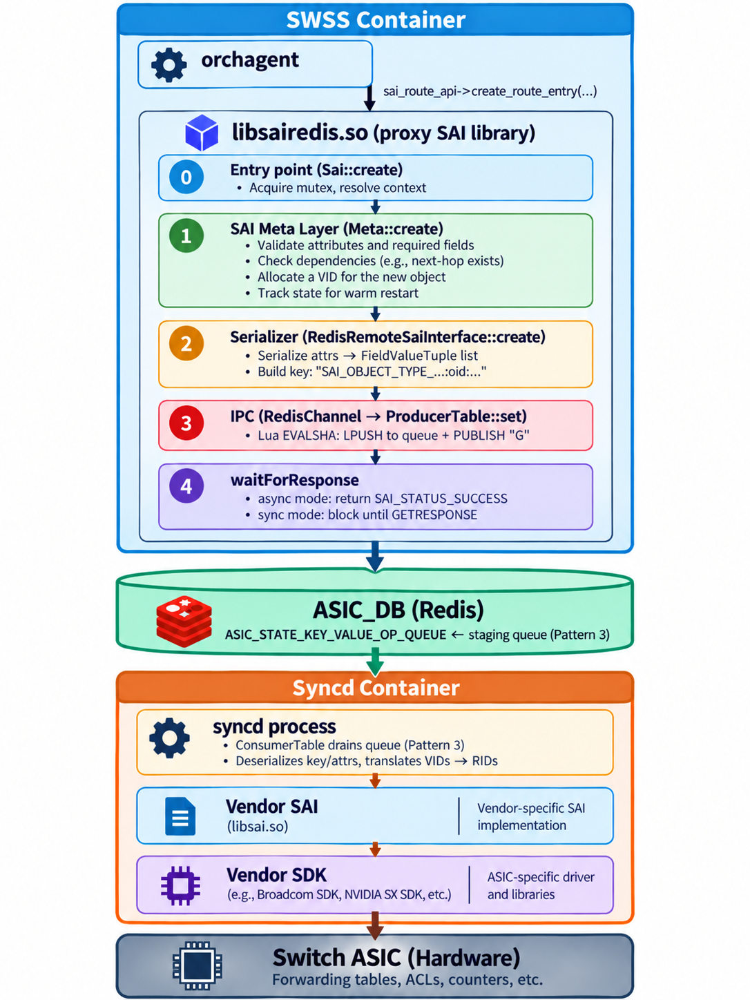

# SAI and the Syncd Container

> **Prerequisite**: [Orchagent Deep Dive](12_orchagent.md) — understand how orchagent makes SAI calls through the sairedis library.

SAI (Switch Abstraction Interface) is what makes SONiC vendor-independent. It defines a standard API for programming switch ASICs, regardless of which silicon vendor manufactured the chip. The syncd container is the process that executes these SAI calls against the actual hardware.

## What is SAI?

SAI is a **vendor-agnostic API** for controlling network forwarding elements (switch ASICs, NPUs, or software switches). It was created under the Open Compute Project (OCP) and defines:

- **Object types**: ports, routes, next-hops, ACLs, queues, buffers, etc.
- **Attributes**: properties of each object (e.g., a port has speed, admin state, MTU).
- **Operations**: create, remove, set, get for each object.
- **Notifications**: asynchronous events from hardware (link state, FDB, etc.).

### SAI Headers vs. Vendor Implementations

The SAI project publishes only **header files** (C `.h` files). These headers define the API contract: function signatures, object types, attribute enums, and data structures. They are maintained at: https://github.com/opencomputeproject/SAI

Each silicon vendor writes their own **implementation** of that API, compiled as a shared library (`libsai.so`):

- **Broadcom** targets the Broadcom SDK and ASICs (Tomahawk, Trident, etc.).
- **NVIDIA Mellanox** targets the SX SDK and Spectrum ASICs.

Both expose the exact same function signatures (e.g., `sai_create_route_entry()`), but internally the code is completely different because each vendor's SDK and ASIC architecture are different.

Think of it like a C interface: the header says "there must be a function called `sai_create_route_entry()` with these parameters," but it says nothing about *how* that function works. Each vendor fills in the body of that function with their own proprietary SDK calls.

This is what makes SONiC portable — orchagent calls the same SAI API regardless of the underlying hardware, and only the linked `libsai.so` changes from one platform to another.

Each SONiC release is tied to a SAI API **generation** (major.minor), fixed at release cut. The API surface — object types, attributes, function signatures — does not change within a generation. Patch revisions within that generation continue to be adopted on the release branch for bug fixes and metadata corrections (e.g., 202511 was cut at 1.17.0 but has since moved to 1.17.5). SONiC follows a **biannual release cadence** — one release in May and one in November each year — with releases named by year and month (`YYYYMM`).

| SONiC Release | SAI Generation (at cut) |
|---------------|-------------------------|
| 202006        | 1.6                     |
| 202012        | 1.7                     |
| 202106        | 1.8                     |
| 202111        | 1.9                     |
| 202205        | 1.10                    |
| 202211        | 1.11                    |
| 202305        | 1.12                    |
| 202311        | 1.13                    |
| 202405        | 1.14                    |
| 202411        | 1.15                    |
| 202505        | 1.16                    |
| 202511        | 1.17                    |

> **Note**: There is a weekly SAI community meeting (typically Thursdays) where vendors propose new attributes, object types, and enhancements.

### ASIC-Specific Syncd Containers

**How does SONiC know which `libsai.so` to use?** The decision is made entirely at **build time**.

When you build SONiC with `make PLATFORM=broadcom`, the build system pulls in Broadcom's SAI package and syncd container. Building with `PLATFORM=mellanox` does the same for NVIDIA's packages. The resulting SONiC image contains exactly one syncd container with exactly one vendor SAI library baked in.

| Container           | Vendor / ASIC                                  | SAI Package |
|---------------------|------------------------------------------------|-------------|
| `docker-syncd-brcm` | Broadcom (Tomahawk, Trident, etc.)             | `libsaibcm` |
| `docker-syncd-mlnx` | NVIDIA Mellanox Spectrum                       | `mlnx-sai`  |
| `docker-syncd-mrvl` | Marvell                                        | `mrvl-sai`  |
| `docker-syncd-vs`   | Virtual Switch (software datapath for testing) | `libsaivs`  |

## How SAI Works in SONiC

### Two SAI Libraries

A SONiC system has **two separate SAI libraries**, one on each side of ASIC_DB:

- **`libsairedis.so`** (SWSS container) — the library orchagent links against. It implements the same SAI function signatures as a real vendor SAI, but it never touches hardware. Instead, it validates the call through a built-in meta layer, then serializes it into a Redis entry and writes it to ASIC_DB.

- **`libsai.so`** (syncd container) — the vendor-provided SAI library that actually programs the ASIC. The syncd process reads entries from ASIC_DB and invokes the corresponding function in `libsai.so`, which translates the call into vendor-specific SDK operations on the hardware.

Orchagent does not know that it is talking to a proxy — it calls the standard SAI API, and the two libraries plus Redis handle the rest.

### Architecture Diagram



### Virtual IDs and Real IDs

Every SAI object has two identifiers:

- **VID (Virtual ID)**: Assigned by the sairedis meta layer in the SWSS container when orchagent creates an object. VIDs are used in orchagent's bookkeeping and in all references stored in ASIC_DB.

- **RID (Real ID)**: Assigned by the vendor SAI when syncd actually creates the object in hardware. RIDs are opaque handles meaningful only to the vendor SDK.

Syncd maintains a **VID↔RID mapping table**. When it receives a SAI operation referencing a VID, it translates the VID to the corresponding RID before calling the vendor SDK. When the vendor SDK returns a new RID (on object creation), syncd records the VID↔RID pair for future lookups.

This indirection is what enables warm restart: SONiC can compare the VID-based state it intends to program against the RID-based state already in hardware, reconciling only the differences.

### The SAI Meta Layer

Between orchagent's SAI call and the actual ASIC_DB write, there is a **meta validation layer** inside sairedis. It performs four key functions:

1. **Validates attributes**: If the SAI header defines an attribute as `uint32_t` but orchagent passes a boolean, the meta layer rejects the call before it reaches the ASIC.

2. **Checks dependencies**: If a route references a next-hop that does not exist, the meta layer rejects the call early — avoiding an expensive round-trip to the vendor SDK.

3. **Allocates VIDs**: Every new SAI object receives a Virtual ID (as described in [Virtual IDs and Real IDs](#virtual-ids-and-real-ids) above).

4. **Maintains state for warm restart**: The meta layer tracks all objects and their attributes, allowing SONiC to compare intended state against programmed state during warm restart reconciliation.

#### Common Meta Layer Errors

When you see syslog messages like:

```
SAI_STATUS_INVALID_PARAMETER: attribute type mismatch
SAI_STATUS_ITEM_NOT_FOUND: referenced object does not exist
```

These are typically caught at the meta layer — the call never reached the ASIC.

### Async vs. Sync Mode

After the meta layer validates the call and sairedis writes it to ASIC_DB, the `waitForResponse` step determines how orchagent handles the result. The mode is set at startup and cannot be changed at runtime.

#### Asynchronous Mode (Default)

In async mode, orchagent's SAI call returns `SAI_STATUS_SUCCESS` as soon as the request is queued in ASIC_DB — without waiting for syncd to process it. If the vendor SAI call subsequently fails in syncd:

- Syncd logs the error.
- Syncd calls `abort()` — intentionally crashing itself.
- This is a deliberate safety mechanism: an inconsistent state (where orchagent believes something is programmed but it is not) is more dangerous than a restart.
- The crash triggers container restart, which re-initializes the ASIC to a known state.

#### Synchronous Mode

In sync mode, orchagent's SAI call blocks until syncd processes it and returns a status code. If the vendor SAI call fails:

- Syncd sends the `SAI_STATUS_*` error code back to orchagent via a `GETRESPONSE` message.
- Orchagent decides what to do based on the specific error and object type (retry, ignore, or alert).
- No crash is needed — the error is handled gracefully at the application layer.

-----

## The Syncd Container

### What Syncd Does

The syncd container has two primary responsibilities:

1. **Programs the ASIC**: Reads SAI operations from ASIC_DB, translates VIDs to RIDs, and calls the vendor SAI to program hardware.

2. **Publishes hardware events**: When the ASIC reports events (link state changes, MAC learning), syncd sends notifications back to orchagent through Redis.

### Processing Loop

Syncd's main loop (`Syncd::run()`) blocks on a `select()` waiting for events from multiple sources: the ASIC_DB channel, a restart query, and flex counter tables. When a new ASIC_DB entry arrives, syncd drains all pending entries in a loop:

1. Pops the message (key, operation, fields) from the `ConsumerTable`.
2. Parses the key to extract the SAI object type and deserializes the attributes.
3. Translates VID references to RIDs in the attributes (except for GET, where attributes are output parameters).
4. Dispatches the call to the vendor SAI based on the operation type.
5. In sync mode, sends a `GETRESPONSE` back to orchagent with the status. In async mode, if the vendor SAI call fails, syncd calls `abort()` and crashes (see [Async vs. Sync Mode](#async-vs-sync-mode)).

```
while (true)
{
    sel = select();                    // Block until an event fires

    do {
        entry = consumer.pop();        // Read entry from queue

        switch (entry.operation)
        {
            case CREATE:
                translateVidToRid(entry.attrs);
                rid = vendorSai->create(entry);
                recordVidRidMapping(entry.vid, rid);
                break;

            case SET:
                translateVidToRid(entry.attrs);
                rid = translateVidToRid(entry.vid);
                vendorSai->set(rid, entry.attrs);
                break;

            case REMOVE:
                rid = translateVidToRid(entry.vid);
                vendorSai->remove(rid);
                eraseVidRidMapping(entry.vid, rid);
                break;

            case GET:
                rid = translateVidToRid(entry.vid);
                vendorSai->get(rid, entry.attrs);
                sendGetResponse(entry);
                break;
        }

        sendApiResponse(status);       // sync mode only
    }
    while (!consumer.empty());         // drain all pending entries
}
```

> **Note**: Beyond the four basic operations shown above, syncd also handles bulk operations (`BULK_CREATE`, `BULK_REMOVE`, `BULK_SET`), FDB flush, stats queries, and capability queries — all through the same dispatch mechanism.

An important detail: **syncd does not have special-case code per object type**. It uses the SAI metadata (`sai_metadata_get_object_type_info()`) to generically look up the correct function pointer for any object type. Whether the object is a route, a next-hop, or an ACL entry, the same code path handles deserialization, VID translation, and vendor SAI dispatch.

### Notification Path (Hardware → Software)

Syncd also acts as a **publisher**, forwarding hardware events to orchagent:

```
orchagent notification thread consumes the event
    ^
    │
NotificationProducer → publishes to ASIC_DB notification channel
    ^
    │
syncd notification handler
    ^
    │
Vendor SDK fires callback into syncd
    ^
    │
ASIC detects event (e.g., link down)
```

The main event types syncd publishes:

| Event              | Description |
|--------------------|-------------|
| Port state change  | Link up/down from the optical/PHY layer |
| FDB event          | MAC address learned or aged out |
| Queue PFC deadlock | PFC watchdog detection |
| BFD session state  | BFD up/down transition |

For details on how orchagent processes these notifications, see [The Notification Thread](12_orchagent.md#the-notification-thread).

-----

## Worked Example: From SAI Call to ASIC

To tie everything together, let's trace what happens when orchagent installs a route for `10.1.0.0/24` pointing to a next-hop.

### Step 1 — Orchagent Calls the SAI API

```cpp
sai_route_entry_t route_entry;
route_entry.switch_id   = switch_oid;        // VID of the switch object
route_entry.vr_id       = vr_oid;            // VID of the virtual router
route_entry.destination = {10.1.0.0/24};     // prefix

sai_attribute_t attr;
attr.id    = SAI_ROUTE_ENTRY_ATTR_NEXT_HOP_ID;
attr.value.oid = nexthop_oid;                // VID of the next-hop

sai_route_api->create_route_entry(&route_entry, 1, &attr);
```

Because orchagent is linked against **sairedis** (not the vendor SAI), this call does not touch the ASIC. The meta layer validates the call first, then sairedis serializes everything into strings.

### Step 2 — sairedis Writes to ASIC_DB

sairedis converts the SAI call into a Redis producer-consumer message on the `ASIC_STATE` table in ASIC_DB:

| Part          | Value                      |
|---------------|----------------------------|
| **Operation** | `create`                   |
| **Key**       | `SAI_OBJECT_TYPE_ROUTE_ENTRY:{"dest":"10.1.0.0/24","switch_id":"oid:0x21000000000000","vr":"oid:0x3000000000022"}` |
| **Fields**    | `SAI_ROUTE_ENTRY_ATTR_NEXT_HOP_ID` = `oid:0x400000000067c` |

Notice that:
- The **object type** is encoded in the key (`SAI_OBJECT_TYPE_ROUTE_ENTRY`).
- The **entry struct** (destination, switch, virtual router) is serialized as JSON.
- All object references are **VIDs** (the `oid:0x…` strings) — not hardware RIDs.
- The **operation** (`create`, `remove`, `set`, `get`) tells syncd which SAI function to call.

### Step 3 — Syncd Programs the ASIC

Syncd's main loop detects the new entry on the ASIC_DB channel and processes it through the [processing loop](#processing-loop) described above:

1. **Pop** the message from the queue.
2. **Parse** the key — extract `SAI_OBJECT_TYPE_ROUTE_ENTRY` and deserialize the JSON into a `sai_route_entry_t` struct.
3. **Deserialize** the fields — convert `SAI_ROUTE_ENTRY_ATTR_NEXT_HOP_ID` back to an attribute struct.
4. **Translate VIDs → RIDs** — look up each VID in the mapping table and replace it with the real hardware ID.
5. **Dispatch** — the operation is `create`, so syncd calls the vendor SAI's `sai_create_route_entry()`.
6. **Program hardware** — the vendor SAI translates the call into ASIC-specific SDK operations that write to the forwarding tables.

## The SAI API Surface

SAI defines APIs for many object types. Here are the main categories:

| Category       | SAI Object Types |
|----------------|-----------------|
| **Switching**  | Port, VLAN, FDB, STP, LAG |
| **Routing**    | Router Interface, Route, Next Hop, Next Hop Group, Virtual Router |
| **ACL**        | ACL Table, ACL Entry, ACL Counter |
| **QoS**        | Queue, Scheduler, Scheduler Group, Buffer, WRED |
| **Tunneling**  | Tunnel, Tunnel Map, Tunnel Term |
| **Monitoring** | Mirror Session, sFlow, TAM |
| **Security**   | MACsec, IPsec |

## Summary

| Component   | Location                 | Role                           |
|-------------|--------------------------|--------------------------------|
| SAI Headers | Shared (at compile time) | Define the vendor-agnostic API |
| sairedis    | SWSS container           | Serialize SAI calls to ASIC_DB |
| SAI Meta    | SWSS container           | Validate attributes and allocate VIDs |
| VID↔RID map | Syncd container          | Translate between virtual and real object IDs |
| syncd       | Syncd container          | Execute vendor SAI against the real SDK |
| Vendor SDK  | Syncd container          | Drive the physical ASIC |

---

**Previous**: [← Orchagent Deep Dive](12_orchagent.md) · **Next**: [The BGP Container and FRR →](14_bgp_container.md)
