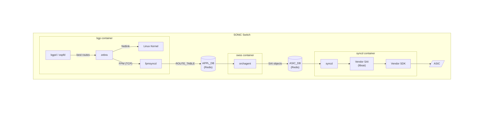
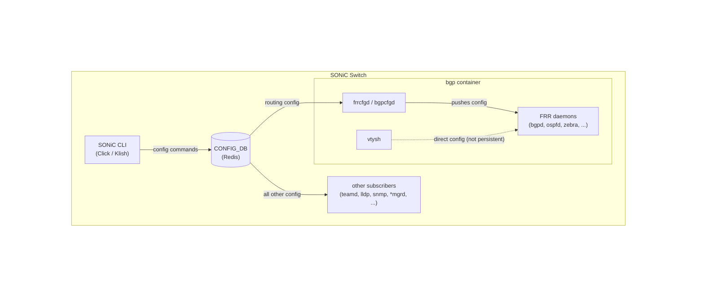

# The BGP Container and FRR in SONiC

The BGP container runs the routing stack in SONiC. Despite its name, it handles more than just BGP — it runs the full FRRouting (FRR) suite, which supports BGP, OSPF, IS-IS, static routes, and more.

> **Prerequisite**: [SAI and Syncd](14_sai_and_syncd.md) — understand SAI, syncd, and how SONiC programs the ASIC.

## FRRouting (FRR)

Before looking at the BGP container's architecture, you need to understand FRR — the routing engine that lives inside it.

[FRR](https://frrouting.org/) is an open-source routing protocol suite. It is a collection of daemons — each one speaks a different routing protocol to exchange reachability information with neighboring routers. SONiC uses FRR as its routing stack. For a deeper look at FRR itself — its architecture, the full list of protocol daemons, netlink, zebra, administrative distance, RIB, FIB — see the companion project [FRR-LabNet](https://github.com/ManiAm/FRR-LabNet). This section covers only what you need to understand the BGP container.

### Zebra — The Central Manager

Zebra is the **RIB manager** — the central coordinator inside FRR (see [FRR-LabNet — Zebra](https://github.com/ManiAm/FRR-LabNet/blob/master/FRRouting.md#zebra-the-route-manager) for background). The RIB (Routing Information Base) is the master table of all routes learned from every protocol. Zebra does not speak to external routers itself. Instead, all routing protocol daemons (bgpd, ospfd, etc.) send their best routes to zebra. Zebra then:

- **Selects the best route** across all protocols. When two protocols offer a route to the same destination, zebra picks the winner using administrative distance — a priority number assigned to each protocol (lower is preferred; e.g., static = 1, BGP = 20, OSPF = 110).

- **Installs the route** into the Linux kernel routing table via netlink.

On a standard Linux router, zebra's job ends here. The Linux kernel forwards packets based on its routing table, and that is sufficient.

On a network switch running SONiC, the situation is different. The Linux kernel is **not** responsible for forwarding data-plane traffic — the dedicated hardware ASIC is. The ASIC can forward millions of packets per second at wire speed, something the kernel cannot do. But the ASIC has no knowledge of routes unless someone explicitly programs them into it. Installing a route into the Linux kernel alone is not enough — the route must also reach the ASIC.

Zebra has a third output — the **FPM** (Forwarding Plane Manager) interface — which sends routes to **fpmsyncd**, a SONiC-specific daemon that bridges the gap between FRR and the ASIC programming pipeline. The next section explains how this works.

## fpmsyncd — The Bridge to SONiC

fpmsyncd is an SWSS sync daemon — part of the same `sonic-swss` codebase as orchagent and the other `*syncd` daemons — but it runs inside the BGP container rather than the SWSS container because it needs direct access to zebra's FPM socket. Its job is to connect zebra's route output to SONiC's Redis infrastructure.

fpmsyncd works as following:

1. At startup, fpmsyncd opens a TCP socket to zebra's FPM interface.
2. Zebra sends route updates (in netlink message format) through this socket.
3. fpmsyncd parses the netlink messages and writes routes to APPL_DB.

```
zebra (FPM socket) → fpmsyncd → APPL_DB:ROUTE_TABLE
```

The original SONiC design had routes flowing through the kernel:

```
bgpd → zebra → kernel (netlink) → fpmsyncd → APPL_DB
```

The problem is netlink is **not reliable**. If the socket buffer overflows (which happens at scale with hundreds of thousands of routes), messages are silently dropped. The current design uses FPM for a direct, reliable path. FPM provides a reliable TCP connection between zebra and fpmsyncd — no messages are lost.

## The Route's Journey Through SONiC

In a standard Linux environment, FRR's job is finished once it hands a route to the Linux kernel. SONiC, however, runs on high-performance network switches with dedicated forwarding hardware (the ASIC). The ultimate goal is to program routes into the ASIC so the switch can forward data at **line rate** — wire speed, with zero CPU involvement — handling millions of packets per second.



Step by step:

1. **Route reception**: A BGP peer sends an UPDATE message over TCP. bgpd processes the update, applies import policies, and passes the winning route to zebra.

2. **RIB selection**: Zebra selects the best path across all protocols and installs it via two parallel paths — **every winning route goes to both**:

   - **Kernel (netlink)** — installs the route into the Linux kernel routing table. The kernel handles traffic that the ASIC punts to the CPU: control-plane protocols (BGP sessions, OSPF hellos), management traffic (SSH, NTP, SNMP), locally originated packets (ping, route advertisements), and ARP/NDP resolution.
   - **ASIC (FPM)** — sends the same route to fpmsyncd via FPM. This path ultimately programs the ASIC for line-rate data-plane forwarding.

   Zebra's dataplane pipeline is a provider chain: the kernel provider (`DPLANE_PRIO_KERNEL`) processes each route first by sending it to the kernel via netlink, then the FPM provider (`DPLANE_PRIO_POSTPROCESS`) sends the same route to fpmsyncd over TCP. There is no filtering — if a route wins RIB selection, it is installed in both places.

3. **Database entry**: fpmsyncd translates the route and writes it to APPL_DB. For example:
   ```
   ROUTE_TABLE:10.1.0.0/24 → { "nexthop": "10.0.0.1", "ifname": "Ethernet0" }
   ```

4. **Hardware translation**: orchagent (in the SWSS container) subscribes to APPL_DB, resolves the next-hop to a SAI next-hop object, creates a SAI route entry, and writes the result to ASIC_DB.

5. **ASIC programming**: syncd reads from ASIC_DB, translates virtual object IDs to real hardware IDs, and calls the vendor SAI library to program the physical ASIC. The route is now in hardware, and data-plane transit traffic is forwarded entirely by the ASIC without CPU involvement.


### Consistency Between Views

Each winning route lives in **five places**. In steady state, all five agree:

1. **RIB** (zebra's memory) — The full routing table inside the zebra process, in the BGP container. Contains all candidate routes from every protocol, not just the winners. Only the best route per prefix is selected for installation. Not stored in Redis — exists only in zebra's process memory.

2. **Linux kernel FIB** (kernel routing table) — The winning routes that zebra installed into the Linux kernel via netlink. The kernel uses this table to forward packets that the ASIC punts to the CPU: control-plane protocols (BGP, OSPF hellos), management traffic (SSH, NTP), and locally originated packets (ping, traceroute). Every winning route from the RIB is installed here.

3. **APPL_DB `ROUTE_TABLE`** — The same winning routes, written by fpmsyncd after receiving them from zebra over the FPM channel. This is the entry point into the SONiC orchestration pipeline. Entries persist here as long as the route is active. fpmsyncd deletes them only when zebra withdraws the route.

4. **ASIC_DB `SAI_OBJECT_TYPE_ROUTE_ENTRY`** — The routes translated into vendor-agnostic SAI objects by orchagent. Each route references a SAI next-hop object ID instead of an IP address. Entries persist here as long as the route is active — orchagent maintains an internal cache (`m_syncdRoutes`) that mirrors what it has written to ASIC_DB.

5. **Hardware FIB** (the ASIC chip) — The actual forwarding entries programmed into the ASIC's forwarding tables (TCAM/LPM) by syncd via the vendor SDK. This is where line-rate forwarding happens.

During transient states, these views can **diverge**:

| Scenario                | RIB | Kernel | APPL_DB | ASIC_DB | HW FIB |
|-------------------------|-----|--------|---------|---------|--------|
| BGP just learned route  | ✅  | —      | —       | —       | —      |
| zebra installed         | ✅  | ✅     | ✅      | —       | —      |
| orchagent processed     | ✅  | ✅     | ✅      | ✅      | —      |
| Steady state            | ✅  | ✅     | ✅      | ✅      | ✅     |
| Route withdrawn by BGP  | ❌  | stale  | stale   | stale   | stale  |
| syncd failed to program | ✅  | ✅     | ✅      | ✅      | **❌** |

The last scenario — where ASIC_DB says a route exists but the hardware does not have it — is dangerous. The control plane believes traffic will be forwarded, but the hardware is dropping it. This is why syncd crashes in async mode when it encounters programming errors: an inconsistent FIB must not go undetected.

## Inspecting Routes in SONiC

SONiC exposes routes at multiple points in the pipeline. Quick reference:

| Layer        | Command                                                               |
|--------------|-----------------------------------------------------------------------|
| RIB          | `vtysh -c "show ip route"`                                            |
| Kernel FIB   | `ip route`                                                            |
| APPL_DB      | `sonic-db-cli APPL_DB keys "ROUTE_TABLE:*"`                           |
| ASIC_DB      | `sonic-db-cli ASIC_DB keys "ASIC_STATE:SAI_OBJECT_TYPE_ROUTE_ENTRY*"` |
| Hardware FIB | Vendor-specific SDK debug commands                                    |


## Managing FRR Configuration

Because SONiC relies on CONFIG_DB as its single source of truth, managing FRR introduces a challenge known as the **split-brain problem**. FRR has its own traditional CLI called `vtysh`. If a network engineer logs into `vtysh` and configures a route, FRR knows about it — but CONFIG_DB does not. On reboot, that configuration is lost. SONiC solves this by offering two operating modes.

### Unified Mode (Default and Recommended)

In Unified Mode, CONFIG_DB is the single source of truth. The user configures the switch through the SONiC CLI (Click or Klish), and every command is written to CONFIG_DB.



**At boot**: A tool called `sonic-cfggen` reads the saved CONFIG_DB and generates FRR startup files (`frr.conf`, `bgpd.conf`, etc.), so the routing daemons start with the correct configuration without any manual intervention.

**At runtime**: When a user makes a change through the CLI, CONFIG_DB is updated and its subscribers react:

- For **routing configuration** (BGP neighbors, OSPF areas, route maps, etc.), a background daemon called `frrcfgd` (or `bgpcfgd` in older versions) monitors CONFIG_DB inside the BGP container. When it detects a routing change, it translates it and pushes the configuration directly into the running FRR daemons. FRR then installs the resulting routes through the FPM pipeline described above.

- For **all other configuration** (ports, interfaces, VLANs, LAG, LLDP, SNMP, DHCP, system settings, etc.), the respective subscribers pick up the changes from CONFIG_DB and apply them within their own scope.

You can still use `vtysh` to inspect the routing table or test changes (shown as the dashed line in the diagram), but changes made through `vtysh` bypass CONFIG_DB — they will not survive a reboot or container restart.

### Split Mode (Advanced Use Cases)

In Split Mode, you intentionally break the synchronization link between SONiC and FRR. The `frrcfgd` daemon stops pushing updates to FRR. You manage physical ports and IP addresses via SONiC, but manage routing protocols entirely through FRR's `vtysh` shell, saving configuration directly to `frr.conf`.

Use Split Mode when:

- You need highly complex routing topologies or advanced route maps that the SONiC management framework doesn't support yet.
- You prefer traditional industry CLIs for routing configuration.
- You want direct, unhindered access to the underlying FRR routing engine.

## How SONiC Builds FRR

SONiC cannot use the standard off-the-shelf FRR because it needs custom integrations with its internal databases and specific datacenter behaviors. Instead, it builds a customized version from scratch during the SONiC image creation process:

1. **Clone**: SONiC maintains its own fork ([sonic-frr](https://github.com/sonic-net/sonic-frr)) that tracks a stable upstream FRR release. It is pulled in as a Git submodule during the build.

2. **Patch**: Before compiling, SONiC applies custom patches for SONiC-specific behaviors (custom BGP DSCP handling, VRF tweaks, and integration hooks for the database).

3. **Build**: The patched source is compiled into Debian packages:
   - `frr` — core daemons (zebra, bgpd, etc.)
   - `frr-pythontools` — Python utility scripts
   - `frr-snmp` — SNMP support for network monitoring
   - `frr-dbgsym` — debugging symbols for troubleshooting

4. **Package into Docker**: These packages are installed into the `docker-fpm-frr` image (the BGP container), alongside `fpmsyncd`, configuration sync daemons (`bgpcfgd`/`frrcfgd`), and utility tools.

---

**Previous**: [← SAI and Syncd](14_sai_and_syncd.md) · **Next**: [The BGP Route-Download Benchmark →](16_benchmark.md)
