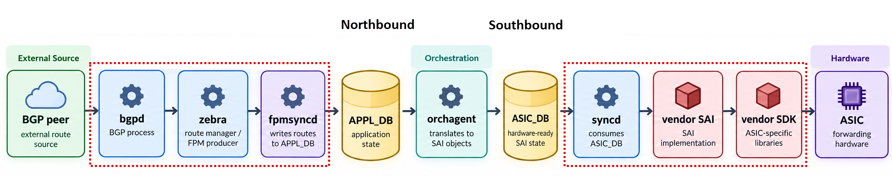
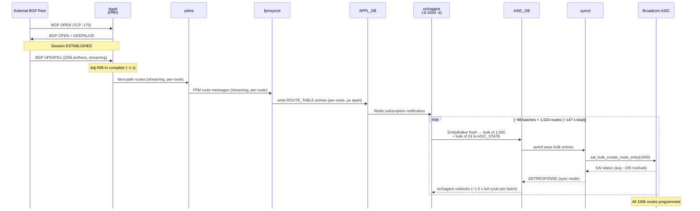
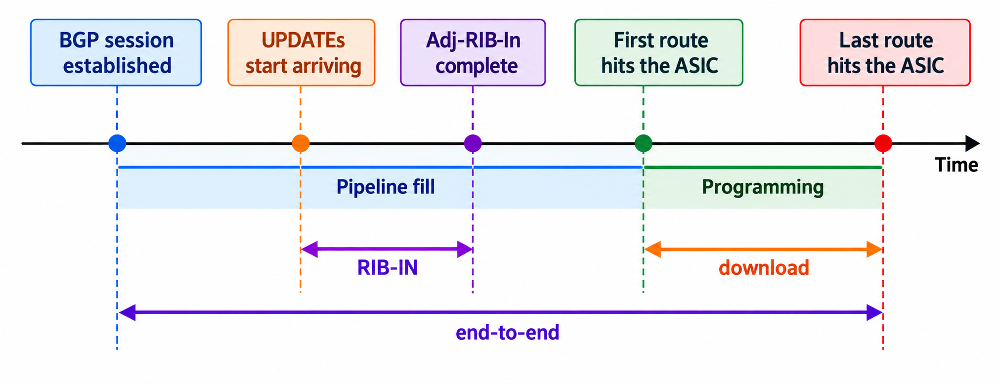

# The BGP Route-Download Benchmark

> **Prerequisite**: [The BGP Container and FRR](15_bgp_container.md) — understand the route journey from BGP peer to ASIC. The pipeline stages referenced in this document (bgpd, zebra, fpmsyncd, orchagent, syncd) are explained in docs [12](12_swss_container.md)–[15](15_bgp_container.md).

> All measurements in this document come from a [Celestica Seastone DX010](https://github.com/ManiAm/net-lab-dx010) (Broadcom ASIC) running SONiC 202405 with default settings unless noted otherwise.


## The Route Pipeline — From BGP Peer to ASIC

When a SONiC switch learns a route from a BGP peer, that route does not go straight into hardware. It walks through a long pipeline of processes and databases before it is finally programmed into the ASIC. The full journey is documented in [The BGP Container — The Route's Journey Through SONiC](15_bgp_container.md#the-routes-journey-through-sonic). For quick reference, here is the compact path:



Each stage is covered in an earlier doc: [bgpd, zebra, and fpmsyncd](15_bgp_container.md) handle protocol processing and route selection; [orchagent](13_orchagent.md) translates route intent into SAI hardware operations; [syncd and the vendor SAI](14_sai_and_syncd.md) execute those operations against the ASIC; the intermediate databases (APPL_DB, ASIC_DB) are covered in [Core Redis Databases](09_redis_databases.md).

This separation keeps protocol logic independent of any specific hardware, makes the system inspectable at every stage, and lets SONiC run on ASICs from different vendors without changing the layers above SAI. The trade-off is that every hop between layers adds serialization, queueing, and context-switch overhead. When a switch suddenly receives thousands of routes — after a reboot or a peering flap — that cumulative overhead determines how long traffic is forwarded on incomplete information.

### The Two IPC Hops That Dominate Pipeline Speed

Two inter-process communication (IPC) hops around orchagent have the largest impact on pipeline speed:

- **Northbound (fpmsyncd → orchagent):** fpmsyncd writes routes to APPL_DB, and orchagent drains them via Redis subscription in batches of up to 1,024 entries (the `-b` flag default). This is the standard SONiC IPC path ([ProducerStateTable / ConsumerStateTable](11_ipc_mechanisms.md#pattern-4-producerstatetable--consumerstatetable-hash-based)).

- **Southbound (orchagent → syncd):** orchagent does not write one route at a time to ASIC_DB. Instead, its EntityBulker collects SAI operations and flushes them in bulk. The bulk size is the `-k` flag; this platform omits it, so the default of 1,000 applies. It also runs synchronous mode (`-s`): after each bulk flush, orchagent blocks until syncd acknowledges the result, so programming errors surface immediately as return codes.


## 100k Routes Through the Pipeline — A Concrete Example

The previous section outlined the pipeline at a conceptual level. This section traces it concretely through a real workload: 100,000 IPv4 /24 prefixes advertised by an external BGP peer to a DX010 switch (Broadcom ASIC).

The following diagram traces the complete data flow from an external BGP peer through each pipeline stage to the ASIC:



### Stage-by-Stage Walkthrough

#### External BGP Peer → bgpd

The external peer streams the entire route set as BGP UPDATE messages over the established TCP session. Each UPDATE carries multiple /24 prefixes packed together (prefixes sharing the same path attributes are encoded in a single message). bgpd parses each UPDATE as it arrives, stores the prefixes in its Adj-RIB-In, and runs best-path selection — all **streaming, per-UPDATE**.

#### bgpd → zebra → fpmsyncd

As bgpd selects best paths, it immediately installs them into zebra. Zebra forwards each route to fpmsyncd over the FPM (Forwarding Plane Manager) socket. Both handoffs are **streaming, per-route**. Routes begin flowing downstream while bgpd is still receiving UPDATEs from the peer. The pipeline is concurrent, not sequential.

#### fpmsyncd → APPL_DB

fpmsyncd writes each route to the `ROUTE_TABLE` in APPL_DB using `ProducerStateTable` (the standard Redis-based IPC pattern). Each route is a separate Redis write with its own microsecond timestamp:

```text
2026-10-01.10:01:05.340007|ROUTE_TABLE:100.9.23.0/24|SET|...
2026-10-01.10:01:05.340121|ROUTE_TABLE:100.71.144.0/24|SET|...
2026-10-01.10:01:05.340163|ROUTE_TABLE:100.64.85.0/24|SET|...
```

Each route is 38–114 µs apart. Routes accumulate in APPL_DB far faster than they drain into hardware downstream.

#### APPL_DB → orchagent

Orchagent's `ConsumerStateTable` receives a Redis notification that new routes are available. It calls `pops()` to drain up to **1,024 entries** from APPL_DB in one batch. `RouteOrch::doTask()` iterates through all 1,024 entries, collecting the SAI route-create operations into an `EntityBulker` — a buffer that defers actual SAI calls until the batch is complete. This is **the first point of batching** in the pipeline.

> For a full explanation, see [Orchagent — Batch Processing and EntityBulker](13_orchagent.md#batch-processing-and-entitybulker).

#### orchagent → ASIC_DB

At the end of `doTask()`, `EntityBulker::flush()` fires. The sairedis library serializes the route operations into `BULK_CREATE` entries on ASIC_DB. This run used the stock command line (`-b 1024`, no `-k`), so the SAI bulk size stayed at its default of 1,000. Each 1,024-route orchagent batch therefore produced **two** ASIC_DB writes: one bulk of 1,000 routes and one bulk of the remaining 24.

> Both numbers are orchagent options, at different layers. `-b` is how many APPL_DB entries one `doTask()` drains. `-k` is how many of those entries go into one SAI bulk call (default 1,000 when omitted). This measurement did not pass `-k`, so the 1,000 + 24 split is what the DX010 actually did. See [The SAI Bulk Size](13_orchagent.md#the-sai-bulk-size--k-flag).

#### ASIC_DB → syncd

Syncd's main loop is blocked on `select()` waiting for ASIC_DB events. When a bulk entry arrives, syncd pops it, iterates through all entries calling `processEntry()` for each (translating Virtual IDs to Real IDs), and dispatches a `sai_bulk_create_route_entry()` call to the Broadcom vendor SAI library.

```text
syncd: inc: 10000 (calls 10000) Syncd::processBulkEntry::processEntry(route_entry)
       CREATE op took: 1721 ms
syncd: inc: 10000 (calls 10000) ... CREATE op took: 1815 ms
syncd: inc: 10000 (calls 10000) ... CREATE op took: 2979 ms
```

#### syncd → Broadcom ASIC

The Broadcom SAI implementation translates each 1,000-route bulk call into SDK operations that program the ASIC's forwarding tables. This is the **slowest stage** in the pipeline:

```text
syncd: threadFunction: time span  24 ms for 'bulkcreate:SAI_OBJECT_TYPE_ROUTE_ENTRY:1000'
syncd: threadFunction: time span  74 ms for 'bulkcreate:SAI_OBJECT_TYPE_ROUTE_ENTRY:1000'
syncd: threadFunction: time span 313 ms for 'bulkcreate:SAI_OBJECT_TYPE_ROUTE_ENTRY:1000'
syncd: threadFunction: time span 806 ms for 'bulkcreate:SAI_OBJECT_TYPE_ROUTE_ENTRY:1000'
```

Across 116 measured bulk creates: **min 3 ms, max 1,197 ms, median 161 ms, avg 195 ms** per 1,000-route bulk. The wide spread (3 ms to 1.2 s) reflects ASIC table management overhead varying with table occupancy.

#### syncd → orchagent

Because orchagent runs in synchronous mode, it blocks after each bulk flush, waiting for syncd's `GETRESPONSE` message through ASIC_DB. Syncd accumulates responses and writes them back in bulk:

```text
syncd: inc: 10240 (calls 20) Syncd::syncUpdateRedisBulkQuadEvent op took: 946 ms
syncd: inc: 10240 (calls 20) Syncd::syncUpdateRedisBulkQuadEvent op took: 611 ms
syncd: inc: 10240 (calls 20) Syncd::syncUpdateRedisBulkQuadEvent op took: 569 ms
```

Each `syncUpdateRedisBulkQuadEvent` writes ~10,240 response entries (~20 bulk operations' worth) back to ASIC_DB in 500–1,800 ms. Only when orchagent reads the response does it unblock and start the next batch.

#### The Complete Cycle

The stages from `APPL_DB → orchagent` through `syncd → orchagent` acknowledgment form a single programming cycle. With 100,000 routes and an orchagent batch size of 1,024, the pipeline executes ~98 `doTask()` iterations (97 full batches + 1 remainder of 672), producing ~195 SAI bulk calls over ~147 seconds — roughly 1.5 seconds per batch, of which only ~390 ms is SAI hardware time (two bulk calls × ~195 ms each) and the rest is Redis serialization overhead.

### Summary

| Stage                   | Transfer mode             | Reason |
|-------------------------|---------------------------|----------------------------------|
| BGP peer → bgpd         | Streaming, per-UPDATE     | BGP protocol: each UPDATE is processed as it arrives |
| bgpd → zebra            | Streaming, per-route      | Internal FRR handoff, no queue |
| zebra → fpmsyncd        | Streaming, per-route      | FPM socket, no batching |
| fpmsyncd → APPL_DB      | Per-route Redis writes    | ProducerStateTable, µs apart |
| **APPL_DB → orchagent** | Batched, 1,024 routes     | `-b 1024` flag; first batching point |
| **orchagent → ASIC_DB** | Bulk writes of 1,000 + 24 | Default `-k` of 1,000 (flag omitted on this run) |
| ASIC_DB → syncd         | Bulk processing           | Syncd pops entire bulk entry |
| syncd → ASIC            | Bulk hardware install     | `sai_bulk_create_route_entry()` |
| syncd → orchagent       | Sync-mode response        | Orchagent blocks until acknowledgment |


## What Is Route-Download Benchmark?

The route-download benchmark is a repeatable test that measures **the rate at which a switch programs routes into its ASIC**, expressed in routes per second (r/s). The measurement is hardware-verified: the clock stops only when a route is confirmed in the forwarding table of the ASIC — not when a routing daemon accepts it, and not when it appears in an intermediate software database. The resulting metric is commonly referred to as the *route download rate* or *FIB install rate*.

As the [route pipeline](#the-route-pipeline--from-bgp-peer-to-asic) shows, the path from zebra through orchagent and syncd to the ASIC is the same regardless of which protocol originated the route — BGP, OSPF, or static configuration. The download rate therefore reflects pipeline throughput in general, not just one protocol.

**Why this benchmark focuses on BGP.** BGP is the only protocol where "a router suddenly receives an enormous route set" is a real, everyday event. A border router takes a full Internet table (~1 million prefixes), or a datacenter leaf relearns tens of thousands of fabric routes after a reboot or peering flap (modern datacenter fabrics run eBGP as their routing protocol, per RFC 7938). Interior protocols like OSPF and IS-IS carry intra-domain topology — typically hundreds to a few thousand routes — and never produce this kind of bulk load. BGP is therefore the natural stress test for the pipeline.

**Why do we need benchmarking?** After a reboot or a peering flap, the switch forwards traffic on incomplete information until every route is back in the ASIC. The programming rate decides how long that risky window lasts. For a 100,000-route fabric:

| Rate             | Time until fully converged |
|------------------|----------------------------|
| ~700 r/s         | ~2.4 minutes               |
| 1,000 r/s        | ~1.7 minutes               |
| ~9,000 r/s       | ~11 seconds                |
| 20,000 r/s       | ~5 seconds                 |

Without a benchmark, "route programming feels slow" is an opinion. With one, it becomes a tracked number: improvements can be proven, regressions can be caught automatically, and the slowest stage of the pipeline can be identified precisely instead of guessed at.


## Measuring Route-Download Speed — Two Rates

The benchmark measures how fast routes reach the ASIC, but the answer depends on **where the clock starts and where it stops**. Two rate metrics capture different scopes of the same pipeline, each expressed in routes per second (r/s):



- **Download rate:** This measures the pipeline once it is flowing — pure throughput with the warm-up excluded. It is the higher number and the one that directly reflects pipeline configuration and ASIC speed.

```text
download rate = N / (t_last_route_in_asic − t_first_route_in_asic)
```

- **End-to-end (E2E) rate:** This includes the **pipeline fill** — the few seconds of BGP processing, best-path selection, and database hops before the very first route reaches hardware. It is always lower than the download rate, and it is what an operator experiences: the wall-clock time from "session came up" to "all routes forwarding."

```text
end-to-end rate = N / (t_last_route_in_asic − t_bgp_session_established)
```

The gap between them is the **pipeline fill time**: how long the pipeline takes to prime before the first route lands in hardware. On the DX010 (the switch used throughout this document) it is roughly 3–4 seconds — negligible in a 100k run, but it would dominate a small 1k run. That is why download rate and E2E rate converge at large scale and diverge at small scale.

**Which metric to report.** Always report both. The download rate isolates pipeline throughput; the E2E rate reflects operational convergence time — the interval an operator waits after a reboot or peering flap. Reporting one without identifying which it is makes the number ambiguous, and comparing a download rate from one benchmark against an E2E rate from another produces a misleading result.

### Per-Stage Lag — Finding the Bottleneck

Beyond the two headline rates, the benchmark should record **when each pipeline stage received its first and last route**. The difference between consecutive stages is the per-stage lag — a diagnostic metric that identifies exactly where time is spent.

For example, if bgpd completes route ingestion in 4 seconds while the ASIC requires 148 seconds, the bottleneck lies downstream of bgpd. Per-stage lags narrow the diagnosis further: whether the delay originates in orchagent's batching, syncd's SAI calls, or the ASIC hardware itself. This identifies the actual constraint rather than relying on assumptions.

## RIB-IN Convergence — A Different Kind of Metric

The download rate and E2E rate above are both **rates** — routes per second reaching hardware. Many published benchmarks, however, report a different metric: **RIB-IN convergence**, measured in **seconds**, whose clock stops much earlier in the pipeline. Recognizing the difference is essential when comparing results across sources.

RIB-IN convergence is an IETF benchmarking-methodology term (RFC 7747). It measures the interval from when BGP UPDATE messages begin arriving until the *last* route is stored in the receiving daemon's **Adj-RIB-In** — the inbound routing table defined in RFC 4271. The clock stops inside bgpd's memory: no best-path selection, no forwarding database, no ASIC. It captures pure BGP ingestion — TCP receive, UPDATE parsing, and table insert.

As the [diagram above](#measuring-route-download-speed--two-rates) shows, RIB-IN convergence completes well before the first route reaches hardware. On the DX010, bgpd holds the full 100k route set within ~1–2 seconds of session establishment; ASIC programming requires an additional ~143–151 seconds — a roughly 100× difference in the same run. Independent testing confirms this order of magnitude: an [open-source BGP stack comparison](https://elegantnetwork.github.io/posts/comparing-open-source-bgp-stacks/) (Pietsch, 2021) measured FRR receiving 100K routes in ~3–4 seconds, while published SONiC [ASIC-verified benchmarks](https://github.com/sonic-net/SONiC/blob/master/doc/l3-performance-scaling/L3_performance_and_scaling_enchancements_HLD.md) on a comparable Tomahawk platform report 90K routes programmed into hardware in 68 seconds (~1,300 r/s). The gap between software ingestion and hardware programming is consistently one to two orders of magnitude.


## Measured Results

The results below come from a [Celestica Seastone DX010](https://github.com/ManiAm/net-lab-dx010) (Broadcom ASIC) running SONiC 202405 (build `202405.1120136-86a9a7b1a`). The switch used its default settings throughout — `orchagent -b 1024 -s` (batch size 1,024, synchronous mode), standard APPL_DB/Redis northbound path (no ZMQ), default memory profile — with no tuning applied. Routes were injected as IPv4 /24 prefixes via GoBGP over the management network.

**Route counts and ASIC table capacity.** The DX010's Memory Table holds approximately **147,456 IPv4 route entries** (37 baseline + 147,419 available, as reported by CRM). The benchmark tests at 25k, 50k, and 100k routes — the three sizes that fit comfortably within this limit. Larger counts would exceed the hardware table and are not included.

The experiment was repeated three times at each route count. Each iteration follows the same procedure: inject, wait for ASIC programming to complete, withdraw, drain back to baseline, then repeat. For the exact step-by-step procedure, see [Running the Benchmark](../benchmark/README.md).

### Iteration 1

| Metric | 25k | 50k | 100k |
|---|---|---|---|
| Routes programmed | 25,000 | 50,000 | 100,000 |
| **RIB-IN convergence** | 1.4 s | 1.3 s | 1.1 s |
| | | | |
| Pipeline fill | 4.9 s | 6.8 s | 5.8 s |
| + Programming window | 33.4 s | 66.9 s | 138.8 s |
| = **Total time** | **38.3 s** | **73.7 s** | **144.5 s** |
| → **Download rate** (N / window) | **749 r/s** | **747 r/s** | **720 r/s** |
| → **E2E rate** (N / total) | **653 r/s** | **678 r/s** | **692 r/s** |

### Iteration 2

| Metric | 25k | 50k | 100k |
|---|---|---|---|
| Routes programmed | 25,000 | 50,000 | 100,000 |
| **RIB-IN convergence** | 1.1 s | 1.6 s | 0.6 s |
| | | | |
| Pipeline fill | 4.8 s | 3.7 s | 7.5 s |
| + Programming window | 34.8 s | 69.2 s | 138.2 s |
| = **Total time** | **39.6 s** | **72.9 s** | **145.7 s** |
| → **Download rate** (N / window) | **718 r/s** | **723 r/s** | **724 r/s** |
| → **E2E rate** (N / total) | **631 r/s** | **686 r/s** | **686 r/s** |

### Iteration 3

| Metric | 25k | 50k | 100k |
|---|---|---|---|
| Routes programmed | 25,000 | 50,000 | 100,000 |
| **RIB-IN convergence** | 0.9 s | 0.0 s | 1.8 s |
| | | | |
| Pipeline fill | 3.7 s | 2.1 s | 5.4 s |
| + Programming window | 32.9 s | 73.1 s | 141.0 s |
| = **Total time** | **36.6 s** | **75.3 s** | **146.4 s** |
| → **Download rate** (N / window) | **760 r/s** | **684 r/s** | **709 r/s** |
| → **E2E rate** (N / total) | **683 r/s** | **664 r/s** | **683 r/s** |

Per-stage lags (bgpd, orchagent, syncd → ASIC) are not shown in this run — the `swss.rec` and `sairedis.rec` log files rotated during the benchmark, causing the saved byte offsets to point into a different file by the time artifacts were collected. The primary metrics above are unaffected because they use CRM counters and the BGP session epoch, not the rec files.

All times come from the switch's own clock: the BGP session-established epoch from FRR (1-second granularity, so pipeline fill and total carry ±1 s) and CRM counter timestamps from `asic_monitor.py` for the programming window. E2E starts at session *Established*; an operator additionally experiences a few seconds of TCP/BGP session setup before that, which neither metric counts.

## How to Interpret These Numbers

The pipeline is concurrent: upstream stages continue flowing while downstream stages are still processing. bgpd finishes receiving all 100k routes in ~1–2 seconds, while the ASIC takes ~139–146 seconds to program them all. The bottleneck is the hardware programming loop (syncd → ASIC), not the ingestion or the software handoffs above it. Keeping this overlap in mind is essential for reading the numbers below.

- **Consistency is the first health check.** Three runs within ~8% of each other means the harness is sound; large run-to-run variance means something else is running on the switch or the measurement itself is interfering. The 100k E2E rate spread is 683–692 r/s (**1%**) and total time spread is 144.5–146.4 s (**1%**) — excellent. The 50k E2E spread is 664–686 r/s (~3%). At 25k the spread is higher (~8%) because CRM polling granularity (~3–4 s per cycle) is a larger fraction of the ~33 s programming window.

- **Download vs E2E tells you where time goes.** Every run pays a roughly fixed ~4–5 s of pipeline fill (BGP processing, best-path selection, and database hops before the first route reaches hardware). At 100k that is amortized over a ~139–141 s programming window, so E2E (~687 r/s avg) sits close to the download rate (~718 r/s avg). At smaller scales the fill is a larger fraction of total time. The download rate isolates throughput; the E2E rate is what convergence actually feels like. Comparing two runs is only fair when the same metric is used.

- **Quote the configuration with the number.** These ~680–720 r/s came from SONiC 202405's *default* profile (batch 1024, synchronous mode, standard Redis/FPM northbound path) on a Broadcom-based DX010. A different ASIC, a different SONiC version, or a different set of orchagent flags would produce a different number. A rate without its configuration is not comparable to anything.

## Why Run at Multiple Route Counts?

Repeating the same count (the 3 iterations) gives statistical confidence at one size; sweeping across counts (25k / 50k / 100k) answers questions a single size cannot:

- **Separate fixed cost from per-route cost.** Total time follows a fixed-plus-linear model: a roughly constant pipeline-fill overhead plus a per-route programming cost. One route count is one equation with two unknowns; several counts let you fit the line and extract both.

- **Small runs understate the steady-state rate.** A 10k validation run would have a programming window of only ~14 s, short enough that CRM polling granularity (each poll takes ~2 s) introduces significant measurement noise. Runs must be long enough that ramp-up and sampling granularity are negligible; on this platform that means ≥25k routes.

- **Catch degradation near capacity.** As the hardware table fills (this platform tops out around 147k IPv4 routes), table pressure can make the last routes slower than the first. A sweep reveals whether the rate holds flat or sags near the edge — a single size either averages that away or never sees it. The 100k run fills ~68% of the table; on a platform with a larger ASIC table, adding runs at higher counts (e.g., 150k, 200k) would reveal whether performance degrades close to the hardware limit.

- **The relevant number depends on the deployment's scale.** Convergence time is not linear in route count: fill is constant, programming is linear. A 10k-route fabric converges in fill-dominated time almost regardless of rate; a 100k fabric is rate-dominated. Measure at the scale you actually operate.

From the data collected, the download rate declines mildly with scale — averaging ~742 r/s at 25k, ~718 r/s at 50k, and ~718 r/s at 100k — real but gentle table-pressure degradation, with no cliff even at 68% of table capacity (100k of ~147k). Total time scales linearly: 38 s → 74 s → 146 s (ratios of 1.94× and 1.97×), confirming a fixed-plus-linear model. The fixed pipeline-fill cost averages ~4–6 s, and the per-route cost is the reciprocal of the download rate (~1.4 ms per route).


## Improving the Route-Download Rate

The DX010 baseline measured above is a conservative starting point. SONiC exposes several configuration knobs that can increase this rate significantly. This section walks through each one, explains what it does, where it acts in the pipeline, and what trade-offs it introduces. Every improvement targets a specific stage; none of them change the BGP protocol processing upstream of fpmsyncd, because that stage completes in ~1–2 seconds and is never the bottleneck.

### 1. Switch the Northbound IPC from Redis to ZMQ

**What it is.** By default, fpmsyncd writes routes to APPL_DB using [ProducerStateTable](11_ipc_mechanisms.md#pattern-4-producerstatetable--consumerstatetable-hash-based), and orchagent reads them using `ConsumerStateTable`. Both sides go through Redis: the producer stages data in a Redis hash, publishes a notification on a Redis channel, and the consumer receives the notification and pops the data from Redis. Every route passes through Redis twice — once on the write side, once on the read side.

**What ZMQ changes.** [ZmqProducerStateTable / ZmqConsumerStateTable](11_ipc_mechanisms.md#pattern-5-zmqproducerstatetable--zmqconsumerstatetable-zmq-based) replaces the Redis notification path with a direct ZeroMQ socket between fpmsyncd and orchagent. The route data travels program-to-program over a TCP socket, skipping the Redis pub/sub layer. Redis can still be used for persistence (so the data is inspectable in APPL_DB), but the critical wake-up-and-deliver path no longer depends on it.

**Why it helps.** Redis is a general-purpose key-value store — excellent for inspectability and persistence, but not optimized for high-throughput message delivery between two processes on the same machine. ZMQ is built specifically for low-latency, high-throughput inter-process messaging. Removing Redis from the notification path eliminates its serialization overhead, its single-threaded event loop as a bottleneck, and the extra network hop through the Redis TCP socket. The effect is most visible when the ASIC is fast enough that Redis overhead — not hardware programming — becomes the limiting factor.

**How to enable it.** ZMQ mode is typically enabled at the platform level through build-time or runtime configuration. The exact mechanism varies by SONiC version and vendor platform. On platforms that support it, the fpmsyncd and orchagent processes are started with ZMQ-aware flags that redirect their IPC through the ZMQ socket.

**Trade-offs.** ZMQ is point-to-point: only one consumer receives each message, so there is no fan-out to multiple subscribers the way Redis pub/sub provides. This is not a problem for the route pipeline (orchagent is the sole consumer), but it changes the debugging story — you cannot simply subscribe to a Redis channel to watch routes flow. The data is still written to APPL_DB for inspection, but the live notification stream is no longer visible through Redis tooling.

### 2. Increase the Orchagent Batch Size (`-b` flag)

**What it is.** The `-b` flag controls how many entries orchagent drains from APPL_DB in a single `doTask()` call. The default is **1,024**. When orchagent wakes up (triggered by a Redis or ZMQ notification), it calls `pops()` to read up to `-b` entries from the consumer table, processes all of them in one loop iteration, and flushes the resulting SAI operations.

**Why it helps.** A larger batch means more routes are processed per `doTask()` cycle. Each cycle carries fixed overhead — waking up, acquiring locks, setting up the EntityBulker, flushing, and waiting for the sync-mode response. Spreading that fixed cost over more routes reduces the per-route overhead. For example, doubling `-b` from 1,024 to 2,048 cuts the number of `doTask()` cycles roughly in half for the same total route count.

**How to change it.** The `-b` flag is passed on the orchagent command line, typically set in the SWSS container's startup script or supervisord configuration. For example, changing `-b 1024` to `-b 4096` means orchagent will drain up to 4,096 routes per cycle.

**Trade-offs.** Larger batches increase the memory footprint of each `doTask()` cycle (more entries buffered in the EntityBulker before flushing) and increase the latency of individual route programming — a single route arriving in an otherwise quiet system must wait until the batch timer fires or the batch fills, whichever comes first. For bulk convergence scenarios (reboot, peering flap), larger batches are strictly better. For steady-state single-route updates, the difference is negligible because the batch rarely fills.

### 3. Increase the SAI Bulk Size (`-k` flag)

**What it is.** The `-k` flag controls how many SAI operations orchagent packs into a single bulk call to ASIC_DB. The default is **1,000**. After `doTask()` collects all route operations in the EntityBulker, `flush()` splits them into chunks of `-k` and writes each chunk as one `BULK_CREATE` (or `BULK_REMOVE`) entry in ASIC_DB.

**How it interacts with `-b`.** The `-b` and `-k` flags operate at different layers. `-b` controls how many routes orchagent reads from APPL_DB; `-k` controls how many of those routes go into each SAI bulk call. With the defaults (`-b 1024`, `-k 1000`), each batch produces two ASIC_DB writes: one bulk of 1,000 and one of 24. If `-k` is raised to 1,024 or higher, the entire batch fits in a single bulk call, eliminating the leftover write.

**Why it helps.** Each bulk call to ASIC_DB carries fixed overhead: Redis serialization, syncd wake-up, VID-to-RID translation setup, and (in sync mode) a round-trip wait for the response. Fewer, larger bulk calls reduce the number of times this overhead is paid. The improvement is most visible when `-k` is aligned with or exceeds `-b`, so the batch/bulk split disappears entirely.

**How to change it.** Like `-b`, the `-k` flag is passed on the orchagent command line. For example, `orchagent -b 4096 -k 4096 -s` drains 4,096 routes per cycle and sends them all in one SAI bulk call.

**Trade-offs.** Very large bulk sizes increase the memory consumed by a single ASIC_DB entry and the time syncd spends processing one bulk before it can do anything else. In practice, values of 1,000–4,096 are commonly used; going much higher yields diminishing returns because the ASIC's own per-call overhead dominates.

### 4. Switch from Synchronous to Asynchronous Mode

**What it is.** Orchagent's `-s` flag enables synchronous mode. After each bulk flush to ASIC_DB, orchagent blocks — it does not process the next batch until syncd writes a `GETRESPONSE` message back to ASIC_DB confirming that the hardware programming succeeded (or failed). This is the default since [SONiC PR #5735](https://github.com/sonic-net/sonic-buildimage/pull/5735) (October 2020).

**What async mode changes.** Without the `-s` flag, orchagent runs in asynchronous mode. Each SAI call returns `SAI_STATUS_SUCCESS` as soon as the operation is queued in ASIC_DB — orchagent does not wait for syncd to actually program the ASIC. It immediately moves on to the next batch, keeping the pipeline moving without round-trip delays.

**Why it helps.** The sync-mode round trip is expensive. In the DX010 measurements, each 1,024-route batch took ~1.5 seconds end-to-end, of which only ~390 ms was actual ASIC programming time (two SAI bulk calls × ~195 ms average). The remaining ~1.1 seconds was Redis serialization and the blocking wait for the response. Async mode eliminates the blocking wait, allowing orchagent to pipeline multiple batches — it can prepare and send the next batch while syncd is still programming the previous one.

**Why it is not the default.** In sync mode, if the vendor SAI returns an error (e.g., table full, invalid parameter), orchagent sees it immediately as a return code and can handle it — log the error, retry, or skip the entry. In async mode, orchagent has already moved on. If syncd encounters a programming failure, it has no way to report it back to orchagent. The only safe response is for syncd to crash (`abort()`), which triggers a container restart and full state reconciliation. This is why SONiC switched the default from async to sync — silent hardware programming failures in production were going undetected.

**Trade-offs.** Async mode increases throughput but **sacrifices error visibility**. If a single route fails to program (e.g., the ASIC table is full), syncd crashes, which restarts the entire SYNCD container and forces a full reconciliation of all programmed state — a much more disruptive event than a single error handled gracefully in sync mode. Operators choosing async mode must accept this trade-off and have monitoring in place to detect syncd crashes.

For a detailed explanation of both modes, including the error-handling behavior, see [SAI and Syncd — Async vs. Sync Mode](14_sai_and_syncd.md#async-vs-sync-mode).

### 5. ASIC Hardware and Vendor SAI

**What it is.** The final stage of the pipeline — syncd calling the vendor SAI library, which programs the ASIC's forwarding tables — is the slowest stage and the one that no SONiC software knob can change. The speed of this stage is determined by two factors: the ASIC hardware itself (how fast its table management engine operates) and the vendor SAI implementation (how efficiently the SAI library translates bulk operations into ASIC SDK calls).

**Why it matters.** On the DX010, the measured SAI bulk-create time ranged from 3 ms to 1,197 ms per 1,000-route bulk, with a median of 161 ms and an average of 195 ms. This wide spread reflects table management overhead that grows as the table fills. A different ASIC — for example, an NVIDIA Spectrum-based switch — may have fundamentally different table architecture and programming speed, producing a very different rate even with identical SONiC software settings.

**What determines the difference.** ASIC vendors design their forwarding table hardware differently. Some use hash-based tables that program in near-constant time regardless of occupancy; others use algorithmic longest-prefix-match (LPM) structures whose insertion time varies with table depth and prefix distribution. The vendor SAI library also matters: a well-optimized SAI implementation can batch SDK calls, use DMA transfers, or exploit hardware-specific acceleration that a generic implementation cannot. These are ASIC-vendor engineering decisions, not SONiC configuration choices.

**What an operator can do.** This knob is not a configuration change — it is a hardware choice. When evaluating platforms, request route-download benchmark results from the vendor, run your own benchmark using the methodology described in this document, and compare rates at the route counts relevant to your deployment. Ensure the comparison uses the same SONiC software settings (batch size, sync mode, IPC path) so the numbers reflect ASIC differences rather than configuration differences.

### Summary of Knobs

| # | Knob                 | Stage                | Default          | Change to          | Trade-off |
|---|----------------------|----------------------|------------------|--------------------|-----------|
| 1 | Northbound IPC       | fpmsyncd → orchagent | Redis            | ZMQ                | Loses pub/sub observability |
| 2 | Batch size (`-b`)    | APPL_DB → orchagent  | 1,024            | 2,048 / 4,096      | More memory per cycle |
| 3 | SAI bulk size (`-k`) | orchagent → ASIC_DB  | 1,000            | Match `-b`         | Diminishing returns past ~4,096 |
| 4 | Sync mode (`-s`)     | orchagent ↔ syncd    | Synchronous      | Remove `-s`        | Errors crash syncd instead of graceful handling |
| 5 | ASIC / vendor SAI    | syncd → ASIC         | Broadcom (DX010) | Different platform | Hardware choice, not configuration |

---

**Previous**: [← The BGP Container and FRR](15_bgp_container.md) · **Next**: [The PMON Container →](17_pmon_container.md)
