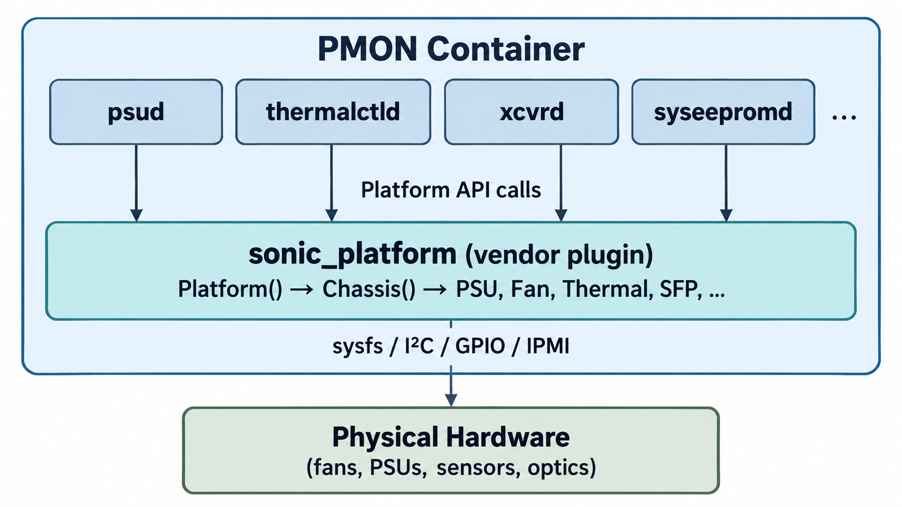

# The PMON Container (Platform Monitor)

> **Prerequisites**: [SONiC Container Architecture](03_sonic_container.md), [Core Redis Databases](08_redis_databases.md) (STATE_DB role), and [Container Communication](09_container_communication.md) (how containers talk through Redis and sysfs).

The PMON (Platform Monitor) container is responsible for everything that is not the ASIC — fans, power supplies, temperature sensors, transceivers (optics), LEDs, system EEPROM, PCIe devices, and storage health. While the SWSS and Syncd containers manage the forwarding pipeline, PMON manages the **physical platform** that the forwarding pipeline runs on.

If a fan fails, PMON detects it. If a power supply is pulled, PMON logs it and updates the LED. If a transceiver is inserted, PMON reads its EEPROM and publishes its capabilities to the database. Without PMON, SONiC would have no visibility into the health of the hardware surrounding the ASIC.

## Why a Dedicated Container?

A switch's physical peripherals are accessed through low-level hardware interfaces — `I²C` buses (a serial protocol for talking to sensor and controller chips), `sysfs` files (a Linux virtual filesystem that exposes hardware state as readable files), `GPIO` pins (general-purpose input/output lines), and `IPMI` (an out-of-band management interface for board-level monitoring). These interfaces are platform-specific: every vendor wires the hardware differently. Isolating all of this in one container has three benefits:

1. **Fault isolation.** A bug in a fan-monitoring daemon cannot crash orchagent or disrupt packet forwarding. PMON daemons can crash, restart, and recover without affecting the data plane.

2. **Hardware access isolation.** PMON is the only container that needs direct access to `/sys`, I²C devices, and GPIO pins. The Docker run options for PMON include Linux capabilities (`--cap-add=SYS_RAWIO`, `--cap-add=SYS_ADMIN`) and volume mounts (`-v /sys/:/sys/:rw`) — privileges that no other SONiC container requires.

3. **Vendor boundary.** The vendor-specific code that translates a generic request like "read fan speed" into the actual low-level hardware operation lives inside PMON, behind a standard API. The rest of SONiC never touches it.


## What PMON Does Not Do

PMON is a **monitoring and reporting** container. It reads hardware state and publishes it to the database. It does *not*:

- **Program the ASIC.** That is Syncd's job.
- **Run routing protocols.** That is the BGP container's job.
- **Apply user configuration.** That is the SWSS container's job (manager daemons read CONFIG_DB; PMON daemons read hardware state).
- **Make forwarding decisions.** PMON has no involvement in the packet-forwarding pipeline.
- **Aggregate system-wide health.** That is `healthd`'s job — a host-level systemd service that reads PMON's STATE_DB output and combines it with container/service liveness checks. See [Host Services](18_host_services.md#system-health-monitoring-healthd) for details.

The two areas where PMON *writes* to hardware (rather than just reading) are LED control and fan speed control. These are physical platform actions, not data-plane actions — the details are covered in [Fan Speed Control](#fan-speed-control) later in this chapter.


## The Hardware Access Problem

Every network switch has the same categories of peripherals — fans, PSUs, temperature sensors, transceivers — but every platform vendor connects them differently. One vendor might expose fan speed through an I²C-connected fan controller chip; another might use IPMI commands to a BMC (Baseboard Management Controller — a dedicated management processor on the board); a third might expose the same data through a CPLD register (a programmable logic chip used for board-level I/O control) mapped to sysfs.

SONiC solves this with a two-layer architecture: a **common API** that all PMON daemons call, and a **vendor plugin** that implements that API for each specific platform. The following shows the big picture.




## The Platform API

The Platform API is a Python class hierarchy defined in the [`sonic-platform-common`](https://github.com/sonic-net/sonic-platform-common) package. It defines abstract base classes for every hardware component, with standard method signatures that all PMON daemons use. The daemons never access hardware directly — they call the Platform API, and the vendor-provided implementation translates those calls into the actual hardware access.

### Containment Hierarchy

The tree below shows **containment** (has-a) relationships. For example, `ChassisBase` holds a list of `PsuBase` objects — it does not inherit from `PsuBase`. Notice that `FanBase` and `ThermalBase` appear at multiple levels. This mirrors real hardware — a PSU has its own internal fan and temperature sensor, separate from the chassis-level fans and sensors on the main board.

```
PlatformBase                                # Root: represents the entire platform
│                                         
└── ChassisBase(DeviceBase)                 # The chassis (one per platform)
    │                                     
    ├── _fan_drawer_list[]                
    │   └── FanDrawerBase(DeviceBase)       # A fan tray (holds one or more fans)
    │       └── _fan_list[]               
    │           └── FanBase(DeviceBase)     # An individual fan motor
    │                                     
    ├── _psu_list[]                       
    │   └── PsuBase(DeviceBase)             # A power supply unit
    │       ├── _fan_list[]                 # PSU-internal fan(s)
    │       │   └── FanBase(DeviceBase)   
    │       └── _thermal_list[]             # PSU-internal temp sensor(s)
    │           └── ThermalBase(DeviceBase)
    │                                     
    ├── _pdb_list[]                         # (DC platforms only)
    │   └── PdbBase(PsuBase)                # A power distribution board
    │                                     
    ├── _thermal_list[]                     # Board-level temperature sensors
    │   └── ThermalBase(DeviceBase)       
    │                                     
    ├── _sfp_list[]                       
    │   └── SfpBase(DeviceBase)             # A transceiver (SFP, QSFP, OSFP, etc.)
    │                                     
    ├── _component_list[]                 
    │   └── ComponentBase                   # A firmware component (BIOS, CPLD, FPGA)
    │                                     
    ├── _module_list[]                      # (modular chassis only)
    │   └── ModuleBase(DeviceBase)          # A line card or supervisor module
    │                                     
    ├── _voltage_sensor_list[]              # Board-level voltage sensors
    ├── _current_sensor_list[]              # Board-level current sensors
    │                                     
    ├── _watchdog                         
    │   └── WatchdogBase                    # The hardware watchdog timer
    │                                     
    └── _eeprom                           
        └── Eeprom (TlvInfoDecoder)         # The system EEPROM (TLV format)
```

Every base class inherits from `DeviceBase`, which defines the methods common to all hardware devices:

| Method                                  | Purpose |
|-----------------------------------------|----------------------------------|
| `get_name()`                            | Human-readable name (e.g., "PSU-1", "FAN-3F") |
| `get_presence()`                        | Whether the device is physically present |
| `get_model()`                           | Model or part number |
| `get_serial()`                          | Serial number |
| `get_status()`                          | Whether the device is operating normally |
| `get_position_in_parent()`              | Physical slot position (for SNMP entity MIB) |
| `set_status_led()` / `get_status_led()` | Control the device's status LED |

Each specific base class adds methods relevant to its device type. For example:

| Base Class     | Key Methods                   |
|----------------|-------------------------------|
| `FanBase`      | `get_speed()`, `get_target_speed()`, `get_direction()`, `get_speed_tolerance()` |
| `PsuBase`      | `get_voltage()`, `get_current()`, `get_power()`, `get_temperature()`, `get_powergood_status()` |
| `ThermalBase`  | `get_temperature()`, `get_high_threshold()`, `get_low_threshold()`, `get_high_critical_threshold()` |
| `SfpBase`      | `get_transceiver_info()`, `get_transceiver_bulk_status()`, `get_presence()`, `reset()` |
| `WatchdogBase` | `arm()`, `disarm()`, `is_armed()`, `get_remaining_time()` |

All of these methods raise `NotImplementedError` in the base class. The vendor must override them.

### Vendor Implementation

Each platform vendor provides a Python package called `sonic_platform` that implements the base classes for their specific hardware. This package is installed as a wheel file (a standard Python package format, like a `.zip` archive with metadata) at `/usr/share/sonic/platform/sonic_platform-1.0-py3-none-any.whl` and is loaded when the PMON container starts.

For example, the Celestica Seastone DX010 provides:

```
device/celestica/x86_64-cel_seastone-r0/sonic_platform/
├── platform.py      # PlatformBase → creates Chassis
├── chassis.py       # ChassisBase → creates 5 FanDrawers, 2 PSUs, 5 Thermals, 32 SFPs
├── fan.py           # FanBase → reads fan speed via EMC2305 I²C chip + GPIO
├── fan_drawer.py    # FanDrawerBase → groups front/rear fans in a tray
├── psu.py           # PsuBase → reads PSU data via I²C hwmon + GPIO
├── thermal.py       # ThermalBase → reads temperature via I²C hwmon sensors
├── sfp.py           # SfpBase → reads transceiver EEPROM via optoe driver
├── watchdog.py      # WatchdogBase → controls the hardware watchdog
├── eeprom.py        # System EEPROM (TLV decode)
└── component.py     # ComponentBase → BIOS, CPLD firmware versions
```

The key pattern is always the same: the vendor class reads a sysfs file, an I²C register, or a GPIO pin and translates the raw value into the standard return type the Platform API defines.

**Example: Reading fan speed on the DX010.** The DX010 has two EMC2305 fan controller chips on I²C bus 13, at addresses `0x2E` and `0x4D`. Each chip controls five fan outputs. The `Fan.get_speed()` method reads the chip's `pwmN` sysfs file (exposed by the kernel's `emc2305` driver at `/sys/bus/i2c/drivers/emc2305/`), converts the raw PWM (Pulse-Width Modulation) value (0–255) to a percentage (0–100), and returns it. The daemon calling `get_speed()` has no idea that an EMC2305 chip is involved — it just gets a percentage.

**Example: Reading temperature on the DX010.** The DX010 has five temperature sensors connected via I²C (buses 5, 6, 7, 14, 15). The `Thermal.get_temperature()` method reads an hwmon sysfs file (hwmon is Linux's hardware-monitoring framework) at the sensor's I²C path, divides the raw millidegree value by 1000, and returns degrees Celsius as a float.

### How the Plugin Is Loaded

When the PMON container starts, its entrypoint script (`docker_init.sh`) checks whether the `sonic_platform` package is installed. If not, it installs the wheel file from the platform directory:

```bash
python3 -c "import sonic_platform" > /dev/null 2>&1
if [ $? -ne 0 ]; then
    pip3 install /usr/share/sonic/platform/sonic_platform-1.0-py3-none-any.whl
fi
```

Each daemon then loads the platform chassis object with the same two lines:

```python
import sonic_platform.platform
platform_chassis = sonic_platform.platform.Platform().get_chassis()
```

From this single `platform_chassis` object, the daemon can access every peripheral — `platform_chassis.get_all_fans()`, `platform_chassis.get_all_psus()`, `platform_chassis.get_sfp(port_index)`, and so on.


## Data Flow: Hardware → STATE_DB → CLI/SNMP

All PMON daemons follow the same data flow pattern shown in the [architecture diagram above](#the-hardware-access-problem). Each daemon:

1. Loads the `sonic_platform` plugin to get a chassis object.
2. Enters a polling loop (each daemon has its own interval).
3. On each iteration, reads hardware state through the Platform API.
4. Writes the results to **STATE_DB** (the Redis database for observed system state).
5. If a status change is detected (e.g., fan removed, PSU overheated), logs a syslog message and updates the hardware LED.

Hardware data moves in one direction — from the physical device, through the Platform API, into STATE_DB — and consumers read exclusively from Redis:

```
         Daemons write to Redis
              │
              v
┌───────────────────────────────┐
│  STATE_DB                     │
│                               │
│  PSU_INFO|PSU-1               │
│    presence: true             │
│    voltage: 12.05             │
│    power: 99.6                │
│                               │
│  FAN_INFO|FAN-1F              │
│    speed: 62                  │
│    direction: exhaust         │
│                               │
│  TRANSCEIVER_INFO|Ethernet0   │
│    type: QSFP28               │
│    vendor: Finisar            │
│                               │
│  THERMAL_INFO|...             │
│  EEPROM_INFO|...              │
└──────────┬────────────────────┘
           │
           v  Consumers read from Redis
    ┌──────────────┐
    │  • CLI       │  show platform psustatus
    │  • SNMP      │  ENTITY-MIB, ENTITY-SENSOR-MIB
    │  • Telemetry │  gNMI subscriptions
    └──────────────┘
```

This architecture means that:

- **CLI commands never touch hardware.** `show platform psustatus` reads `PSU_INFO` from STATE_DB. `show platform fan` reads `FAN_INFO`. `show interfaces transceiver` reads `TRANSCEIVER_INFO`. These commands are instant because they read cached data.

- **SNMP never touches hardware.** The SNMP agent reads the same STATE_DB tables and maps them to standard MIBs (ENTITY-MIB, ENTITY-SENSOR-MIB).

- **Hardware access is serialized through the daemons.** Multiple consumers cannot race to read the same I²C bus simultaneously — only the owning daemon reads the hardware, at its own cadence.


## The Daemons Inside PMON

The PMON container runs multiple independent daemons, each responsible for a specific category of hardware. Their source code lives in the [`sonic-platform-daemons`](https://github.com/sonic-net/sonic-platform-daemons) repository. All daemons are managed by **supervisord** (the same process manager used inside every SONiC container) and follow the [data flow pattern](#data-flow-hardware--statedb--CliSNMP) described above.

### Daemon Reference

| Daemon          | What It Monitors              | Poll Interval | STATE_DB Table(s) |
|-----------------|-------------------------------|---------------|-------------------|
| **xcvrd**       | Transceivers (SFP/QSFP/OSFP) — presence, EEPROM info, DOM (Digital Optical Monitoring) | 1 s (events), 60 s (DOM) | `TRANSCEIVER_INFO`, `TRANSCEIVER_DOM_SENSOR`, `TRANSCEIVER_STATUS` |
| **psud**        | Power supply units — presence, power good, voltage, current, power, temperature | 3 s | `PSU_INFO`, `CHASSIS_INFO`, `FAN_INFO` (PSU fans) |
| **thermalctld** | Fans and temperature sensors — speed, direction, presence, thermal thresholds, thermal policy | 60 s | `FAN_INFO`, `FAN_DRAWER_INFO`, `THERMAL_INFO` |
| **sensormond**  | Voltage and current sensors (board-level) | Configurable | Sensor-specific tables |
| **ledd**        | Front-panel port LEDs — link up/down state | Event-driven (not polled) | None (controls LEDs directly) |
| **syseepromd**  | System EEPROM — serial number, MAC address, platform name | 60 s (integrity check) | `EEPROM_INFO` |
| **pcied**       | PCIe devices — presence and device ID verification | 60 s | `PCIE_DEVICE`, `PCIE_DEVICES` |
| **stormond**    | Storage devices (SSD/NVMe) — health, temperature, wear | 3600 s (1 hour) | `STORAGE_INFO` |
| **chassisd**    | Chassis modules (modular chassis only) — module presence, status | Varies | Module-specific tables |
| **ycabled**     | Y-cable management (DualToR only) — active/standby ToR switching, cable health | Event-driven + polled | `MUX_CABLE_TABLE`, `HW_MUX_CABLE_TABLE` |
| **sensord**     | Hardware voltage, temperature, and current sensors via Linux's `lm-sensors` framework | Configurable | None (logs alerts via syslog; CLI access via `sensors` command) |
| **fancontrol**  | Fan speed regulation using Linux's `fancontrol` framework | Configurable | None (writes PWM values directly to sysfs) |

> `sensord` and `fancontrol` are standard Linux packages (not SONiC-written Python daemons), but they run **inside the PMON container** alongside the other daemons, managed by supervisord. They are included only if the platform provides a `sensors.conf` or `fancontrol` configuration file respectively. During container startup, the entrypoint script copies `sensors.conf` from the [platform directory](17_platform_configuration.md) into `/etc/sensors.d/` inside the container, where lm-sensors loads it to get human-readable sensor names, value scaling, and alarm thresholds.

> Do not confuse `sensord` with `sensormond`: `sensord` is a standard Linux daemon from the `lm-sensors` package that reads a static `sensors.conf` file, while `sensormond` is a SONiC-written Python daemon that reads voltage and current sensors through the Platform API.

### xcvrd — Transceiver Daemon

`xcvrd` is the most complex daemon in PMON. Transceivers (SFP, QSFP28, QSFP-DD (Double Density), OSFP (Octal Small Form Factor Pluggable)) are hot-pluggable, governed by industry standards (SFF-8472 for SFP, SFF-8636 for QSFP, and CMIS (Common Management Interface Specification) for newer QSFP-DD/OSFP), and have EEPROM data including vendor information, link capabilities, and real-time sensor readings (temperature, voltage, TX/RX power, laser bias current).

**What it does on startup:**
1. Detects all ports and reads transceiver EEPROM for any optics already present.
2. Publishes transceiver information (vendor, part number, serial, cable type, supported speeds) to `TRANSCEIVER_INFO` in STATE_DB.
3. Starts background tasks for DOM (Digital Optical Monitoring) polling, CMIS state machine management (for newer transceivers like QSFP-DD/OSFP), and SFP event monitoring.

**What it does in steady state:**
- Polls for hot-plug events (insert/remove) every 1 second.
- Updates DOM sensor readings (temperature, voltage, TX/RX optical power, laser bias) every 60 seconds.
- For CMIS-compliant transceivers, manages the initialization state machine (low power → high power → data path activation).
- Applies media settings and signal integrity parameters from platform-specific configuration files.

**Why it matters.** Without `xcvrd`, SONiC would not know what optic is plugged into each port, could not detect hot-plug events, and would not have DOM data for monitoring link quality. The `show interfaces transceiver` CLI command reads its data entirely from STATE_DB tables populated by `xcvrd`.

### psud — Power Supply Daemon

`psud` monitors all power supply units (PSUs) and power distribution boards (PDBs). It runs a simple loop every 3 seconds:

1. For each PSU, read presence, power-good status, voltage, current, power, temperature, and thresholds through the Platform API.
2. If any status changes (PSU removed, voltage out of range, temperature too high), log a warning and update the PSU LED (green for OK, red for fault).
3. Write all readings to the `PSU_INFO` table in STATE_DB.
4. On modular chassis, compute total power budget (supplied vs. consumed) and update the master PSU LED.

The daemon also tracks fans that are physically inside the PSU (PSU-internal fans are separate from the main chassis fans). It writes their status to the `FAN_INFO` table so that `show platform fan` reflects PSU fan state accurately.

### thermalctld — Thermal Control Daemon

`thermalctld` monitors temperature sensors and fans, and implements the platform's **thermal control policy** — the algorithm that adjusts fan speed based on temperature.

**Fan monitoring (every 60 seconds):**
- Read each fan's speed, target speed, direction, and presence.
- Detect faults: fan absent, fan stopped, fan running under or over its speed tolerance, fan direction mismatch (mixing intake and exhaust fans is dangerous — it creates internal recirculation instead of proper airflow).
- Log syslog warnings on state transitions (e.g. "Fan removed warning", "Fan fault warning", "Fan low speed warning") and set individual fan/drawer LEDs to green or red.
- Update `FAN_INFO` and `FAN_DRAWER_INFO` tables in STATE_DB.

**Temperature monitoring (every 60 seconds):**
- Read each thermal sensor's temperature and compare against high/low thresholds.
- Log syslog warnings when thresholds are exceeded or when temperature changes too rapidly between cycles.
- Update `TEMPERATURE_INFO` table in STATE_DB.

**Thermal policy:**
- The platform vendor provides a thermal policy file (`thermal_policy.json`) and a Python class derived from `ThermalManagerBase`. The policy defines condition–action rules like "if any fan is absent, set all fans to full speed" or "if temperature exceeds the critical threshold, power-cycle the switch."
- `thermalctld` evaluates this policy on every cycle. Depending on the platform, the policy may act purely as a **safety override** (fault-only intervention while a separate process handles routine speed), or it may be the **primary fan-speed controller** (setting speeds directly on every cycle). See [Fan Speed Control](#fan-speed-control) for details on the three platform architectures.
- If too many fans fail or temperatures exceed critical thresholds, the policy can trigger a system shutdown to prevent thermal damage.

### sensormond — Sensor Monitor Daemon

`sensormond` monitors board-level **voltage** and **current** sensors — the sensors that measure power-rail voltages (e.g., 3.3 V, 5 V, 12 V rails) and current draw on the main board. These are distinct from the PSU-level readings that `psud` handles and the temperature readings that `thermalctld` handles.

**What it does:**
1. On startup, discover all voltage and current sensors through the Platform API.
2. On each poll cycle, read each sensor's value and compare it against high/low thresholds defined by the vendor.
3. If a reading crosses a critical or warning threshold, log a syslog alert.
4. Write all readings to sensor-specific tables in STATE_DB.

`sensormond` is not included on every platform — it runs only if the build explicitly enables it (see [Daemon Control](#daemon-control-enabling-and-disabling-daemons)). Platforms that do not expose discrete voltage/current sensors (or that fold these readings into the PSU driver) do not need it.

### ledd — LED Daemon

`ledd` controls front-panel port LEDs based on link state. Unlike other daemons, it is **event-driven**, not polled:

1. Subscribe to the `PORT_TABLE` in APPL_DB using [`SubscriberStateTable`](10_ipc_mechanisms.md#pattern-1-subscriberstatetable-key-space-notifications).
2. When a port's `oper_status` field changes (up or down), call the platform's `LedControl.port_link_state_change()` method.
3. The vendor's LED control module sets the appropriate LED color (typically green for link up, off for link down).

For ports that are split into multiple logical sub-ports (breakout), `ledd` tracks sub-port states independently and sets the LED based on whether all sub-ports are up, all are down, or a mix.

### syseepromd — System EEPROM Daemon

`syseepromd` reads the system EEPROM once at startup and publishes the decoded TLV fields (serial number, base MAC address, platform name, vendor, manufacture date) to the `EEPROM_INFO` table in STATE_DB. It then runs a background loop every 60 seconds to check if the table was deleted (by another process restarting) and re-populates it if needed.

The system EEPROM follows the ONIE TLV format (an industry-standard format for switch identification data). The `show platform syseeprom` CLI reads from STATE_DB rather than accessing hardware directly, so the command is fast and safe to run repeatedly.

### pcied — PCIe Device Daemon

`pcied` verifies that all expected PCIe devices are present and functioning. At startup, it loads a per-platform PCIe configuration file that lists the expected devices (bus addresses, device IDs). Every 60 seconds, it scans the PCIe bus, compares the results against the expected list, and writes the status to STATE_DB. If a device disappears (e.g., a PCIe link failure), it logs an error.

### stormond — Storage Monitor Daemon

`stormond` monitors storage devices (SSDs and NVMe drives) for health metrics: temperature, remaining life (wear leveling), read/write statistics. It polls every hour (3600 seconds) and writes results to `STORAGE_INFO` in STATE_DB. This is a slow-poll daemon because storage wear changes gradually and does not need frequent updates.

### chassisd — Chassis Module Daemon

`chassisd` manages **line cards** and **supervisor modules** on modular chassis platforms. A modular chassis is a large switch where the forwarding capacity is split across multiple removable line cards, all coordinated by one or more supervisor cards. Fixed-configuration switches (the most common type) do not have modules and do not run `chassisd`.

**What it does:**
1. On startup, enumerate all module slots through the Platform API, which returns a list of `ModuleBase` objects.
2. Poll each slot for presence and operational status — detect when a line card is inserted, removed, powered on, or enters a fault state.
3. Track the supervisor card's own status (active vs. standby on dual-supervisor systems).
4. Write module status to module-specific tables in STATE_DB so that other services know which line cards are available.

`chassisd` starts only on modular chassis systems (`IS_MODULAR_CHASSIS == 1`) or smart switches (see [Daemon Control](#daemon-control-enabling-and-disabling-daemons)). On a standard fixed-configuration switch, it is never launched.


## Fan Speed Control

Every air-cooled platform (the vast majority of switches) needs a mechanism that reads temperatures and adjusts fan PWM to keep the switch cool. SONiC does not prescribe a single approach — instead, platforms choose from several architectures. All share one invariant: **only one process may write PWM values at any given time.** Two writers to the same PWM register would race — one sets 60%, the other overwrites with 80% — and the fan oscillates unpredictably.

A scan of every platform in `sonic-buildimage` reveals three distinct approaches:

| Architecture | Who sets fan speed | thermalctld's role |
|---|---|---|
| **fancontrol-delegated** | `fancontrol` (Linux utility, inside PMON) | Supervisor — stops/starts `fancontrol` on fault |
| **thermalctld-native** | `thermalctld` via `fan.all.set_speed` policy actions (inside PMON) | Full control — sets speeds directly through Platform API |
| **Vendor-specific** | A host-level process or systemd service provided by the vendor | Monitoring only — writes STATE_DB for CLI/SNMP; does **not** set fan speed |

### fancontrol-delegated model

*Used by: Celestica (DX010, E1031, Midstone), Centec, Ingrasys, UFISpace, Delta, Netberg, FS, WNC, and older Accton/AlphaNetworks models.*

The platform ships a `fancontrol` configuration file and a `thermal_policy.json` whose actions use the `thermal_control.control` type. At boot, thermalctld calls `ThermalManager.start_thermal_control_algorithm()`, which on these platforms runs `service fancontrol start`. From that point, `fancontrol` handles routine fan-speed adjustment — reading temperatures, computing PWM values, writing them to sysfs.

thermalctld continues to **monitor** fans and temperatures every 60 seconds (detecting failures, direction mismatches, threshold breaches), but it does not touch PWM values during normal operation. Its thermal policy intervenes only on faults:

- **Fault detected** (fan absent, fan broken, overtemperature) → policy calls `stop_thermal_control_algorithm()` → `service fancontrol stop`. With `fancontrol` stopped, the fans hold their last PWM value (the hardware maintains it). The platform may define additional safety behavior at this point.
- **Fault cleared** (all fans present and healthy, temperatures normal) → policy calls `start_thermal_control_algorithm()` → `service fancontrol start`. Normal speed regulation resumes.

The two processes never write PWM simultaneously — thermalctld acts as a gatekeeper that enables or disables `fancontrol`.

### thermalctld-native model

*Used by: Nokia (IXS7215, IXR7220, IXR7250), Arista (all models), Dell (S6000, S3248T), Marvell (D64P512T), Nexthop, AlphaNetworks (SNJ60D0), Celestica (DS3000), Supermicro.*

thermalctld's thermal policy uses `fan.all.set_speed`, `thermal.temp_check_and_set_all_fan_speed`, or vendor-equivalent action types that call `fan.set_speed()` through the Platform API. There is no `fancontrol` process — thermalctld is the sole fan actuator.

The exact boot behavior varies by platform. Nokia sets `run_at_boot_up: false` with a `fan_speed_when_suspend` value, so the base class directly calls `fan.set_speed(50)` on every fan at startup. Arista sets `run_at_boot_up: true` but does not override `start_thermal_control_algorithm()` (it is a no-op), so the policy's `fan.all.set_speed` actions handle all speed changes from the first cycle onward.

### Vendor-specific model

*Used by: all NVIDIA/Mellanox platforms, and many Accton, Dell, Quanta, Inventec, Juniper, Micas, Ragile, Ruijie, Tencent, Wistron platforms.*

The largest group of platforms has **no `thermal_policy.json` and no `fancontrol` configuration file**. Neither `fancontrol` nor thermalctld actuates fans. Instead, the vendor provides a **host-level process** — a systemd service, a custom daemon, or an init script — that reads temperatures, runs its own thermal algorithm, and controls fan speed independently of PMON.

thermalctld still runs inside PMON, but it performs monitoring only (writing fan/temperature data to STATE_DB for CLI and SNMP). It has no thermal policy to execute.

Examples:

- **Accton** — [`accton_as9716_32d_pddf_monitor.py`](https://github.com/sonic-net/sonic-buildimage/blob/master/platform/broadcom/sonic-platform-modules-accton/as9716-32d/service/as9716-32d-pddf-platform-monitor.service)
- **Juniper** — [`juniper_qfx5210_monitor.py`](https://github.com/sonic-net/sonic-buildimage/blob/master/platform/broadcom/sonic-platform-modules-juniper/qfx5210/service/qfx5210-platform-init.service)
- **Micas** — [`intelligent_monitor/monitor_fan.py`](https://github.com/sonic-net/sonic-buildimage/blob/master/platform/broadcom/sonic-platform-modules-micas/common/service/platform_process.service)
- **Wistron** — [`sonic-fanthrml-monitor`](https://github.com/sonic-net/sonic-buildimage/blob/master/platform/marvell-teralynx/sonic-platform-modules-wistron/6512-32r/service/6512-32r-platform.service) (a bash script that uses IPMI commands to a BMC)
- **NVIDIA/Mellanox** — [`hw-management-tc`](https://github.com/Mellanox/hw-mgmt/blob/master/debian/hw-management.hw-management-tc.service)

This approach is common on platforms where the vendor ported their existing fan-control logic from a proprietary NOS and did not migrate it into the SONiC `ThermalManagerBase` framework.


## Fan Control on BMC-Equipped Switches

BMC (Baseboard Management Controller) is an independent microcontroller on the switch's management board that can read sensors and control fans on its own. Many 1U open networking switches — including most entry-level and mid-range models — have no BMC at all. On these platforms, all hardware management (fan speed, thermal monitoring, PSU status, LED state) is handled by CPLDs (Complex Programmable Logic Devices) on the management board, accessed over I²C from the main CPU running SONiC. If the NOS crashes or the CPU hangs, the CPLDs continue driving fans at their last commanded speed, but there is no independent controller to adjust them.

Newer and higher-end switches do include a BMC. The BMC is a dedicated microcontroller that runs on standby power — it is active the moment the switch is plugged into a power source, even if the main CPU is off. It communicates with SONiC (or any NOS) through IPMI commands or, on newer platforms, through a Redfish REST API.

> For a deeper introduction to BMCs, IPMI, Redfish, DC-SCM, and out-of-band management in general, see [Data Center Infrastructure Management](https://github.com/ManiAm/DC-Fundamentals/blob/master/docs/02_README_MGMT.md).

### How BMC-Equipped Switches Handle Fan Control

When a BMC is present, it can operate in one of two modes with respect to fan speed:

#### Autonomous mode — BMC controls fans, SONiC is read-only

The BMC runs its own internal thermal algorithm and adjusts fan speed independently. SONiC **cannot** override the BMC's fan decisions — `Fan.set_speed()` returns `False`. thermalctld and fancontrol are irrelevant for actuation; they only monitor and report to STATE_DB.

This is the simplest model from SONiC's perspective: the BMC handles everything, and SONiC is a passive observer.

*Example — Celestica Silverstone:*
```python
def set_speed(self, speed):
    # FAN speed is controlled by BCM always
    return False
```

#### Manual mode — SONiC commands the BMC

Many BMCs support both an **auto mode** (BMC decides) and a **manual mode** (BMC accepts external commands). On these platforms, the vendor's fan-control script switches the BMC from auto to manual mode at startup, then sends PWM values to the BMC via IPMI. The BMC is just a hardware interface — the same role an I²C fan controller chip plays on non-BMC platforms.

*Example — Wistron 6512-32r* (`sonic-fanthrml-monitor`):
```bash
# Switch BMC to manual fan control and set PWM
ipmitool raw 0x30 0x21 0x1 $fan_pwm_input
# Switch BMC back to auto mode
ipmitool raw 0x30 0x21 0x0 0x0
```

*Example — Celestica Questone 2* (`Fan.set_speed()`):
```python
# ipmitool raw 0x3a 0x0e 0x00  → enable BMC auto fan control
# ipmitool raw 0x3a 0x0e 0x01  → disable BMC auto fan control (SONiC takes over)
```

In manual mode, the BMC is just the communication channel — the fan-speed decision is made by whichever SONiC process calls `Fan.set_speed()` (thermalctld, fancontrol, or a vendor script).

### BMC vs. Non-BMC — Not a Separate Architecture

The BMC is a **hardware-access mechanism** (like I²C or sysfs), not a fan-control architecture. The three-model taxonomy from the previous section applies regardless of whether a BMC is present:

| Fan-control architecture | Without BMC                                       | With BMC (manual mode)                        | With BMC (autonomous mode) |
|--------------------------|---------------------------------------------------|-----------------------------------------------|----------------------------|
| fancontrol-delegated     | `fancontrol` writes PWM to sysfs                  | `fancontrol` writes PWM to sysfs (BMC-backed) | N/A — BMC is in control |
| thermalctld-native       | `thermalctld` calls `Fan.set_speed()` → I²C/sysfs | `thermalctld` calls `Fan.set_speed()` → IPMI  | N/A — BMC is in control |
| Vendor-specific          | Vendor script writes PWM to sysfs                 | Vendor script sends IPMI commands to BMC      | N/A — BMC is in control |


## Daemon Control: Enabling and Disabling Daemons

Not every platform needs every daemon. A platform without fan trays does not need `thermalctld`. A fixed-configuration switch does not need `chassisd`. PMON supports daemon control through two mechanisms:

### pmon_daemon_control.json

Each platform can provide a `pmon_daemon_control.json` file (either in the hwsku directory or the platform directory). This JSON file sets flags that disable specific daemons by name:

```json
{
    "skip_ledd": true,
    "skip_thermalctld": false,
    "skip_xcvrd": false,
    "skip_psud": false,
    "skip_syseepromd": false,
    "skip_pcied": true
}
```

The entrypoint script (`docker_init.sh`) reads this file and passes it to `sonic-cfggen`, which renders the supervisord configuration template. Daemons with `skip_*` set to `true` are omitted from the generated supervisord configuration entirely — they never start.

### Conditional Compilation in supervisord Template

The supervisord template (`docker-pmon.supervisord.conf.j2`) uses Jinja2 (a Python template engine) conditionals to include or exclude daemons based on platform capabilities:

- **lm-sensors** and **fancontrol** run only if the platform provides `sensors.conf` and `fancontrol` configuration files.
- **chassisd** runs only on modular chassis systems (`IS_MODULAR_CHASSIS == 1`) or smart switches.
- **sensormond** runs only if the build explicitly includes it.
- **ycabled** runs only on DualToR (dual top-of-rack) configurations.


## Container Lifecycle

### Startup Sequence

The PMON container starts after the `database` and `config-setup` services (as declared in `pmon.service` — see the [startup dependency graph](05_container_run_time.md#dependency-graph)). Its startup sequence is:

1. **Docker creates the container** with hardware-access capabilities (`SYS_RAWIO`, `SYS_ADMIN`) and volume mounts for `/sys`, `/etc/sonic`, and platform-specific directories.

2. **`docker_init.sh` runs** (the container's entrypoint):
   - Runs the platform wait script (`platform_wait`) if one exists — some platforms need hardware to settle before daemons can start.
   - Installs the `sonic_platform` Python wheel if not already present (see [How the Plugin Is Loaded](#how-the-plugin-is-loaded)).
   - Detects platform capabilities (sensor config files, fan control config, modular chassis).
   - Renders the supervisord configuration from the Jinja2 template, incorporating the [daemon control](#daemon-control-enabling-and-disabling-daemons) flags.

3. **supervisord starts** and launches the configured daemons. Each daemon has a `priority` value in the supervisord configuration — lower numbers start first. Typically, `syseepromd` and `pcied` start early (they perform one-time hardware discovery), while `xcvrd`, `psud`, and `thermalctld` follow once the platform is fully initialized. Each daemon starts as an independent process, loads the `sonic_platform` chassis object, and enters its own polling loop.

### Runtime

Each daemon runs as a separate process under supervisord. If a daemon crashes, supervisord restarts it automatically (`autorestart=unexpected`). Daemons are designed to recover gracefully — they re-read hardware state and re-populate STATE_DB on restart. During the restart gap (typically a few seconds), the STATE_DB data is stale but not deleted, so CLI commands still return the last-known values.

### Shutdown

On container stop, each daemon receives `SIGTERM`, cleans up its STATE_DB entries (removes the keys it owns), and exits. The cleanup prevents stale data from persisting across container restarts.

---

**Previous**: [← The Route-Download Benchmark](15_benchmark.md) · **Next**: [Platform Configuration →](17_platform_configuration.md)
