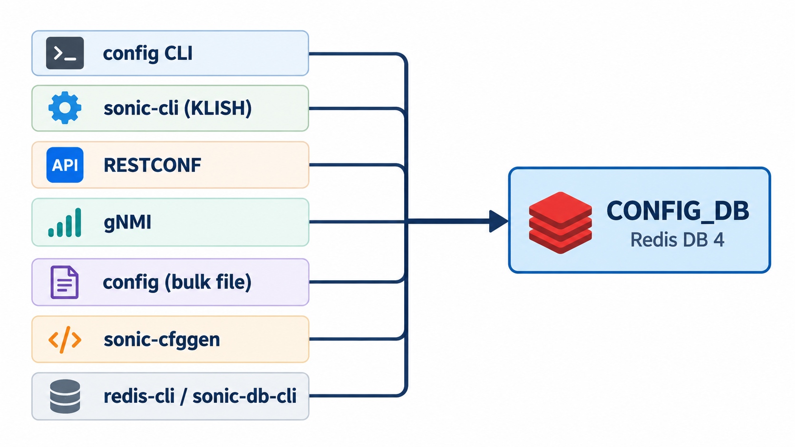
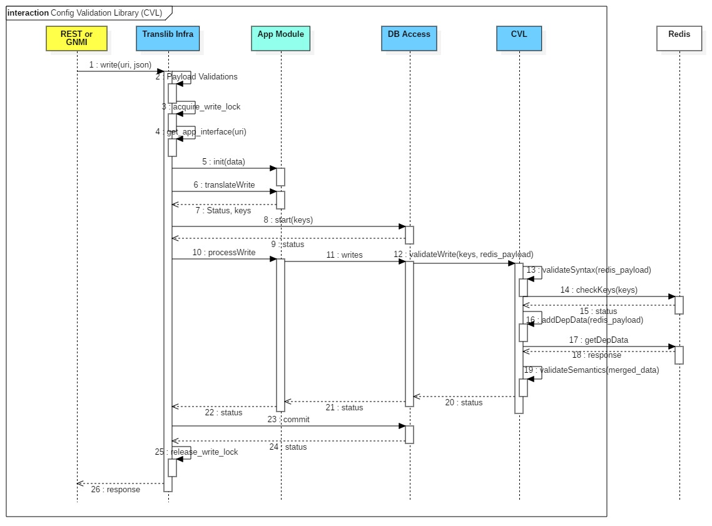

# Configuration Management

> **Prerequisites**: [Core Redis Databases](09_redis_databases.md) (CONFIG_DB as the operator's desired state), [The Database Container](08_database_container.md) (how that database is filled at boot), and [The SWSS Container](12_swss_container.md) (the manager daemons that consume it).

This document covers the full lifecycle of configuration in SONiC: where the running configuration lives, how it is populated at boot, which tools can change it, how those changes are validated, and how the rest of the system reacts when a setting changes.

## CONFIG_DB and the Saved File

### What CONFIG_DB Stores

CONFIG_DB is the **running configuration** of the switch. It holds the desired state — every port, VLAN, interface, ACL, and protocol setting the operator has defined. This is the single source of truth that the rest of SONiC reads to decide how the switch should behave.

CONFIG_DB lives in Redis memory. Redis is fast and gives SONiC a way to notify daemons instantly when a setting changes, but memory does not survive a reboot. To persist configuration across reboots, SONiC keeps a copy on disk:

```
/etc/sonic/config_db.json
```

### How the File Is Organized

The JSON file is CONFIG_DB written out as nested objects. Every value is a string, because a Redis hash stores strings:

```
{
    "PORT": {                            ← table name
        "Ethernet0": {                   ← key (which port)
            "admin_status": "up",        ← field: value
            "speed": "100000",
            "mtu": "9100"
        }
    },
    "VLAN": {                            ← table name
        "Vlan100": {                     ← key (which VLAN)
            "vlanid": "100"
        }
    },
    "VLAN_MEMBER": {                     ← table name
        "Vlan100|Ethernet4": {           ← composite key (VLAN + port)
            "tagging_mode": "untagged"
        }
    },
    "INTERFACE": {                       ← table name
        "Ethernet0|10.0.0.1/31": {       ← composite key (port + address), no fields

        }
    }
}
```

Every entry follows the same pattern, from the outside in:

```
TABLE  →  KEY  →  { field: value, ... }
```

When this file is loaded into Redis, `sonic-cfggen` turns each entry into a Redis hash. The table name and the key are joined with `|`:

```
PORT|Ethernet0                  →  admin_status=up, speed=100000, mtu=9100
VLAN|Vlan100                    →  vlanid=100
VLAN_MEMBER|Vlan100|Ethernet4   →  tagging_mode=untagged
INTERFACE|Ethernet0|10.0.0.1/31 →  (key present, no fields)
```

A composite key such as `Vlan100|Ethernet4` already contains the separator. The Redis key is the table name, another `|`, then that key. An empty object still creates the key: for `INTERFACE`, the address is part of the key, and the key's presence is the configuration.

> The reason CONFIG_DB uses `|` instead of the more conventional `:` is covered in [Core Redis Databases](09_redis_databases.md#config_db).

The file is also the unit you back up. Copying it to another switch of the same platform and HwSKU (the hardware SKU that defines the port layout and default speeds) reproduces the configuration, because port names and speeds come from that HwSKU. See [Platform Configuration](18_platform_configuration.md).

## How CONFIG_DB Is Populated at Boot

The database container is the first container to start. Once its Redis instances are up, the boot process populates CONFIG_DB. Which path runs depends on whether the switch has booted before (see [The Database Container — Startup](08_database_container.md#startup-and-readiness)).

**Clean first boot or image upgrade.** The file `/etc/sonic/config_db.json` does not exist yet (or belongs to an older release). The host service `config-setup` takes over:

- On a **clean install**, `config-setup` calls `sonic-cfggen` to read the platform seed files (`platform.json` / `port_config.ini`), generates `/etc/sonic/config_db.json`, and loads it into CONFIG_DB with `config reload`. The seed files are described in [Platform Configuration](18_platform_configuration.md#from-files-to-a-running-switch--who-reads-what-when).
- On an **upgrade from an older image**, `config-setup` copies the old configuration, reloads it, and runs the database schema migrator to update any entries to the current release's expected format.

After the file exists, it is not regenerated. The seed files are read again only when the saved file is absent.

**Normal boot.** The file already exists. The database container's startup hook loads `/etc/sonic/config_db.json` into CONFIG_DB using `sonic-cfggen --write-to-db`, runs the schema migrator if needed, and sets the `CONFIG_DB_INITIALIZED` flag. Every other container waits for that flag before it starts reading CONFIG_DB.

Once `CONFIG_DB_INITIALIZED` reaches `1`, the rest of the system is unblocked — SWSS, syncd, BGP, and every other container read CONFIG_DB and begin operating.

## Writing to CONFIG_DB

Multiple tools and interfaces can write to CONFIG_DB:



- **`config` CLI** — Python Click commands on the host; the most common way to make changes. See [Applying One Setting](#applying-one-setting).
- **`sonic-cli` (KLISH shell)** — An industry-style CLI served by the `mgmt-framework` container that translates traditional network-OS commands into CONFIG_DB writes.
- **RESTCONF** — An HTTPS API served by the `mgmt-framework` container for external automation clients and orchestrators.
- **gNMI** — A gRPC-based API served by the `gnmi` container; the standard interface used by many network automation platforms.
- **Bulk file commands** — `config load`, `config apply-patch`, `config replace`, and `config reload` apply a JSON file to CONFIG_DB. See [Applying a File](#applying-a-file).
- **`sonic-cfggen --write-to-db`** — The low-level translator used internally by boot scripts and `config load`. See [Low-Level Writes](#low-level-writes).
- **`redis-cli` / `sonic-db-cli`** — Direct Redis access; the tool of last resort for debugging. See [Low-Level Writes](#low-level-writes).

> `sonic-cli`, RESTCONF, and gNMI all pass through the `translib` library, which validates every write against YANG models before committing it. See [The Two YANG Engines](#the-two-yang-engines).

> All of these write CONFIG_DB in Redis. None of them touch `/etc/sonic/config_db.json`. The next section explains why this matters.

### CONFIG_DB and the File Diverge

Because writes go to Redis and not to the file, CONFIG_DB and `/etc/sonic/config_db.json` drift apart with each change. The file still holds whatever was last saved. If the switch reboots before the operator saves, every change since the last save is lost.

`config save` is the command that syncs them:

```bash
sudo config save -y
```

This reads CONFIG_DB and writes `/etc/sonic/config_db.json`. It does not restart anything, and it does not change the running database. To keep a backup under another name:

```bash
sudo config save -y /tmp/config_db.backup.json
```

### Applying One Setting

The `config` command is the most common way to make a single change:

```bash
sudo config interface speed Ethernet0 100000
sudo config vlan add 100
sudo config vlan member add 100 Ethernet4
```

Every `config` command requires root, so the examples use `sudo`.

### Applying a File

Four commands apply a JSON file. They differ in which keys they change and whether they restart services.

#### `config load`

`config load` merges a JSON file into CONFIG_DB. Fields named in the file are written onto the matching key. Other fields already on that key stay, and keys the file does not mention are left in place.

With no path, it reads `/etc/sonic/config_db.json`. It asks for confirmation unless you pass `-y`.

```bash
sudo config load -y
sudo config load -y /tmp/extra.json
```

#### `config apply-patch`

`config apply-patch` takes a JSON Patch (RFC 6902) — a list of add, replace, and remove operations that describe changes relative to the current CONFIG_DB. Only the operations in the patch are applied: a key is removed only when an explicit `remove` operation targets it.

```bash
sudo config apply-patch /tmp/port-down.json
```

```json
[
    { "op": "replace", "path": "/PORT/Ethernet0/admin_status", "value": "down" }
]
```

Add `-d` to simulate the result and print it without writing:

```bash
sudo config apply-patch -d /tmp/port-down.json
```

#### `config replace`

`config replace` takes a complete `config_db.json`-shaped file. The file is the entire configuration: after the command finishes, CONFIG_DB matches the file exactly. Any key or field that the file omits is deleted. The updater builds a patch from the current database to the target file and applies the difference.

```bash
sudo config replace /tmp/new_config.json
```

Add `-d` for a dry run:

```bash
sudo config replace -d /tmp/new_config.json
```

#### `config reload`

`config reload` is a full reset. It stops all SONiC services, deletes every CONFIG_DB key, loads the file, and starts the services again. Traffic is interrupted until the services recover. With no path it reads `/etc/sonic/config_db.json`. It asks for confirmation unless you pass `-y`.

```bash
sudo config reload -y
sudo config reload -y /tmp/new_config.json
```

> The step-by-step sequence is in [Config Reload](21_config_reload.md).

> After `config reload` from a path other than the boot file, CONFIG_DB matches that path while `/etc/sonic/config_db.json` still holds the previous configuration. The next boot loads the boot file. Run `config save` when the new configuration should survive a reboot.

### Low-Level Writes

`sonic-cfggen` is the program that `config load` and `config reload` call internally to translate JSON into CONFIG_DB. Boot scripts and container entrypoints also use it to render config files from the database.

```bash
sonic-cfggen -j /tmp/my_config.json --write-to-db
```

A direct Redis write does the same thing one field at a time. From [Accessing the Database](08_database_container.md#accessing-the-database):

```bash
redis-cli -n 4 HSET "PORT|Ethernet0" "admin_status" "down"
```

These are useful in the lab when you need to see the raw database effect. Neither tool validates the data against YANG models, so they can store a value the schema does not allow. They also leave `/etc/sonic/config_db.json` unchanged.

## YANG Validation

### The Problem: Redis Has No Schema

As shown above, many different tools can write to CONFIG_DB — CLI commands, RESTCONF, gNMI, bulk file loads, and even raw Redis writes. Redis itself is a plain key-value store: it accepts whatever data it is given. If a tool writes `admin_status = "maybe"` or sets `speed = "banana"`, Redis stores it without complaint.

This is a problem. The manager daemon expecting `admin_status` to be `up` or `down` will not know what to do with `maybe`. It may ignore the key, log an error, or apply only the fields it understands. The switch ends up in an inconsistent state that is hard to debug.

Each writing tool could implement its own validation — and some do (for example, `config vlan add` checks that the VLAN ID is between 2 and 4094). But per-tool checks are fragile: they can be inconsistent across tools, incomplete, or absent entirely. A better approach is a single, centralized schema that describes what a legal CONFIG_DB looks like, so any tool can validate against the same rules.

### What Is YANG?

YANG (RFC 7950) is a data-modeling language designed for network equipment. The IETF introduced it in 2010 (and revised it in 2016) to give the networking industry a standard way to describe configuration and state data — what fields a device supports, what values those fields accept, and how they relate to each other. Before YANG, every vendor defined its own configuration format with its own validation rules, making automation across different devices difficult.

A YANG model is not code that runs on the device. It is a formal description — a schema — that tools read to understand the shape of the data. A model says things like "this field is a string that must match `up` or `down`" or "this list is keyed by interface name." Any tool that knows the schema can validate data before sending it to the device, regardless of whether that tool is a CLI, a REST client, or a gNMI controller.

YANG is widely adopted across the industry. OpenConfig publishes vendor-neutral YANG models for common features (interfaces, BGP, LLDP, and others), and most network operating systems — including SONiC — ship their own YANG models for platform-specific configuration.

> For a deeper introduction to YANG see [YANG (Yet Another Next Generation)](https://github.com/ManiAm/GNS-Sonic-Telemetry/blob/master/docs/05_README_yang.md).

### How SONiC Uses YANG

SONiC uses YANG as the schema for CONFIG_DB. The YANG models define which tables are allowed, which fields each table may contain, and which values those fields may hold. They ship with the image and match the string values stored in Redis.

A shortened illustration — each `leaf` is a single field, and `type` / `pattern` constrain its values:

```yang
leaf admin_status {
    type string {
        pattern "up|down";
    }
}
leaf speed { type string; }
leaf mtu   { type string; }
```

### The Two YANG Engines

YANG models are just descriptions — they do not execute on their own. Something has to load the models, take the data that is about to be written, and check it against the rules. SONiC has two libraries that do this, written in different languages for different parts of the system.

- **CVL (Config Validation Library)** is a Go library in the `sonic-mgmt-common` repository. It is the YANG engine used by `translib`, the shared backend that serves RESTCONF, gNMI, and the `sonic-cli` (KLISH) shell. When any of these interfaces writes to CONFIG_DB, the `translib` DB layer calls `CVL.ValidateEditConfig()` inside the transaction, before the Redis write is committed. CVL validates **each edit individually**. It checks the operation (create, update, delete) against the YANG model for that table, resolving types, patterns, leafrefs, and `must`/`when` constraints in the context of the current database state.

    

    *The diagram above traces a write request from a northbound interface (REST or gNMI) through translib. After the App Module translates the request into Redis keys and values, the DB Access layer calls CVL to validate the payload before anything is committed. CVL runs syntax validation on the fields, checks the keys, fetches dependent data from Redis (the current database state needed to evaluate leafrefs and `must`/`when` constraints), and runs semantic validation on the merged data. Only after CVL returns success does the DB Access layer issue the Redis `commit`. If CVL rejects the edit, the transaction is rolled back and the caller receives an error.*

- **`sonic_yang`** is a Python library used by the `config` CLI utilities. It is the engine behind `config apply-patch`, `config replace`, and `config reload <file>`. These commands do not validate one edit at a time. Instead, they simulate the **entire resulting configuration**, load it into `sonic_yang`, and call `validate_data_tree()` to check the whole tree at once. If validation fails, nothing is written.

Both libraries load the same YANG model files that ship with the image. They enforce the same schema — the difference is in granularity (per-edit vs. whole-config) and which part of the system calls them.

### Which Writers Validate

Not every writer goes through a YANG engine. The table below shows which engine, if any, validates each writer:

| Writer                                  | Validation                             |
|-----------------------------------------|----------------------------------------|
| `sonic-cli` (KLISH)                     | CVL — per-edit validation              |
| RESTCONF                                | CVL — per-edit validation              |
| gNMI                                    | CVL — per-edit validation              |
| `config apply-patch`                    | `sonic_yang` — whole-config validation |
| `config replace`                        | `sonic_yang` — whole-config validation |
| `config reload <file>`                  | `sonic_yang` — whole-config validation |
| `config interface`, `config vlan`, ...  | Per-command checks only (no YANG)      |
| `config load`                           | None                                   |
| `config reload` (no file argument)      | None                                   |
| `sonic-cfggen --write-to-db`            | None                                   |
| `redis-cli` / `sonic-db-cli`            | None                                   |

A write that skips the YANG check can store a value the models do not allow. The manager daemon for that table may then ignore the key, log an error, or apply only the part it understands.

Some `config` subcommands (hostname, portchannel, SNMP, mirror session) can optionally route their writes through the same updater that `config apply-patch` uses. This happens when `yang_config_validation` is enabled in CONFIG_DB:

```
DEVICE_METADATA|localhost → yang_config_validation = enable
```

```bash
sudo config yang_config_validation enable
sudo config yang_config_validation disable
```

When the field is absent or set to `disable`, those subcommands store the fields directly without a YANG check. `config apply-patch` and `config replace` always validate regardless of this setting.

## What Happens After a CONFIG_DB Change

No matter which tool wrote the change, the result is the same: CONFIG_DB now holds a new or modified key, and programs that are watching that table are notified. Three categories of programs respond, each owning different tables.

**SWSS manager daemons** handle the tables that become forwarding state. `portmgrd` watches `PORT`, `vlanmgrd` watches `VLAN` and `VLAN_MEMBER`, `intfmgrd` watches `INTERFACE`, and the other `*mgrd` processes follow the same pattern. The daemon is notified of the changed key, checks that the change can be applied, updates the Linux kernel when the feature has a kernel object, and writes the result to APPL_DB. Orchagent then translates APPL_DB into ASIC_DB, and syncd programs the ASIC.

```
CONFIG_DB
    │
    v
Manager daemon (portmgrd, vlanmgrd, intfmgrd, ...)
    │
    ├── checks the change and updates the Linux kernel
    |
    v
APPL_DB  →  orchagent  →  ASIC_DB  →  syncd  →  ASIC
```

> Which daemon owns which table is listed in [The SWSS Container](12_swss_container.md#manager-daemons-mgrd).

**Host services** read other tables and apply them on the host itself: hostname, DNS, NTP, syslog, and the management interface. They do not write APPL_DB. See [Host Services](19_host_services.md#boot-time-configuration-services).

**Feature containers** read their own tables and build their process configuration. BGP is the common case: the BGP container renders FRR's configuration from CONFIG_DB. Learned routes reach the ASIC later, through `fpmsyncd` and APPL_DB, which is a different path from the manager-daemon path above. See [The BGP Container](15_bgp_container.md).

### Live Changes vs. Restart-Only Tables

Most CONFIG_DB tables are watched in real time by a daemon. `portmgrd` subscribes to `PORT`, `vlanmgrd` subscribes to `VLAN` and `VLAN_MEMBER`, `intfmgrd` subscribes to `INTERFACE`, and so on. When a key in one of these tables changes, the daemon is notified through Redis and applies the change live. No restart is needed.

Some CONFIG_DB tables are only read when their service starts. The service does not subscribe to Redis notifications for that table, so writing a new value has no visible effect while the service is running — the change sits in CONFIG_DB, but nothing picks it up until the next restart.

This distinction matters most for `config apply-patch` and `config replace`. Both use the Generic Config Updater (GCU) to apply changes. The GCU writes every change to CONFIG_DB. For tables that have a live subscriber (such as `PORT` watched by `portmgrd`), the subscriber picks up the change through a Redis notification and no restart is needed. For tables that the GCU knows require extra action, it runs a post-write validator that may restart the associated service.

The mapping lives in `gcu_services_validator.conf.json`. Each entry names a table and a validator function.

The validators that restart a service include:

- `rsyslog-config` — for `SYSLOG_SERVER` changes
- `dhcp_relay` — for `DHCP_RELAY`, `DHCP_SERVER`, and VLAN DHCP-server changes
- `chrony` — for `NTP_SERVER` changes
- `gnmi` — for `GNMI` VRF changes
- `telemetry` — for `TELEMETRY` VRF changes or `PORT` speed changes

Tables not listed in the file are written and left to their subscribing daemons.

```
config apply-patch                     config replace
        │                                    │
        └──────────────┬─────────────────────┘
                       ▼
            Generic Config Updater (GCU)
                       │
                       ▼
            1. Validate field operations
               and sort patch into ordered changes
                       │
                       ▼
            2. Write each change to CONFIG_DB
                       │
                       ▼
            3. Run post-write validators
               (from gcu_services_validator.conf.json)
                       │
        ┌──────────────┴──────────────────────┐
        │                                     │
    Table has a validator               Table has no validator
        │                                     │
        ▼                                     ▼
    Validator runs                    Subscribing daemon
    (may restart service:             picks up the change
     rsyslog, dhcp_relay,             via CONFIG_DB notification
     chrony, gnmi, telemetry)
        │                                     │
        └──────────────┬──────────────────────┘
                       ▼
            4. Verify CONFIG_DB matches
               expected target config
```

`config reload` sidesteps this entirely: it stops and starts all services, so every table — live or restart-only — is read fresh.

For a single `config` command (such as `config interface speed`), the command output says when a restart is required. The command itself does not restart the service automatically:

```
admin@sonic:~$ sudo config interface speed Ethernet0 40000
Speed setting for Ethernet0 will take effect after restart syncd service.
```

The speed field is now updated in CONFIG_DB, but `syncd` has not been restarted. The operator must restart it manually (`sudo systemctl restart syncd`) for the new speed to take effect.

---

**Previous**: [← Host Services](19_host_services.md) · **Next**: [Config Reload →](21_config_reload.md)
