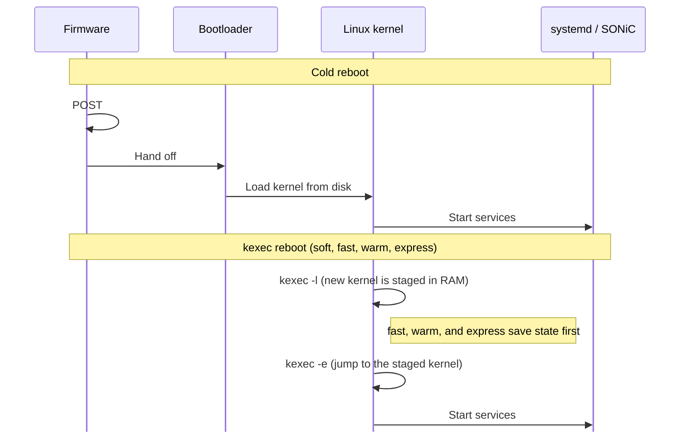

# Reboot Types

> **Prerequisites**: [Container Run Time](05_container_run_time.md) (systemd starts services after the kernel boots), [The Database Container](07_database_container.md) (Redis and `config_db.json`), and [SAI and Syncd](13_sai_and_syncd.md) (how software programs the forwarding chip).

SONiC can restart a switch in five ways. They differ in two things: how much of the hardware initialization they skip, and how much forwarding state they keep.

| | Cold | Soft | Fast | Warm | Express |
|---|---|---|---|---|---|
| **Command** | `sudo reboot` | `sudo soft-reboot` | `sudo fast-reboot` | `sudo warm-reboot` | `sudo express-reboot` |
| **Boot path** | Firmware and bootloader | kexec | kexec | kexec | kexec |
| **ASIC** | Reset, programmed from scratch | Reset, programmed from scratch | Reset, then restored | Left running; software reconciles | Left running (PXE pre-shutdown) |
| **Redis** | Empty, then `config_db.json` | Empty, then `config_db.json` | Restored from `dump.rdb` | Restored from `dump.rdb` | Restored from `dump.rdb` |
| **MAC / neighbors** | Relearned | Relearned | Saved, then restored | Stay in the ASIC | Stay in the ASIC |
| **BGP** | Sessions drop | Sessions drop | Graceful Restart | Graceful Restart | Graceful Restart |
| **Data plane** | Minutes | Minutes, minus POST | Target under 30 seconds | Target sub-second or none | Target sub-second or none |
| **Control plane** | Minutes | Minutes, minus POST | Target under 90 seconds | Target under 90 seconds | Target under 90 seconds |
| **Where it runs** | Every platform | Every platform | General | SAI warm-boot support required | Cisco 8000 and Marvell Teralynx |

## Data Plane and Control Plane

Every reboot discussion uses these two terms:

- The **data plane** is the forwarding chip (the ASIC) moving packets. Its tables — which port a MAC address was seen on, which next hop a route uses — live in the ASIC's own memory. The CPU can restart without erasing those tables, as long as nothing explicitly resets the chip.

- The **control plane** is everything that runs on the CPU: the Linux kernel, Redis, the SONiC containers, and BGP. A reboot always restarts the control plane. BGP sessions drop unless the neighbors have been told to hold routes while the switch comes back (that mechanism is [Graceful Restart](#bgp-graceful-restart), below).

## How the CPU Boots

### A cold boot

A cold boot runs the full hardware sequence:

1. Firmware power-on self-test (POST). On a switch this often takes 30–60 seconds, sometimes longer.
2. The bootloader (GRUB, or a platform equivalent) reads the SONiC image from disk.
3. The Linux kernel starts, then systemd starts the SONiC services.

### kexec: skip firmware and the bootloader

**kexec** (kernel execute) loads a new kernel into memory from the kernel that is already running, then jumps to it. The CPU stays in the kernel and skips firmware and the bootloader. Soft, fast, warm, and express reboot use kexec.

kexec has two steps, and SONiC separates them on purpose.

**Load** (`kexec -l`) copies the kernel, the initrd (a small filesystem the kernel uses while it starts), and the kernel command line into a reserved area of RAM. The current system keeps running, so SONiC can still save state after this step.

```bash
# What the reboot scripts run (invoke_kexec). -a lets kexec choose a load method.
/sbin/kexec -l "$KERNEL_IMAGE" --initrd="$INITRD" --append="$BOOT_OPTIONS" -a
```

`$BOOT_OPTIONS` includes `SONIC_BOOT_TYPE=...`, which tells the next boot which reboot just happened. On a secure-boot system the script uses `-s` instead of `-a`, so the kernel image is verified before it is loaded.

**Execute** (`kexec -e`) is the point of no return. The running kernel shuts down and the CPU starts the kernel that was loaded in the first step.

```bash
exec /sbin/kexec -e
```

The kexec scripts load the kernel while services are still up, and they jump to it only after containers have stopped. Fast, warm, and express reboot also save state in between those two steps. Soft reboot does not.



## How the New Boot Chooses a Path

The new kernel learns the reboot type from its command line. After boot, services read that line from `/proc/cmdline`.

syncd turns the type into a **SAI start type**: a number in `sai_start_type_t` that the vendor library uses when it opens the ASIC. syncd passes it with `-t`. Cold and soft leave `-t` off, and the library uses cold (0).

| Reboot | `SONIC_BOOT_TYPE` | syncd flag | SAI start type |
|---|---|---|---|
| Cold | Not set | omitted | 0, cold |
| Soft | `soft` | omitted | 0, cold. Nothing matches `soft`, so the scripts treat it as cold. |
| Fast | `fast-reboot` | `-t fast` | 2 |
| Warm | `warm` | `-t warm` | 1 |
| Warm on NVIDIA | `fastfast` | `-t fastfast` | 3. The operator still runs `warm-reboot`. |
| Express | `express` | `-t express` | 4. Cisco 8000 and Marvell Teralynx. |

What the ASIC does for each flag is described with that reboot type below.

The database container maps the command line in `getBootType()` (`docker_image_ctl.j2`):

```bash
case "$(cat /proc/cmdline)" in
    *SONIC_BOOT_TYPE=warm*)      TYPE='warm'      ;;
    *SONIC_BOOT_TYPE=fastfast*)  TYPE='fastfast'  ;;
    *SONIC_BOOT_TYPE=express*)   TYPE='express'   ;;
    *SONIC_BOOT_TYPE=fast*|*fast-reboot*)
                                 TYPE='fast'      ;;
    *)                           TYPE='cold'      ;;
esac
```

Two details in that match are easy to miss:

- `fastfast` is tested before `fast`. Fastfast is NVIDIA's warm reboot: on Spectrum switches, `sudo warm-reboot` writes `SONIC_BOOT_TYPE=fastfast`, and syncd starts with `-t fastfast` (SAI start type 3). The goal is still a hitless restart. The [warm reboot](#warm-reboot) section describes how the ASIC handling differs. The pattern `*SONIC_BOOT_TYPE=fast*` also matches the string `fastfast`, so this line has to come first. Otherwise a fastfast boot would be classified as fast.

- `soft` matches none of the named patterns, so it falls through to `cold`.

You can see the argument from the new boot with:

```bash
cat /proc/cmdline | grep SONIC_BOOT_TYPE
```

## What Fast, Warm, and Express Share

Cold and soft discard state. Fast, warm, and express keep enough of it for neighbors and link partners to ride through the restart.

### The Redis snapshot

During normal operation Redis is in memory. A reboot wipes that memory. Before a fast, warm, or express reboot, the script calls Redis `SAVE`, which writes `dump.rdb`, and copies that file to `/host/warmboot/`. The `/host` partition is still there after the new kernel starts.

On the next boot the database container sees the matching `SONIC_BOOT_TYPE` and the snapshot file, and it starts Redis by loading `dump.rdb`. Cold and soft reboot rename any leftover snapshot aside and unload a staged kexec kernel, so the next boot cannot accidentally restore it.

The snapshot is trimmed first. Most of STATE_DB is deleted. The script keeps `FDB_TABLE` (MAC addresses the ASIC has learned), the warm-restart flags, and a few other tables such as mirror sessions. Fast reboot, express reboot, and NVIDIA fastfast also flush `ASIC_DB`, `COUNTERS_DB`, and `FLEX_COUNTER_DB` before the save. Fast reboot also flushes `RESTAPI_DB`. Generic warm reboot leaves `ASIC_DB` in the snapshot: the new syncd uses those SAI object IDs to reconnect to the chip that is still forwarding.

After Redis loads the snapshot, syncd checks those flags before it chooses a start type. `SONIC_BOOT_TYPE=fast-reboot` counts as a fast boot only when `FAST_RESTART_ENABLE_TABLE|system` is `true`. Warm, fastfast, and express require the warm-restart flags in that same snapshot. The kernel argument and the saved flags have to agree.

If there is no snapshot, the database container loads `/etc/sonic/config_db.json` into CONFIG_DB and the rest of the system builds state from that configuration. That is the cold and soft path. See [The Database Container](07_database_container.md).

### BGP Graceful Restart

**Graceful Restart** (RFC 4724) is a BGP signal sent before the routing stack stops. It tells each neighbor: this speaker is restarting; keep the routes you learned from it for the restart interval (commonly about 120 seconds) instead of withdrawing them.

Without that signal, every neighbor would delete the switch's routes as soon as the BGP session closed, and traffic across the network would shift even if this switch's ASIC were still forwarding. With it, neighbors keep forwarding toward the switch until BGP comes back and refreshes the routes.

Fast, warm, and express reboot send this signal and depend on neighbors that support it. On NVIDIA switches, warm reboot runs as fastfast and uses the same signal. Cold and soft reboot do not send it: the BGP sessions drop, and neighbors withdraw the routes.

### LACP slow mode

A **LAG** (link aggregation group) bundles several physical links. **LACP** keeps the bundle alive by sending periodic messages to the partner switch.

LACP has two speeds:

| Mode | Message interval | Partner declares the link dead after |
|------|------------------|--------------------------------------|
| Fast | 1 second         | 3 seconds                            |
| Slow | 30 seconds       | 90 seconds                           |

Fast, warm, and express reboot take longer than 3 seconds, so a LAG in fast mode drops during the restart. Slow mode leaves a 90-second window. The reboot script also starts `lag_keepalive.py`, which keeps sending LACP messages through the gap. LAG members used with these reboot types need to be in LACP slow mode.


## Cold Reboot

Cold reboot is a full restart through firmware. The ASIC is reset, Redis starts empty, and every service programs the switch from `config_db.json`. Plan on minutes. Use it when the running state cannot be trusted, or when the next image cannot reuse state that a faster reboot would try to keep.

```bash
sudo reboot
```


**Shut down**

- On most platforms the script asks syncd for a cold shutdown (`syncd_request_shutdown --cold`) and stops the pmon container.
- Any `dump.rdb` left by an earlier fast, warm, or express reboot is renamed, and a staged kexec kernel is unloaded.
- The script records the reboot cause and calls `/sbin/reboot`. The kernel and the remaining containers go down with that reset.

**Firmware POST**

- The CPU resets through firmware. Power-on self-test often takes 30–60 seconds, sometimes longer.

**Bootloader**

- GRUB, or the platform bootloader, loads the SONiC kernel from disk.
- `SONIC_BOOT_TYPE` is not set.

**Fresh Redis**

- systemd starts the database container. Redis is empty.
- `/etc/sonic/config_db.json` is loaded into CONFIG_DB, and the other containers start from that configuration.

**ASIC from scratch**

- syncd starts with no `-t` flag. That is SAI start type 0, cold.
- The firmware reset cleared the ASIC. orchagent programs it again from the configuration that was just loaded.

**BGP relearn**

- Graceful Restart is not sent. BGP sessions drop, and neighbors withdraw routes immediately.
- Sessions form again and routes are learned from scratch.


## Soft Reboot

Soft reboot programs the ASIC from scratch, the same way a cold reboot does. It uses kexec, so firmware POST and the bootloader do not run. Skipping those steps usually saves 30–60 seconds. Use it for a clean restart when that time is the only thing you need to save.

```bash
sudo soft-reboot
```


**Shut down**

- On most platforms the script asks syncd for a cold shutdown, then stops pmon.
- It turns warm-restart off, renames any leftover `dump.rdb`, and unloads a staged kexec kernel.
- No Redis snapshot is taken. Graceful Restart and LACP keepalive are not used.

**kexec**

- The script loads the next kernel with `SONIC_BOOT_TYPE=soft`, then jumps to it with `kexec -e`.
- Firmware POST and the bootloader do not run. The new boot treats `soft` as cold, because no startup script has a `soft` branch.

**Fresh Redis**

- systemd starts the database container with empty Redis.
- `config_db.json` is loaded into CONFIG_DB. This is the same handoff as a cold boot.

**ASIC from scratch**

- syncd is not given `-t`, so the ASIC is programmed as a cold start (SAI start type 0).

**BGP relearn**

- Graceful Restart is not sent. Neighbors withdraw routes, and the sessions are built again.


## Fast Reboot

Fast reboot resets the ASIC and then restores the saved state, so the switch does not have to relearn the network from scratch. The data-plane target is under 30 seconds. The control-plane target is under 90 seconds, inside the Graceful Restart window. Forwarding stops while the ASIC is reset, and it returns when the saved entries are programmed again.

```bash
sudo fast-reboot
```


**Save state**

- The script sets `FAST_RESTART_ENABLE_TABLE|system` to `true` and enables warm-restart. It checks database integrity, free space on `/host`, and the next image.
- It loads the next kernel with `kexec -l` and `SONIC_BOOT_TYPE=fast-reboot`. The old kernel keeps running.
- LACP keepalive starts. orchagent is paused so it cannot change the ASIC during shutdown.
- Learned routes are deleted from APPL_DB. Connected and default routes stay (`fast-reboot-filter-routes.py`).
- Services stop in the order in `/etc/sonic/fast-reboot_order`. BGP signals [Graceful Restart](#bgp-graceful-restart) as it stops. Fast reboot does not send a pre-shutdown to syncd, so the ASIC is not asked to keep forwarding.
- Redis `SAVE` writes `dump.rdb`, which is copied to `/host/warmboot/`. That directory is on the `/host` partition, so it is still there after the new kernel starts. Before the save, most of STATE_DB is deleted. `FDB_TABLE` (learned MAC addresses) and the warm-restart flags are kept. `ASIC_DB`, `COUNTERS_DB`, `FLEX_COUNTER_DB`, and `RESTAPI_DB` are flushed. Docker is then stopped.

**kexec**

- `kexec -e` jumps to the kernel loaded in the previous block. Firmware and the bootloader do not run.

**Restore Redis**

- systemd starts the containers. The database container finds `SONIC_BOOT_TYPE=fast-reboot` and `/host/warmboot/dump.rdb`, and Redis loads that snapshot.

**ASIC fast restore**

- syncd sees the fast-reboot argument and `FAST_RESTART_ENABLE_TABLE|system` set to `true`, and it starts with `-t fast` (SAI start type 2).
- The ASIC was reset, so syncd creates new SAI objects. orchagent refills the chip from the restored state, including the saved MAC and neighbor entries.

**Graceful Restart**

- BGP sent Graceful Restart before it stopped. Neighbors hold the routes for the restart interval, commonly about 120 seconds, while the sessions come back.
- LAG members rejoin. They stay up through the gap only if LACP is in slow mode.


## Warm Reboot

Warm reboot restarts the control plane and leaves the ASIC forwarding. The chip is not reset. Routes, neighbors, and the MAC table stay in ASIC memory while the kernel and the containers come back. The data-plane target is a sub-second hit, or no loss. The control plane still has to finish inside the Graceful Restart window.

```bash
sudo warm-reboot
```


**Save state**

- The script enables warm-restart and checks that this reboot is safe: database integrity, free space on `/host`, a valid next image, and an ASIC configuration that matches the next image. If that configuration differs, the script stops.
- It loads the next kernel with `kexec -l` and `SONIC_BOOT_TYPE=warm`. The old kernel keeps running.
- LACP keepalive starts, and the LACP retry count is raised when the neighbors support it. orchagent is paused.
- Services stop in the order in `/etc/sonic/warm-reboot_order`. BGP signals Graceful Restart as it stops.
- After swss stops, syncd is asked to pre-shutdown (`syncd_request_shutdown --pre`). That request does not reset the ASIC. Forwarding entries stay in the chip.
- Redis `SAVE` writes `dump.rdb` to `/host/warmboot/`. Most of STATE_DB is deleted first. `FDB_TABLE` and the warm-restart flags are kept. `ASIC_DB` is kept as well, so the new syncd still has the SAI object IDs for the running chip. Docker is then stopped.

**kexec**

- `kexec -e` starts the staged kernel. Firmware and the bootloader do not run. The ASIC is a separate device and is not part of this jump.

**Restore Redis**

- The database container sees `SONIC_BOOT_TYPE=warm` (`fastfast` on NVIDIA) and loads `dump.rdb`. APPL_DB, ASIC_DB, CONFIG_DB, and the warm-restart flags are back.

**ASIC reconcile**

- syncd starts with `-t warm` (SAI start type 1) only when the restored snapshot still has the warm-restart flags. The kernel argument and those flags have to agree. It then reconnects to the ASIC using the saved SAI object IDs.
- Each layer compares the restored Redis state with what the hardware already has, and programs only the differences. That comparison is **reconciliation**. The vendor SAI library has to implement it.

**Graceful Restart**

- BGP sent Graceful Restart before it stopped. Neighbors hold the routes for the restart interval, commonly about 120 seconds. The new BGP session refreshes those routes.
- LAGs rejoin without a link-down, which requires LACP slow mode.

On NVIDIA Spectrum switches the same command takes a different internal path. The script sees `asic_type=mellanox`, checks that fast-fast boot is supported, then runs the boxes above as `fastfast-reboot` with `SONIC_BOOT_TYPE=fastfast`. syncd starts with `-t fastfast` (SAI start type 3) only when the warm-restart flags are in the restored snapshot. Pre-shutdown is still `--pre`. `ASIC_DB`, `COUNTERS_DB`, and `FLEX_COUNTER_DB` are flushed before the snapshot, and `FDB_TABLE` is kept. Graceful Restart is still sent. The operator command and the goal — a hitless restart — stay the same.

The reconciliation steps inside each container are in [Warm Reboot Deep Dive](22_warm_reboot.md).


## Express Reboot

Express reboot keeps the ASIC forwarding while the software stack restarts. It is implemented only for Cisco 8000 and Marvell Teralynx. On any other ASIC the script exits with `eXpress Boot is not supported`. The data-plane target matches warm reboot.

```bash
sudo express-reboot
```


**Save state**

- The script checks the ASIC type, enables warm-restart, and runs the same safety checks as warm reboot, including the ASIC configuration match against the next image.
- It loads the next kernel with `kexec -l` and `SONIC_BOOT_TYPE=express`.
- LACP keepalive starts, the LACP retry count is raised when neighbors support it, and orchagent is paused.
- Services stop in `/etc/sonic/warm-reboot_order`, the same file warm reboot uses. BGP signals Graceful Restart as it stops.
- After swss stops, syncd is asked to pre-shutdown in PXE mode (`syncd_request_shutdown --pxe`). That vendor signal tells the ASIC to hold its forwarding entries. Warm reboot sends `--pre` at this same point.
- Redis `SAVE` writes `dump.rdb` to `/host/warmboot/`. Most of STATE_DB is deleted first. `FDB_TABLE` and the warm-restart flags are kept. `ASIC_DB`, `COUNTERS_DB`, and `FLEX_COUNTER_DB` are flushed. Docker is then stopped.

**kexec**

- `kexec -e` starts the staged kernel. Firmware and the bootloader do not run. The ASIC keeps the forwarding entries left by the PXE pre-shutdown.

**Restore Redis**

- The database container sees `SONIC_BOOT_TYPE=express` and loads `dump.rdb`. `FDB_TABLE` and the warm-restart flags are in that snapshot. `ASIC_DB` is empty, because it was flushed before the save.

**ASIC held (PXE)**

- syncd starts with `-t express` (SAI start type 4) only when the restored snapshot still has the warm-restart flags. The kernel argument and those flags have to agree.
- The ASIC was not reset. The vendor SAI attaches to the forwarding state the PXE pre-shutdown left in place.

**Graceful Restart**

- BGP sent Graceful Restart before it stopped. Neighbors hold the routes for the restart interval, commonly about 120 seconds, and LAGs rejoin under LACP slow mode.

## Which Reboot to Use

| Situation | Reboot |
|---|---|
| First boot after installing an image | Cold |
| The switch is in an unknown or failed state | Cold |
| ASIC SDK upgrade, or a downgrade | Cold |
| A clean restart, and skipping firmware POST is enough | Soft |
| Planned upgrade, short data-plane loss is acceptable | Fast |
| The platform cannot warm-reboot | Fast |
| Planned upgrade, traffic must keep flowing | Warm |
| Hitless restart on Cisco 8000 or Marvell Teralynx | Express |

Fast, warm, and express still need Graceful Restart on the BGP neighbors and LACP slow mode on any LAG. If either is missing, use cold or soft.

---

**Previous**: [← Config Reload](20_config_reload.md) · **Next**: [Warm Reboot Deep Dive →](22_warm_reboot.md)
