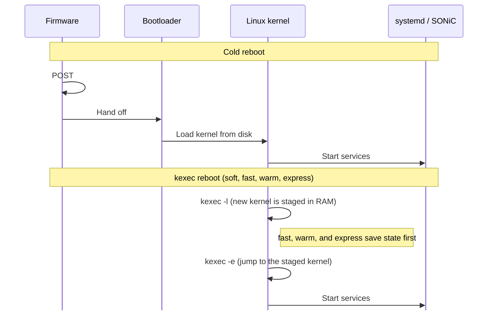

# Reboot Types

> **Prerequisites**: [Container Run Time](05_container_run_time.md) (systemd starts services after the kernel boots), [The Database Container](07_database_container.md) (Redis and `config_db.json`), and [SAI and Syncd](13_sai_and_syncd.md) (how software programs the forwarding chip).

SONiC can restart a switch in five ways. They differ in two things: how much of the hardware initialization they skip, and how much forwarding state they keep.

| | Cold | Soft | Fast | Warm | Express |
|---|---|---|---|---|---|
| **Command** | `sudo reboot` | `sudo soft-reboot` | `sudo fast-reboot` | `sudo warm-reboot` | `sudo express-reboot` |
| **Boot path** | Firmware and bootloader | kexec | kexec | kexec | kexec |
| **ASIC** | Reset, programmed from scratch | Reset, programmed from scratch | Reset, then restored | Left running; software reconciles | Left running (PXE pre-shutdown) |
| **Redis** | Empty, then `config_db.json` | Empty, then `config_db.json` | Restored from `dump.rdb` | Restored from `dump.rdb` | Restored from `dump.rdb` |
| **MAC / neighbors** | Relearned | Relearned | Saved, then restored | Stay in the ASIC | Stay in the ASIC |
| **BGP** | Sessions drop | Sessions drop | Graceful Restart | Graceful Restart | Graceful Restart |
| **Data plane** | Minutes | Minutes, minus POST | Target under 30 seconds | Target sub-second or none | Target sub-second or none |
| **Control plane** | Minutes | Minutes, minus POST | Target under 90 seconds | Target under 90 seconds | Target under 90 seconds |
| **Where it runs** | Every platform | Every platform | General | SAI warm-boot support required | Cisco 8000 and Marvell Teralynx |

## Data Plane and Control Plane

Every reboot discussion uses these two terms:

- The **data plane** is the forwarding chip (the ASIC) moving packets. Its tables — which port a MAC address was seen on, which next hop a route uses — live in the ASIC's own memory. The CPU can restart without erasing those tables, as long as nothing explicitly resets the chip.

- The **control plane** is everything that runs on the CPU: the Linux kernel, Redis, the SONiC containers, and BGP. A reboot always restarts the control plane. BGP sessions drop unless the neighbors have been told to hold routes while the switch comes back (that mechanism is [Graceful Restart](#bgp-graceful-restart), below).

## How the CPU Boots

### A cold boot

A cold boot runs the full hardware sequence:

1. Firmware power-on self-test (POST). On a switch this often takes 30–60 seconds, sometimes longer.
2. The bootloader (GRUB, or a platform equivalent) reads the SONiC image from disk.
3. The Linux kernel starts, then systemd starts the SONiC services.

### kexec: skip firmware and the bootloader

**kexec** (kernel execute) loads a new kernel into memory from the kernel that is already running, then jumps to it. The CPU stays in the kernel and skips firmware and the bootloader. Soft, fast, warm, and express reboot use kexec.

kexec has two steps, and SONiC separates them on purpose.

**Load** (`kexec -l`) copies the kernel, the initrd (a small filesystem the kernel uses while it starts), and the kernel command line into a reserved area of RAM. The current system keeps running, so SONiC can still save state after this step.

```bash
# What the reboot scripts run (invoke_kexec). -a lets kexec choose a load method.
/sbin/kexec -l "$KERNEL_IMAGE" --initrd="$INITRD" --append="$BOOT_OPTIONS" -a
```

`$BOOT_OPTIONS` includes `SONIC_BOOT_TYPE=...`, which tells the next boot which reboot just happened. On a secure-boot system the script uses `-s` instead of `-a`, so the kernel image is verified before it is loaded.

**Execute** (`kexec -e`) is the point of no return. The running kernel shuts down and the CPU starts the kernel that was loaded in the first step.

```bash
exec /sbin/kexec -e
```

The kexec scripts load the kernel while services are still up, and they jump to it only after containers have stopped. Fast, warm, and express reboot also save state in between those two steps. Soft reboot does not.



## How the New Boot Chooses a Path

The new kernel learns the reboot type from its command line. After boot, services read that line from `/proc/cmdline`.

syncd turns the type into a **SAI start type**: a number in `sai_start_type_t` that the vendor library uses when it opens the ASIC. syncd passes it with `-t`. Cold and soft leave `-t` off, and the library uses cold (0).

| Reboot | `SONIC_BOOT_TYPE` | syncd flag | SAI start type |
|---|---|---|---|
| Cold | Not set | omitted | 0, cold |
| Soft | `soft` | omitted | 0, cold. Nothing matches `soft`, so the scripts treat it as cold. |
| Fast | `fast-reboot` | `-t fast` | 2 |
| Warm | `warm` | `-t warm` | 1 |
| Warm on NVIDIA | `fastfast` | `-t fastfast` | 3. The operator still runs `warm-reboot`. |
| Express | `express` | `-t express` | 4. Cisco 8000 and Marvell Teralynx. |

What the ASIC does for each flag is described with that reboot type below.

The database container maps the command line in `getBootType()` (`docker_image_ctl.j2`):

```bash
case "$(cat /proc/cmdline)" in
    *SONIC_BOOT_TYPE=warm*)      TYPE='warm'      ;;
    *SONIC_BOOT_TYPE=fastfast*)  TYPE='fastfast'  ;;
    *SONIC_BOOT_TYPE=express*)   TYPE='express'   ;;
    *SONIC_BOOT_TYPE=fast*|*fast-reboot*)
                                 TYPE='fast'      ;;
    *)                           TYPE='cold'      ;;
esac
```

Two details in that match are easy to miss:

- `fastfast` is tested before `fast`. Fastfast is NVIDIA's warm reboot: on Spectrum switches, `sudo warm-reboot` writes `SONIC_BOOT_TYPE=fastfast`, and syncd starts with `-t fastfast` (SAI start type 3). The goal is still a hitless restart. The [warm reboot](#warm-reboot) section describes how the ASIC handling differs. The pattern `*SONIC_BOOT_TYPE=fast*` also matches the string `fastfast`, so this line has to come first. Otherwise a fastfast boot would be classified as fast.

- `soft` matches none of the named patterns, so it falls through to `cold`.

You can see the argument from the new boot with:

```bash
cat /proc/cmdline | grep SONIC_BOOT_TYPE
```

## What Fast, Warm, and Express Share

Cold and soft discard state. Fast, warm, and express keep enough of it for neighbors and link partners to ride through the restart.

### The Redis snapshot

During normal operation every Redis database lives in memory. A reboot wipes that memory. To preserve state, the reboot script follows three steps before shutting down:

1. **Trim.** The script deletes data that should not survive the reboot. Most of STATE_DB is removed; the script keeps `FDB_TABLE` (learned MAC addresses), the warm-restart flags, and a few other tables such as mirror sessions.

2. **Save.** Redis persists the trimmed in-memory state to `dump.rdb` on disk inside the database container. The flush and trim operations modify enough keys to trigger Redis's background save, so the file on disk reflects the current state.

3. **Copy.** The script copies `dump.rdb` from the database container to `/host/warmboot/`. The `/host` partition sits on the disk, so it is still there after the new kernel starts.

On the next boot, the database container sees the matching `SONIC_BOOT_TYPE` and the snapshot file, loads `dump.rdb` into Redis, and sets the warm-restart flags. Syncd reads those flags and chooses its start type accordingly — the kernel boot argument and the saved flags must agree.

**What differs between reboot types:**

- **Warm reboot** keeps `ASIC_DB` in the snapshot. The new syncd uses those SAI object IDs to reconnect to the chip, which is still forwarding traffic throughout the restart.

- **Fast reboot, express reboot, and NVIDIA fastfast** flush `ASIC_DB`, `COUNTERS_DB`, and `FLEX_COUNTER_DB` before the save, because the ASIC is reset during reboot. Fast reboot also flushes `RESTAPI_DB`.

- **Cold and soft reboot** do not save a snapshot at all. Any leftover `dump.rdb` is renamed aside and any staged kexec kernel is unloaded so the next boot cannot accidentally restore old state. The database container loads `/etc/sonic/config_db.json` into CONFIG_DB instead, and the rest of the system builds state from that configuration. See [The Database Container](07_database_container.md).

### BGP Graceful Restart

Before the BGP daemon shuts down, it signals **Graceful Restart (GR)** to all of its peers (RFC 4724). The GR notification tells each peer:

> "I am going to restart. Please hold all the routes you learned from me for up to 120 seconds (the restart timer). Do not withdraw them. When I come back, I will re-establish the session and confirm which routes are still valid."

From the peers' perspective, the SONiC switch's routes remain in their forwarding tables — traffic continues to flow toward the switch. The peers set a timer; if the switch does not return before the timer expires, they withdraw the routes.

This is critical because a non-cold reboot takes time. Without GR, the moment BGP closes its sessions, every peer would immediately withdraw all routes learned from the switch, causing traffic to be rerouted or dropped across the network — even though the switch's own ASIC may still be forwarding correctly.

Fast, warm, and express reboot all send this signal and depend on neighbors that support it. On NVIDIA switches, warm reboot runs as fastfast and uses the same signal. Cold and soft reboot do not send it: the BGP sessions simply drop, and neighbors withdraw the routes immediately.

### LACP slow mode

A **LAG** (Link Aggregation Group) bundles several physical links into one logical interface. **LACP** (Link Aggregation Control Protocol) keeps the bundle alive by exchanging periodic PDUs (Protocol Data Units) with the partner switch. LACP has two speeds:

| Mode | PDU interval | Partner declares the link dead after |
|------|--------------|--------------------------------------|
| Fast | 1 second     | 3 seconds                            |
| Slow | 30 seconds   | 90 seconds                           |

Fast, warm, and express reboot all take longer than 3 seconds. If a LAG is in fast mode, the partner would declare the member link dead before the switch finishes restarting, and traffic through that LAG would stop. Slow mode gives the switch a 90-second window to restart and rejoin the LAG.

Before shutting down, the teamd daemon sends a final LACP PDU to the partner, signaling that the switch is entering a timeout period. The reboot script also starts `lag_keepalive.py`, which continues sending LACP messages through the gap to keep the partner from timing out.

This is why fast, warm, and express reboot **require LACP slow mode** on all LAG interfaces. Cold and soft reboot do not need it: the LAG drops and is rebuilt from scratch.


## Cold Reboot

Cold reboot is a full restart through firmware. The ASIC is reset, Redis starts empty, and every service programs the switch from `config_db.json`. Plan on minutes. Use it when the running state cannot be trusted, or when the next image cannot reuse state that a faster reboot would try to keep.

```bash
sudo reboot
```

```
┌───────────────────────────────────────────────────────────┐
│ SHUTDOWN                                                  │
│                                                           │
│  syncd cold shutdown                                      │
│  → stop pmon                                              │
│  → rename any leftover dump.rdb                           │
│  → unload staged kexec                                    │
│  → /sbin/reboot                                           │
└─────────────────────────┬─────────────────────────────────┘
                          │  firmware POST + bootloader
                          │  (30–60+ seconds)
                          v
┌───────────────────────────────────────────────────────────┐
│ BOOT (clean start)                                        │
│                                                           │
│  GRUB loads kernel (SONIC_BOOT_TYPE is not set)           │
│  → database container starts with empty Redis             │
│  → config_db.json loaded into CONFIG_DB                   │
│  → syncd starts cold (SAI start type 0, ASIC was reset)   │
│  → orchagent programs ASIC from scratch                   │
└─────────────────────────┬─────────────────────────────────┘
                          │
                          v
┌───────────────────────────────────────────────────────────┐
│ NETWORK CONVERGENCE                                       │
│                                                           │
│  No Graceful Restart — BGP sessions drop                  │
│  → neighbors withdraw routes immediately                  │
│  → new sessions form and routes are learned from scratch  │
│  → no reconciliation, no warmboot-finalizer               │
└───────────────────────────────────────────────────────────┘
```

No state is preserved. No snapshot is saved. No reconciliation runs. The system comes up as if it were powered on for the first time.

## Soft Reboot

Soft reboot is identical to cold reboot in every functional sense — the ASIC is reset, Redis starts empty, and the switch is programmed from `config_db.json`. The only difference is the boot path: firmware POST and the bootloader are replaced with kexec. Skipping those steps usually saves 30–60 seconds.

```bash
sudo soft-reboot
```

```
┌───────────────────────────────────────────────────────────┐
│ SHUTDOWN                                                  │
│                                                           │
│  syncd cold shutdown                                      │
│  → stop pmon                                              │
│  → disable warm restart                                   │
│  → rename any leftover dump.rdb                           │
│  → unload staged kexec                                    │
└─────────────────────────┬─────────────────────────────────┘
                          │  kexec (skips firmware + bootloader)
                          v
┌───────────────────────────────────────────────────────────┐
│ BOOT (clean start)                                        │
│                                                           │
│  New kernel boots (SONIC_BOOT_TYPE=soft, treated as cold) │
│  → database container starts with empty Redis             │
│  → config_db.json loaded into CONFIG_DB                   │
│  → syncd starts cold (SAI start type 0, ASIC was reset)   │
│  → orchagent programs ASIC from scratch                   │
└─────────────────────────┬─────────────────────────────────┘
                          │
                          v
┌───────────────────────────────────────────────────────────┐
│ NETWORK CONVERGENCE                                       │
│                                                           │
│  No Graceful Restart — BGP sessions drop                  │
│  → neighbors withdraw routes immediately                  │
│  → new sessions form and routes are learned from scratch  │
│  → no reconciliation, no warmboot-finalizer               │
└───────────────────────────────────────────────────────────┘
```

The result is the same as cold reboot — a completely clean start. The only advantage is the time saved by skipping firmware POST and the bootloader.


## Fast Reboot

Fast reboot resets the ASIC and then restores the saved state, so the switch does not have to relearn the network from scratch. The data-plane target is under 30 seconds. The control-plane target is under 90 seconds, inside the Graceful Restart window. Forwarding stops while the ASIC is reset and resumes when the saved entries are programmed back.

```bash
sudo fast-reboot
```

```
┌────────────────────────────────────────────────────────────┐
│ PRE-SHUTDOWN (old software)                                │
│                                                            │
│  Enable fast restart                                       │
│  → validate                                                │
│  → stage kexec kernel                                      │
│  → LACP keepalive                                          │
│  → freeze orchagent                                        │
│  → clear learned routes from APPL_DB                       │
│  → stop services (BGP GR, NO syncd pre-shutdown)           │
│  → flush ASIC_DB, COUNTERS_DB, FLEX_COUNTER_DB, RESTAPI_DB │
│  → copy Redis snapshot to /host/warmboot/                  │
│  → kexec --exec                                            │
└─────────────────────────┬──────────────────────────────────┘
                          │  kexec
                          v
┌───────────────────────────────────────────────────────────┐
│ BOOT (new software)                                       │
│                                                           │
│  New kernel boots                                         │
│  → database loads dump.rdb                                │
│  → syncd starts with -t fast (ASIC was reset)             │
│  → new SAI objects created from scratch                   │
│  → orchagent, BGP, teamd start in fast restart mode       │
└─────────────────────────┬─────────────────────────────────┘
                          │
                          v
┌───────────────────────────────────────────────────────────┐
│ RECONCILIATION                                            │
│                                                           │
│  orchagent reprograms ASIC from restored APPL_DB state    │
│  → BGP peers refresh routes (Graceful Restart)            │
│  → LAGs rejoin (requires LACP slow mode)                  │
│  → warmboot-finalizer confirms completion                 │
└───────────────────────────────────────────────────────────┘
```

The key difference from warm reboot: the **ASIC is reset** during fast reboot. `ASIC_DB`, `COUNTERS_DB`, `FLEX_COUNTER_DB`, and `RESTAPI_DB` are flushed before the snapshot because their contents will not be valid after the reset. There is **no syncd pre-shutdown** — the ASIC is not asked to keep forwarding. On the next boot, syncd creates entirely new SAI objects and orchagent reprograms the chip from the restored APPL_DB and CONFIG_DB. Traffic is interrupted while the ASIC is being reprogrammed.


## Warm Reboot

Warm reboot restarts the control plane and leaves the ASIC forwarding. The chip is not reset. Routes, neighbors, and the MAC table stay in ASIC memory while the kernel and the containers come back. The data-plane target is a sub-second hit, or no loss. The control plane must finish inside the Graceful Restart window.

```bash
sudo warm-reboot
```

```
┌───────────────────────────────────────────────────────────┐
│ PRE-SHUTDOWN (old software)                               │
│                                                           │
│  Enable warm restart                                      │
│  → validate                                               │
│  → stage kexec kernel                                     │
│  → LACP keepalive                                         │
│  → freeze orchagent                                       │
│  → stop services (BGP GR + syncd pre-shutdown)            │
│  → trim + copy Redis snapshot                             │
│  → kexec --exec                                           │
└─────────────────────────┬─────────────────────────────────┘
                          │  kexec (~5 seconds)
                          v
┌───────────────────────────────────────────────────────────┐
│ BOOT (new software)                                       │
│                                                           │
│  New kernel boots                                         │
│  → database loads dump.rdb                                │
│  → syncd reconnects to ASIC (no reset)                    │
│  → orchagent, BGP, teamd start in warm restart mode       │
└─────────────────────────┬─────────────────────────────────┘
                          │
                          v
┌───────────────────────────────────────────────────────────┐
│ RECONCILIATION                                            │
│                                                           │
│  Each layer compares old state with new intent            │
│  → only differences are pushed to the ASIC                │
│  → warmboot-finalizer confirms all components reconciled  │
│  → warm restart flags cleared — reboot complete           │
└───────────────────────────────────────────────────────────┘
```

On NVIDIA Spectrum switches, `sudo warm-reboot` internally runs as `fastfast-reboot` with `SONIC_BOOT_TYPE=fastfast`. The flow is the same, but `ASIC_DB`, `COUNTERS_DB`, and `FLEX_COUNTER_DB` are flushed before the snapshot, and syncd starts with SAI start type 3 instead of 1.

For the full step-by-step walkthrough — pre-shutdown checks, orchagent freeze, syncd state save, reconciliation per container, and the warmboot-finalizer — see [Warm Reboot Deep Dive](22_warm_reboot.md).


## Express Reboot

Express reboot keeps the ASIC forwarding while the software stack restarts. It is implemented only for Cisco 8000 and Marvell Teralynx. On any other ASIC the script exits with `eXpress Boot is not supported`. The data-plane target matches warm reboot.

```bash
sudo express-reboot
```

```
┌───────────────────────────────────────────────────────────┐
│ PRE-SHUTDOWN (old software)                               │
│                                                           │
│  Enable warm restart                                      │
│  → validate                                               │
│  → stage kexec kernel                                     │
│  → LACP keepalive                                         │
│  → freeze orchagent                                       │
│  → stop services (BGP GR + syncd pre-shutdown --pxe)      │
│  → flush ASIC_DB, COUNTERS_DB, FLEX_COUNTER_DB            │
│  → copy Redis snapshot to /host/warmboot/                 │
│  → kexec --exec                                           │
└─────────────────────────┬─────────────────────────────────┘
                          │  kexec
                          v
┌───────────────────────────────────────────────────────────┐
│ BOOT (new software)                                       │
│                                                           │
│  New kernel boots                                         │
│  → database loads dump.rdb                                │
│  → syncd starts with -t express (ASIC was NOT reset)      │
│  → vendor SAI attaches to forwarding state held by PXE    │
│  → orchagent, BGP, teamd start in warm restart mode       │
└─────────────────────────┬─────────────────────────────────┘
                          │
                          v
┌───────────────────────────────────────────────────────────┐
│ RECONCILIATION                                            │
│                                                           │
│  Each layer compares old state with new intent            │
│  → only differences are pushed to the ASIC                │
│  → BGP peers refresh routes (Graceful Restart)            │
│  → LAGs rejoin (requires LACP slow mode)                  │
│  → warmboot-finalizer confirms completion                 │
└───────────────────────────────────────────────────────────┘
```

Express reboot is a hybrid of warm and fast. Like warm reboot, the ASIC is **not reset** — syncd sends a PXE pre-shutdown (`syncd_request_shutdown --pxe`) that tells the vendor SAI to hold the forwarding entries. Like fast reboot, `ASIC_DB` is **flushed** before the snapshot, so the new syncd creates fresh SAI objects and reconciles against the hardware state left in the chip. The shutdown order follows `/etc/sonic/warm-reboot_order`, the same file warm reboot uses.

## Which Reboot to Use

| Situation | Reboot |
|---|---|
| First boot after installing an image | Cold |
| The switch is in an unknown or failed state | Cold |
| ASIC SDK upgrade, or a downgrade | Cold |
| A clean restart, and skipping firmware POST is enough | Soft |
| Planned upgrade, short data-plane loss is acceptable | Fast |
| The platform cannot warm-reboot | Fast |
| Planned upgrade, traffic must keep flowing | Warm |
| Hitless restart on Cisco 8000 or Marvell Teralynx | Express |

Fast, warm, and express still need Graceful Restart on the BGP neighbors and LACP slow mode on any LAG. If either is missing, use cold or soft.

---

**Previous**: [← Config Reload](20_config_reload.md) · **Next**: [Warm Reboot Deep Dive →](22_warm_reboot.md)
