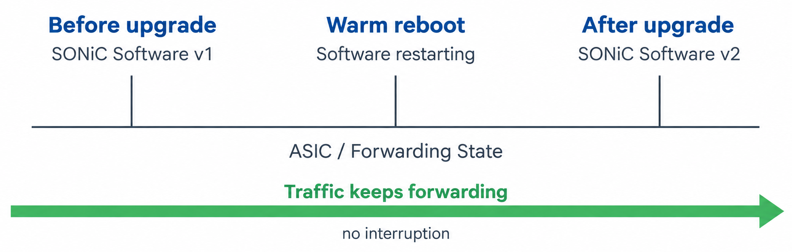

# Warm Reboot Deep Dive

> **Prerequisites**: [Reboot Types](21_reboot_types.md) (comparison of cold, fast, and warm reboot), [The Database Container](07_database_container.md) (Redis persistence), [SAI and Syncd](13_sai_and_syncd.md) (VID/RID mappings and the SAI meta layer), and [Orchagent Deep Dive](12_orchagent.md) (how orchagent processes state from APPL_DB to ASIC_DB).

[Reboot Types](21_reboot_types.md) introduced the five reboot types and summarized what each one does. This document goes deeper into **warm reboot** — the most complex reboot path in SONiC. It covers the full lifecycle: what happens before shutdown, how the kernel transitions, how each layer restores and reconciles state after boot, and how the system knows that warm reboot is complete.

## The Core Idea

In a cold reboot, all state is destroyed and rebuilt from scratch. In a fast reboot, the ASIC is reset but state is saved to disk and restored quickly. In a warm reboot, the ASIC is **never reset** — it continues forwarding traffic while the entire SONiC software stack restarts around it.

This is possible because the ASIC is an independent piece of hardware. Its forwarding tables (routes, neighbors, ACLs, next-hop groups) are stored in the ASIC's own memory, not in the CPU's RAM. As long as no one explicitly clears those tables, traffic keeps flowing even if the Linux kernel, Redis, orchagent, and every other piece of software on the CPU restarts.

The challenge is reconnecting the new software stack to the existing ASIC state without disturbing it. That reconnection process is called **reconciliation**, and it is where most of the complexity lives.

## Why Warm Reboot Exists

Every reboot causes some disruption. For operators running networks that carry production traffic around the clock, even a 25-second fast reboot disruption can be too much — especially when the reboot is for a routine software upgrade, not a failure recovery.

Warm reboot targets the use case of **hitless software upgrades**: upgrading the SONiC image (kernel, containers, configuration) with zero or near-zero packet loss. The switch continues forwarding traffic throughout the process. This lets operators upgrade switches during business hours without scheduling maintenance windows.



## End-to-End Timeline

The following diagram shows the full warm reboot sequence from the operator's command to the final convergence. Each phase is explained in detail in the sections that follow.

```
Operator runs: sudo warm-reboot

┌─────────────────────────────────────────────────────────────────────┐
│ PHASE 1: PRE-SHUTDOWN (old software)                                │
│                                                                     │
│  1. Enable warm restart (WARM_RESTART_ENABLE_TABLE|system)          │
│  2. Validate warm reboot is possible (checks & prerequisites)       │
│  3. Stage kexec kernel (kexec --load, not executed yet)             │
│  4. Start lag_keepalive.py (LACP keepalive through reboot gap)      │
│  5. Freeze orchagent (stop processing, ensure consistent state)     │
│  6. Stop services; BGP signals Graceful Restart to peers;           │
│     syncd pre-shutdown saves its state (ASIC is NOT reset)          │
│  7. Trim Redis + copy snapshot (dump.rdb) to /host/warmboot/        │
│  8. kexec --exec (boot the staged kernel)                           │
└─────────────────────────────────┬───────────────────────────────────┘
                                  │
                     ──── kexec ──── (kernel switch, ~5 seconds)
                                  │
                                  v
┌─────────────────────────────────────────────────────────────────────┐
│ PHASE 2: BOOT (new software)                                        │
│                                                                     │
│  9. New kernel boots (BIOS/firmware skipped)                        │
│ 10. systemd starts services in dependency order                     │
│ 11. database container starts:                                      │
│     - Redis loads dump.rdb snapshot (pre-reboot state restored)     │
│ 12. syncd starts in warm boot mode:                                 │
│     - Reads saved VID↔RID map and SAI object tree                   │
│     - Connects to ASIC without resetting it                         │
│ 13. SWSS container starts:                                          │
│     - orchagent enters reconciliation mode                          │
│ 14. BGP container starts:                                           │
│     - FRR re-establishes sessions with Graceful Restart             │
│ 15. teamd container starts:                                         │
│     - Rejoins LACP sessions without breaking LAGs                   │
└─────────────────────────────────┬───────────────────────────────────┘
                                  │
                                  v
┌─────────────────────────────────────────────────────────────────────┐
│ PHASE 3: RECONCILIATION (new software, ASIC untouched)              │
│                                                                     │
│ 16. Each layer compares old state (from Redis) with new intent      │
│ 17. Only differences are pushed to the ASIC                         │
│ 18. Each container signals "reconciliation done" in STATE_DB        │
│ 19. warmboot-finalizer checks all components are reconciled         │
│ 20. System clears warm restart flags — warm reboot complete         │
└─────────────────────────────────────────────────────────────────────┘
```

## Phase 1: Pre-Shutdown

The warm reboot script (`/usr/local/bin/warm-reboot`) runs on the old software and prepares the system for a hitless restart. Every step in this phase is designed to ensure that the new software stack can pick up exactly where the old one left off.

### Step 1: Enable Warm Restart

The script enables warm restart at the system level:

```
STATE_DB:
  WARM_RESTART_ENABLE_TABLE|system → { "enable": "true" }
```

This flag tells every container, on the next boot, to check whether it should start in warm restart mode rather than cold start mode. After staging the kexec kernel (Step 3), the script also clears any leftover `state` fields in `WARM_RESTART_TABLE|*` from a previous reboot so the next boot starts with a clean slate.

The per-service entries (e.g., `WARM_RESTART_TABLE|orchagent`, `WARM_RESTART_TABLE|bgp`) are not written by the reboot script — each service writes its own entry when it starts up in warm restart mode on the next boot.

> **Why enable before validate?** Right before enabling, the script registers a `trap clear_boot` handler. If anything later in the script fails — including validation — the trap fires and runs `clear_boot`, which calls `config warm_restart disable` to revert the flag, unloads any staged kexec kernel, and renames any leftover `dump.rdb` aside. Enabling first ensures the flag is always covered by the cleanup handler.

### Step 2: Validation and Prerequisites

Before doing anything disruptive, the script runs a series of safety checks. One check — **no warm restart already in progress** — actually runs before Step 1: if the system is mid-way through a previous warm restart that did not complete, the script aborts (unless forced). The remaining checks run after warm restart is enabled:

- **PFC storm check.** Verifies no PFC (Priority-based Flow Control) storm is currently active on any ASIC.

- **SSD health.** Checks the storage device health to ensure the snapshot and state files can be written safely.

- **Database integrity.** Runs `check_db_integrity.py` to validate the Redis databases are consistent before saving them.

- **Disk space.** Verifies that `/host` has enough free space for the `dump.rdb` snapshot and syncd state files.

- **Next image verification.** Runs `sonic-installer verify-next-image` to confirm the target SONiC image is valid.

- **ASIC config checksum.** For warm, fastfast, and express reboot, the script runs `asic_config_check` to verify that the ASIC configuration has not changed between the current and next image. A changed ASIC config could make reconciliation unsafe.

### Step 3: Stage kexec Kernel

The script loads the new kernel and initrd into memory using `kexec --load`. This stages the kernel for a fast reboot later — it is **not executed yet**. Staging it early means the kernel is ready to go the moment the script finishes shutting everything down.

```
kexec --load <new_kernel> --initrd=<initrd> --append="SONIC_BOOT_TYPE=warm ..."
```

### Step 4: LACP Keepalive

If the switch has LAG interfaces, the script starts `lag_keepalive.py`, which continues sending LACP PDUs through the reboot gap to keep the partner from timing out. See [LACP Slow Mode](21_reboot_types.md#lacp-slow-mode) for why slow mode is required and how the keepalive works.

> **Requirement:** All LAG interfaces must be configured in LACP slow mode.

### Step 5: Orchagent Freeze

The reboot script **freezes** orchagent by running `orchagent_restart_check`. This tool asks orchagent to:

1. **Self-check** — verify it has finished processing all pending operations and is not in a transient state (e.g., mid-way through programming a batch of routes).

2. **Freeze** — stop consuming new events from APPL_DB. Once frozen, orchagent's [main select loop](12_orchagent.md#the-main-select-loop) no longer drains entries from its Consumers, so no new SAI operations reach syncd.

```bash
docker exec -i swss /usr/bin/orchagent_restart_check -w 2000 -r 5
#   -w 2000  wait up to 2000 ms per attempt
#   -r 5     retry up to 5 times
```

The tool retries up to 5 times with a 2-second interval, giving orchagent 10 seconds to reach a quiescent state. If orchagent cannot be frozen (e.g., it is stuck in a long operation), the reboot aborts unless the `-f` (force) flag was used.

This is a critical step. Everything after it — stopping services, syncd pre-shutdown, and the Redis snapshot — depends on the guarantee that orchagent will not change ASIC_DB or push new SAI operations while the state is being saved.

### Step 6: Stop Services, BGP Graceful Restart, and Syncd Pre-Shutdown

The script stops all SONiC containers in a defined order. When the **bgp** container stops, FRR automatically signals [BGP Graceful Restart](21_reboot_types.md#bgp-graceful-restart) to all peers, telling them to hold the switch's routes for up to 120 seconds rather than withdrawing them. This keeps traffic flowing toward the switch while it restarts.

When the **swss** container stops, the script triggers syncd pre-shutdown before continuing to the next service. Syncd saves its internal state to a file on disk so the new syncd instance can reconnect to the ASIC without resetting it:

| Saved State | Purpose |
|-------------|---------|
| **VID↔RID mapping table** | Maps SONiC's Virtual IDs to the ASIC's Real IDs. Without this, the new syncd would not know which SAI objects correspond to which hardware entries. See [VID and RID](13_sai_and_syncd.md#virtual-ids-and-real-ids). |
| **SAI object tree** | The complete tree of SAI objects (switches, ports, routes, neighbors, next-hop groups, ACLs, etc.) and their attributes as last known. |
| **SAI meta layer state** | The meta layer's internal bookkeeping — reference counts, attribute records — needed to resume validation of future SAI operations. |

The vendor SAI library also saves whatever internal state it needs for warm restart. This is vendor-specific — for example, the Broadcom SAI may save internal table pointers, while the NVIDIA SAI may save different structures. The important thing is that the SAI library can reconnect to the ASIC and resume operations without a hardware reset.

Because orchagent is already frozen (Step 5), no new SAI operations arrive while syncd is saving. The saved state matches the ASIC exactly.

### Step 7: Redis State Persistence

Only now — after orchagent is frozen and all services are stopped — does the script save the Redis snapshot. It trims the databases and copies `dump.rdb` from the database container to `/host/warmboot/`. Notably, warm reboot keeps `ASIC_DB` in the snapshot so the new syncd can reconnect to the running ASIC using the saved SAI object IDs. See [The Redis Snapshot](21_reboot_types.md#the-redis-snapshot) for the full mechanism and how it differs across reboot types.

Saving the snapshot last guarantees consistency: because orchagent was frozen before services stopped, and services were stopped before the save, the `dump.rdb` reflects the final state of every database with no in-flight changes.

### Step 8: kexec

The script executes the staged kernel:

```
kexec --exec
```

The `SONIC_BOOT_TYPE=warm` kernel argument (set in Step 3) tells the new SONiC system to expect a warm restart and to handle services accordingly.

At this point, the old kernel is gone. The CPU is running new code. But the ASIC — a separate piece of hardware with its own memory — has not been touched. Its forwarding tables, counters, and port state are exactly as they were before the reboot.

## Phase 2: Boot

The new kernel boots and systemd starts SONiC services. The key difference from a cold boot is that every service checks the `SONIC_BOOT_TYPE` flag and, if it is `warm`, enters warm restart mode instead of initializing from scratch.

### Database Container

The database container starts first (it is a dependency for everything else). Instead of starting with empty Redis instances, it:

1. Detects that `SONIC_BOOT_TYPE=warm`.
2. Finds the `dump.rdb` snapshot in `/host/warmboot/`.
3. Starts Redis by loading the snapshot, which reconstructs the pre-reboot in-memory state.

After this step, all Redis databases contain exactly the same data they had before the reboot:

- **APPL_DB** — routes, neighbors, and other application-level intent.
- **ASIC_DB** — SAI objects that map to hardware entries.
- **CONFIG_DB** — the switch configuration.
- **STATE_DB** — warm restart flags and operational state.

### Syncd Container

Syncd starts with a special flag indicating warm boot. The SAI boot type is set to `1` (warm), as opposed to `0` (cold) or `2` (fast):

```
SAI_KEY_BOOT_TYPE = 1  (warm)
```

Syncd's warm boot startup:

1. **Load saved state.** Syncd reads the VID↔RID mapping table and SAI object tree from the file saved during syncd pre-shutdown (Phase 1, Step 6).

2. **Initialize SAI in warm mode.** Syncd calls `sai_api_initialize()` followed by `sai_switch_api->create_switch()` with the `SAI_SWITCH_ATTR_RESTART_WARM` attribute set to `true`. This tells the vendor SAI library: "The ASIC is already running with programmed state. Connect to it without resetting anything."

3. **Verify ASIC connection.** The vendor SAI connects to the ASIC driver and verifies that the hardware state is still intact. If it detects corruption, it may fall back to a cold restart.

At this point, syncd has a complete picture of what is in the ASIC (from the saved state file) and a live connection to the ASIC (through the vendor SAI). It is ready to accept new operations from orchagent.

### SWSS Container (orchagent)

Orchagent starts and detects that it is in warm restart mode. Instead of programming state from scratch, it enters **reconciliation mode** (covered in detail in the next section).

### BGP Container

FRR starts and re-establishes BGP sessions with all peers. Because the switch signaled Graceful Restart before shutting down, the peers have been holding routes. The new BGP session negotiates GR, and the peers send their full route tables again. FRR processes these routes and pushes them to zebra → fpmsyncd → APPL_DB, just like a normal route update.

> **Requirement:** Both the SONiC switch and its BGP peers must support [Graceful Restart (RFC 4724)](21_reboot_types.md#bgp-graceful-restart).

The key difference is that most of these routes will match what is already in APPL_DB (carried over from the pre-reboot state). Orchagent's reconciliation process detects this and avoids reprogramming them.

### teamd Container

teamd reconnects to LACP sessions. Because the LAG partner's timeout has not expired (thanks to LACP slow mode and the keepalive from Step 4), the partner still considers the LAG member active. teamd resumes sending PDUs, and the LAG remains up without any traffic disruption.

## Phase 3: Reconciliation

Reconciliation is the heart of warm reboot. It is the process by which each layer compares the **old state** (what was running before the reboot, preserved in Redis) with the **new state** (what the newly started software computes), and pushes only the differences to the ASIC.

### Why Reconciliation Is Necessary

You might wonder: if the ASIC is untouched and Redis has the old state, why not just leave everything as-is? The answer is that the new software might be different from the old. The new SONiC version might:

- Add new routes (e.g., a new default route from updated configuration).
- Remove routes (e.g., a configuration change removes a static route).
- Modify attributes (e.g., a bug fix changes how an ACL is programmed).
- Have the same routes but computed differently (e.g., ECMP group membership changes).

Even if the new software is identical to the old (same version, same configuration), reconciliation is still needed to **re-register** the software's interest in the existing state. Without reconciliation, orchagent's in-memory data structures would be empty, and it would have no record of the SAI objects it manages.

> **Requirement:** Each container that participates in warm restart must implement reconciliation logic. A daemon that does not support it will reinitialize from scratch, potentially causing brief disruption for its specific feature.

### How Reconciliation Works

Each layer of the stack handles reconciliation independently:

```
┌─────────────────────────────────────────────────────────────┐
│                    Application Layer                        │
│                                                             │
│  orchagent reads APPL_DB (old state from Redis snapshot)    │
│  + receives new state from daemons (fpmsyncd, neighsyncd)   │
│  → compares old vs new                                      │
│  → pushes ONLY diffs to syncd                               │
└──────────────────────────┬──────────────────────────────────┘
                           │  Only differences
                           v
┌─────────────────────────────────────────────────────────────┐
│                    SAI/Syncd Layer                          │
│                                                             │
│  syncd has the saved VID↔RID map and SAI object tree        │
│  + receives diff operations from orchagent                  │
│  → translates VIDs to RIDs                                  │
│  → programs only the changed entries in the ASIC            │
└──────────────────────────┬──────────────────────────────────┘
                           │  Minimal ASIC changes
                           v
┌─────────────────────────────────────────────────────────────┐
│                    ASIC Hardware                            │
│                                                             │
│  Forwarding tables updated incrementally                    │
│  Traffic flow is never interrupted                          │
└─────────────────────────────────────────────────────────────┘
```

### Orchagent Reconciliation in Detail

Orchagent is where most of the reconciliation logic lives. Here is how it works step by step:

**1. Load old state from Redis.**

When orchagent starts in warm mode, APPL_DB already contains the pre-reboot state (restored from the `dump.rdb` snapshot). Orchagent reads all relevant tables — `ROUTE_TABLE`, `NEIGH_TABLE`, `VLAN_TABLE`, `PORT_TABLE`, etc. — into its in-memory Orch data structures. This gives orchagent a complete picture of what the ASIC was programmed with before the reboot.

**2. Receive new state from application daemons.**

Meanwhile, the application daemons (fpmsyncd, neighsyncd, portsyncd, etc.) start up and begin writing their computed state to APPL_DB. For example, fpmsyncd receives routes from zebra (which received them from the re-established BGP sessions) and writes them to `ROUTE_TABLE`.

**3. Compare and compute the diff.**

Once orchagent has both the old state (from the snapshot-restored APPL_DB) and the new state (from the newly started daemons), it compares them entry by entry:

| Comparison Result                                           | Action |
|-------------------------------------------------------------|-------------------------------|
| Entry exists in both old and new, with identical attributes | **No action** — the ASIC already has the correct entry |
| Entry exists in both but attributes differ                  | **Modify** — update only the changed attributes in the ASIC |
| Entry exists in new but not in old                          | **Create** — program the new entry into the ASIC |
| Entry exists in old but not in new                          | **Delete** — remove the stale entry from the ASIC |

In a typical same-version upgrade with the same configuration, the vast majority of entries fall into the "no action" category. The ASIC receives very few (or zero) programming operations, which is why warm reboot achieves near-zero disruption.

**4. Signal completion.**

After orchagent finishes processing all tables, it updates the `WARM_RESTART_TABLE` in STATE_DB:

```
WARM_RESTART_TABLE|orchagent → { "state": "reconciled" }
```

### Syncd Reconciliation

Syncd's reconciliation works at the SAI layer. On warm boot, syncd enters **comparison mode**:

1. Syncd has the **old view** — the saved SAI object tree from before the reboot.
2. Orchagent sends SAI operations representing the **new view** — what the new software wants programmed.
3. Syncd compares the new operations against its saved state.
4. Only actual differences (creates, deletes, or modifications) are pushed to the ASIC.

The comparison logic uses the VID↔RID mappings to correlate the new software's SAI objects with the existing ASIC entries. For example, if orchagent sends a `create_route_entry` for a prefix that already exists with the same attributes, syncd recognizes it as a no-op and skips the hardware call entirely.

After syncd has processed all pending operations and confirmed they match the old state, it transitions out of comparison mode and resumes normal operation.

### BGP Reconciliation

BGP reconciliation happens naturally through the Graceful Restart protocol:

1. The new FRR instance re-establishes BGP sessions.
2. Peers resend their full route tables (they held these routes during the GR timer).
3. FRR runs best-path selection on the received routes.
4. The selected routes are pushed through the normal pipeline: zebra → fpmsyncd → APPL_DB → orchagent.
5. Orchagent's reconciliation logic handles the comparison with pre-reboot state.

If the BGP configuration has not changed, the re-learned routes will be identical to the pre-reboot routes, and orchagent will find no diffs to program.

### teamd Reconciliation

teamd (the LAG daemon) also performs reconciliation:

1. teamd reads the pre-reboot LAG state from Redis (member ports, LACP state).
2. It re-joins the LACP sessions with the partner switches.
3. It compares the current LAG membership with the pre-reboot membership.
4. Any differences (ports added or removed) are updated incrementally.
5. It signals reconciliation complete in `WARM_RESTART_TABLE`.

## The Warmboot Finalizer

The **warmboot-finalizer** is a host-level systemd service that monitors the reconciliation process and declares warm reboot complete. It starts after all SONiC containers have started.

### What It Does

1. Polls the `WARM_RESTART_TABLE` in STATE_DB, watching for each critical service to report `"state": "reconciled"`.
2. Waits for all required services (orchagent, bgp, teamsyncd, and any others enabled for warm restart) to reach the reconciled state.
3. Once all services are reconciled, clears the warm restart flags:
   - Sets `WARM_RESTART_ENABLE_TABLE|system` → `{ "enable": "false" }`.
   - Cleans up individual service warm restart entries.
4. Saves the reconciled configuration to disk (`config save -y`).
5. Declares warm reboot complete.

### Timeouts

The finalizer does not wait forever. Each service has a configurable warm restart timer (default varies by service, typically 120–300 seconds). If a service does not reach the reconciled state before its timer expires, the warm reboot is considered **failed**. The system may:

- Log an error and continue running with whatever state was reconciled successfully.
- Fall back to a cold restart (platform-dependent behavior).

The timer values are configurable:

```bash
# Set warm restart timer for BGP to 180 seconds
config warm_restart bgp_timer 180

# View current timer settings
show warm_restart config
```

## Container-Level Warm Restart

In addition to full-system warm reboot, SONiC supports **per-container warm restart**. This allows restarting a single service (e.g., BGP, SWSS, or teamd) without affecting the rest of the system or the data plane.

### How It Works

Per-container warm restart follows the same principles as full warm reboot, but scoped to a single container:

1. Enable warm restart for the target service.
2. The service saves its state (just as it would during a full warm reboot).
3. The container restarts.
4. On startup, the service detects warm restart mode and performs reconciliation.
5. The warmboot-finalizer watches for reconciliation to complete.

### Commands

```bash
# Enable warm restart for a specific service
config warm_restart enable swss
config warm_restart enable bgp
config warm_restart enable teamd

# Disable warm restart for a service
config warm_restart disable bgp

# Check warm restart state for all services
show warm_restart state

# Check warm restart configuration
show warm_restart config
```

### Example: Restarting BGP with Warm Restart

```bash
# 1. Enable warm restart for BGP
admin@sonic:~$ config warm_restart enable bgp

# 2. Restart the BGP container
admin@sonic:~$ systemctl restart bgp

# 3. Monitor reconciliation progress
admin@sonic:~$ show warm_restart state
Name         Restore_count  State
-----------  -------------  ------------
orchagent    0              reconciled
bgp          1              reconciled
teamsyncd    0              reconciled
```

During this process:
- The ASIC continues forwarding with the pre-restart routes.
- BGP peers hold routes (Graceful Restart).
- The new BGP instance re-learns routes and orchagent reconciles them.
- Once reconciled, normal operation resumes.

### Use Cases for Container-Level Warm Restart

| Scenario                                     | Which Container |
|----------------------------------------------|-----------------|
| Upgrading FRR to fix a BGP bug               | `bgp`           |
| Applying a fix to orchagent or a sync daemon | `swss`          |
| Updating LACP configuration                  | `teamd`         |
| Debugging a container issue without rebooting the whole switch | Any supported container |

Container-level warm restart is less disruptive than a full warm reboot because the kernel stays running, Redis remains in memory (no snapshot needed), and only one service goes through reconciliation.

## Limitations and Failure Modes

### Not All Features Support Warm Restart

Warm restart requires every participating daemon to implement reconciliation. Some features do not have this support:

- Certain **ACL** changes may not reconcile correctly across warm restart.
- Some **QoS** (Quality of Service) policies may be reset.
- **NAT** (Network Address Translation) state may be lost.
- **PBR** (Policy-Based Routing) may not be fully supported.

The exact list of supported features depends on the SONiC version and the vendor platform. Always check the release notes.

### Failure Scenarios

| Failure | What Happens | Recovery |
|---------|-------------|----------|
| SAI warm boot fails (ASIC state corrupted) | Syncd detects the mismatch and triggers a cold restart | Full ASIC reprogram, traffic disruption |
| Redis snapshot (`dump.rdb`) corrupted or missing | Database container starts with empty state | Falls back to cold behavior — full reinit |
| BGP GR timer expires (peers withdraw routes) | Routes are withdrawn across the network | BGP re-converges after sessions re-establish, but traffic was disrupted during the gap |
| LACP timeout (fast mode was used) | LAG partner declares members down | LAG breaks; traffic on that LAG is disrupted until LACP re-converges |
| Reconciliation timeout | warmboot-finalizer logs an error | System continues running but may have stale or missing entries |
| New software version is incompatible | Reconciliation finds too many diffs or crashes | May fall back to cold restart |

### When NOT to Use Warm Reboot

- **Downgrading to an older version.** Warm reboot reconciliation assumes the new software understands the old state format. Older software may not understand state saved by newer software.
- **ASIC SDK upgrade.** If the new SONiC image includes a different ASIC SDK version, the vendor SAI may not support warm restart across SDK versions. Use cold or fast reboot instead.
- **System is in a bad state.** If you suspect corrupted state (unexpected behavior, crashed daemons), warm reboot carries that state forward. Use cold reboot to start clean.
- **Platform does not support it.** Some platforms or ASIC families lack SAI warm boot support entirely.

## Warm Reboot vs Fast Reboot — A Closer Look

Both warm and fast reboot use kexec and BGP Graceful Restart. The fundamental difference is what happens to the ASIC:

```
Fast Reboot:                          Warm Reboot:

   ASIC is RESET                         ASIC is PRESERVED
        │                                     │
        v                                     v
   Forwarding tables cleared             Forwarding tables intact
   FDB/ARP restored from disk            FDB/ARP still in ASIC
   Routes reprogrammed as                Routes stay programmed
   BGP re-converges                      Only diffs applied
        │                                     │
        v                                     v
   ~25s data plane disruption            ~0s data plane disruption
```

The trade-off is complexity. Fast reboot is simpler — it saves state to disk, resets everything, and restores from the saved state. If the restore fails, the system just re-learns everything (slower but safe). Warm reboot is more complex — it must maintain ASIC state across a software restart and reconcile it, which requires more sophisticated logic in syncd, orchagent, and every participating daemon.

## Verifying Warm Reboot

After a warm reboot, you can verify that it completed successfully:

```bash
# Check the boot type
admin@sonic:~$ cat /proc/cmdline | grep SONIC_BOOT_TYPE
SONIC_BOOT_TYPE=warm

# Check warm restart state — all services should be "reconciled"
admin@sonic:~$ show warm_restart state
Name         Restore_count  State
-----------  -------------  ------------
orchagent    1              reconciled
bgp          1              reconciled
teamsyncd    1              reconciled

# Check that no routes were lost
admin@sonic:~$ show ip route summary

# Check BGP sessions are re-established
admin@sonic:~$ show ip bgp summary

# Check LAG interfaces are up
admin@sonic:~$ show interfaces portchannel

# Check system log for warm reboot events
admin@sonic:~$ sudo grep -i "warm" /var/log/syslog | tail -20
```

If any service shows a state other than `reconciled`, check the syslog for errors from that service. Common issues include timer expiry (the service took too long to reconcile) and state mismatches (the new software found unexpected entries in the saved state).

---

**Previous**: [← Reboot Types](21_reboot_types.md) · **Next**: [State Interactions →](23_state_interactions.md)
