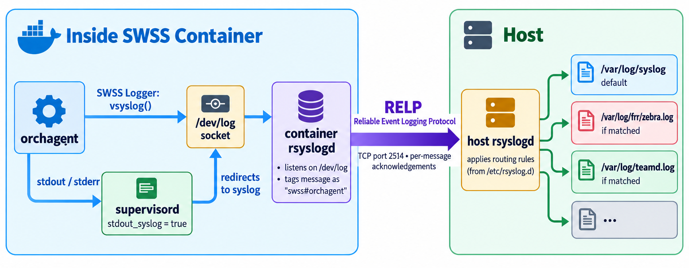

# Logging in SONiC

> **Prerequisites**: [Inside a Running Container](06_inside_a_running_container.md) covers how supervisord captures daemon output and how the container's rsyslog forwards it to the host. [The SWSS Container](11_swss_container.md) and [SAI and Syncd](13_sai_and_syncd.md) provide context for the SWSS logging macros and SAI recording files discussed here.

Every SONiC daemon, across every container, produces log output. Understanding where those logs end up, how to change their verbosity, and how to collect them for analysis is foundational to operating and debugging a SONiC switch. This document covers the full logging stack — from the Linux syslog primitives at the bottom, through SONiC's routing rules and C++ logging framework, up to the diagnostic bundles you hand to engineering when something goes wrong.

## Syslog Basics

Programs on a Linux system send log messages by calling the C `syslog()` function (or by writing to the `/dev/log` Unix socket). Each message carries two pieces of metadata:

- **Facility** — which subsystem produced it (e.g., `kern`, `daemon`, `local0`).
- **Severity** — how important it is.

The eight severity levels, from most to least severe:

| Level | Name      | Meaning                   |
|-------|-----------|---------------------------|
| 0     | `emerg`   | System is unusable        |
| 1     | `alert`   | Immediate action required |
| 2     | `crit`    | Critical condition        |
| 3     | `err`     | Error condition           |
| 4     | `warning` | Warning condition         |
| 5     | `notice`  | Normal but significant    |
| 6     | `info`    | Informational             |
| 7     | `debug`   | Debug-level detail        |

Here is a minimal C program that sends one message at each of three severity levels:

```c
#include <syslog.h>

int main(void)
{
    openlog("myapp", LOG_PID, LOG_DAEMON);    // identity="myapp", facility=daemon

    syslog(LOG_ERR,    "disk full on /var");  // severity 3
    syslog(LOG_NOTICE, "service started");    // severity 5
    syslog(LOG_DEBUG,  "counter = %d", 42);   // severity 7

    closelog();
    return 0;
}
```

`openlog()` sets the **program name** (`myapp`) and the **facility** (`LOG_DAEMON`). Each `syslog()` call then only needs a severity and a message — the syslog daemon handles the rest.

After compiling and running the program, the messages appear in `/var/log/syslog`:

```
Oct  7 21:37:36 sonic myapp[4070575]: disk full on /var
Oct  7 21:37:36 sonic myapp[4070575]: service started
Oct  7 21:37:36 sonic myapp[4070575]: counter = 42
```

Each line contains the timestamp, hostname, program name with PID, and the message text:

```
Oct  7 21:37:36 sonic myapp[4070575]: disk full on /var
│               │     │     │         └─ message
│               │     │     └─ PID
│               │     └─ program name (from openlog)
│               └─ hostname
└─ timestamp
```

All `syslog()` does is write the message to the `/dev/log` Unix socket. A separate **syslog daemon** is listening on that socket — it receives every message and decides where to store it (in this case, `/var/log/syslog`). Without that daemon running, the messages would go nowhere.

Whether the DEBUG-level line (`counter = 42`) appears depends on the syslog daemon's configured severity threshold. A threshold of NOTICE, for example, means only messages at NOTICE severity and above are kept — the DEBUG line would be suppressed. SONiC defaults to NOTICE, as covered in [Runtime Log-Level Tuning](#runtime-log-level-tuning).

This is the core idea behind syslog: programs just emit messages with a facility and a severity, and a separate daemon decides where those messages go. The next section covers that daemon.

## rsyslog

**rsyslog** is the syslog daemon that SONiC uses. It is the most common implementation on Debian-based systems and is significantly more capable than the original `syslogd` — it supports structured logging, reliable transport protocols, content-based filtering, and high-throughput message processing.

rsyslog listens for incoming syslog messages and **routes** them to destinations — log files, the console, or remote servers — based on configurable rules. Its configuration lives in two places:

- `/etc/rsyslog.conf` — the main configuration file.
- `/etc/rsyslog.d/*.conf` — drop-in files for modular rules.

In SONiC, rsyslog runs in **two layers**: each container runs its own rsyslog instance that forwards messages to the host, and the host runs a central rsyslog instance that applies routing rules and writes the final log files. Before tracing this full path, the next section introduces the logging framework that SONiC's C++ daemons use to produce their messages.

## The SWSS Logging Framework

SONiC's C++ daemons across all containers use the **swss-common Logger** class, a shared library that any daemon can link against. It adds structure, automatic function-name tagging, and runtime log-level control through Redis. Examples of daemons that use it include orchagent and portsyncd (in the swss container), syncd (in the syncd container), teamsyncd (in the teamd container), and lldp_syncd (in the lldp container). Every container has access to this library because it is installed in the `docker-config-engine` layer of the [image hierarchy](04_container_build_time.md#the-image-hierarchy), which all containers inherit from. For more on the naming history and scope of swss-common, see [Clearing Up the Name](09_container_communication.md#clearing-up-the-name).

### Log Macros

The header `swss/logger.h` (the `swss/` in the path is the include directory of the swss-common library, not a reference to the swss container) provides five macros, one per severity level:

```cpp
SWSS_LOG_ERROR("Route %s failed: %s", prefix, sai_status_str(status));
SWSS_LOG_WARN("Retrying bulk create, attempt %d", retry_count);
SWSS_LOG_NOTICE("Port %s link up", port_name);
SWSS_LOG_INFO("Processing %zu routes in batch", batch.size());
SWSS_LOG_DEBUG("Entry hash: 0x%lx, flags: %d", hash, flags);
```

Each macro automatically prepends the calling function's name, so the resulting syslog line looks like:

```
Oct  7 12:03:45.678 sonic NOTICE swss#orchagent: :- addRoute: Route 10.0.0.0/24 added
```

The `:- addRoute:` part is the auto-inserted function name. This is invaluable when debugging — you can trace a log line straight to the source code without guessing which function produced it.

### Log Levels

| Level  | Macro             | Shown by Default? | Use For                       |
|--------|-------------------|-------------------|-------------------------------|
| ERROR  | `SWSS_LOG_ERROR`  | Yes               | Failures that need attention  |
| WARN   | `SWSS_LOG_WARN`   | Yes               | Recoverable issues            |
| NOTICE | `SWSS_LOG_NOTICE` | Yes               | Normal operational milestones |
| INFO   | `SWSS_LOG_INFO`   | No                | Detailed operational flow     |
| DEBUG  | `SWSS_LOG_DEBUG`  | No                | Development-level detail      |

The "Shown by Default?" column reflects the default log threshold of **NOTICE** — messages at NOTICE severity and above (WARN, ERROR) are emitted, while INFO and DEBUG are suppressed. See [Runtime Log-Level Tuning](#runtime-log-level-tuning) for how to change this at runtime.

## From Daemon to Disk — How Logs Flow

The diagram below uses orchagent as an example, but the same path applies to every daemon in every container. The mechanism is identical; only the container name and program name change.



The following subsections walk through each stage in the diagram.

### Stage 1 — Daemon Writes to Syslog

As described in the previous section, SONiC daemons use the SWSS Logger. Under the hood, the Logger's `write()` method calls `vsyslog()`, which delivers the message to the `/dev/log` Unix socket inside the container:

```cpp
// logger.cpp — Logger::write()
if (m_output == SWSS_SYSLOG)        // default output mode
{
    vsyslog(prio, fmt, ap);          // writes to /dev/log
}
```

The Logger also supports `SWSS_STDOUT` and `SWSS_STDERR` output modes (selectable via the `LOGOUTPUT` field in CONFIG_DB), but these are rarely used outside of development.

**What about actual stdout/stderr output?** Crash messages, assertion failures, and any direct `printf` or `fprintf(stderr, ...)` calls go to stdout/stderr. supervisord captures these because every daemon's supervisord program block is configured with:

```ini
stdout_logfile=NONE
stdout_syslog=true

stderr_logfile=NONE
stderr_syslog=true
```

`stdout_logfile=NONE` means supervisord does not write a separate log file for stdout. `stdout_syslog=true` means supervisord redirects stdout to syslog. The same pair applies to stderr. supervisord does **not** differentiate between stdout and stderr — both are forwarded to the syslog socket identically.

So whether a daemon uses the SWSS Logger (`vsyslog`) or writes directly to stdout/stderr, the messages all arrive at the same place: the `/dev/log` socket inside the container.

### Stage 2 — Container rsyslog Receives, Tags, and Forwards

Each container runs its own **rsyslog** instance, started by supervisord as the first process (priority 1). All other daemons wait for rsyslog to be running before they start.

This container rsyslog listens on `/dev/log` via the `imuxsock` module:

```
module(load="imuxsock" SysSock.RateLimit.Interval="300" SysSock.RateLimit.Burst="20000")
```

When a message arrives, rsyslog prepends the **container name** to the program tag using the `ForwardFormatInContainer` template:

```
set $.CONTAINER_NAME=getenv("CONTAINER_NAME");
template (name="ForwardFormatInContainer" type="string"
  string="<%PRI%>%TIMESTAMP:::date-rfc3339% %HOSTNAME% %$.CONTAINER_NAME%#%syslogtag%%msg%")
```

For a message from orchagent inside the swss container, the tag becomes `swss#orchagent`. For bgpd inside the bgp container, it becomes `bgp#bgpd`. This tagging is what allows the host rsyslog to route messages by program name.

The container rsyslog then forwards **all** messages to the host using **RELP** (Reliable Event Logging Protocol):

```
module(load="omrelp")
*.* action(type="omrelp" target=`echo $SYSLOG_TARGET_IP` port="2514"
     action.resumeRetryCount="60"
     queue.type="LinkedList" queue.size="20000"
     queue.timeoutEnqueue="0"
     Template="ForwardFormatInContainer")
```

RELP is a TCP-based transport that acknowledges every message, so log lines are not silently lost if the host rsyslog is momentarily busy or the connection drops. The `LinkedList` queue (up to 20,000 messages) buffers messages during transient connection failures, and `resumeRetryCount="60"` means rsyslog retries up to 60 times before giving up. `queue.timeoutEnqueue="0"` ensures that if the queue is full, the sending daemon is not blocked — the message is dropped rather than stalling the daemon.

The `SYSLOG_TARGET_IP` environment variable is set when the container starts: `127.0.0.1` for single-ASIC platforms (where host networking reaches the host directly), or the Docker bridge gateway IP for multi-ASIC platforms.

**The container rsyslog does not save any syslog messages locally.** There are no file-output rules in the container's rsyslog configuration — the `*.* action(type="omrelp" ...)` rule forwards everything and that is the only action. However, some daemons write non-syslog files (such as `.rec` recording files) directly to bind-mounted host directories, bypassing rsyslog entirely — see [SAI Recording Files](#sai-recording-files).

> **History:** Prior to [PR #18113](https://github.com/sonic-net/sonic-buildimage/pull/18113) (April 2026), containers forwarded logs to the host over **UDP** on port 514. UDP is fire-and-forget — if the host rsyslog restarted or fell behind, messages were silently dropped. The switch to RELP added TCP-level acknowledgement, linked-list queuing inside each container, and automatic retry on connection loss. If you are running a build from before this change, your host rsyslog will show `$ModLoad imudp` / `$UDPServerRun 514` instead of `imrelp` on port 2514.

#### Container Rate Limiting

Each container's rsyslog has a rate limit (configured in the `imuxsock` module shown above) to prevent a misbehaving daemon from flooding the host:

- **Interval:** 300 seconds (default)
- **Burst:** 20,000 messages per interval (default)

If a container exceeds this limit, rsyslog drops messages and logs a single warning. You can tune these thresholds per-container through the `SYSLOG_CONFIG_FEATURE` table in CONFIG_DB, which the `rsyslog-container.conf.j2` template reads when generating the container's rsyslog configuration.

### Stage 3 — Host rsyslog Receives and Routes to Files

The host rsyslog listens for RELP connections from all containers:

```
module(load="imrelp")
input(type="imrelp" address="..." port="2514")
```

Once a message arrives, the host rsyslog applies the routing rules described in the [Host rsyslog Routing Rules](#host-rsyslog-routing-rules) section below — splitting messages into dedicated log files by program name or message body, with everything else landing in `/var/log/syslog`.

### Why This Design Matters

Three properties of this architecture matter for daily work:

1. **All logs are centralized on the host.** You never need to enter a container to read logs — everything arrives in `/var/log/` on the host filesystem.

2. **Log rotation is managed in one place.** Because the host owns the files, a single logrotate configuration (covered under [Log Rotation](#log-rotation)) handles every daemon across every container.

3. **Logs survive container restarts.** When a container is destroyed and recreated, the host-side log files are unaffected. The container's own filesystem is ephemeral, but since all syslog messages are forwarded to the host (and non-syslog files like `.rec` recordings live on bind-mounted host directories), no log data is lost.

## Host rsyslog Routing Rules

Once messages arrive on the host, rsyslog uses rules in `/etc/rsyslog.d/` to split them into dedicated log files.

rsyslog loads drop-in files in **lexicographic order**, so the numeric prefix controls priority: `00-sonic.conf` (SONiC's routing rules) runs first, and `99-default.conf` (the catch-all that sends unmatched messages to `/var/log/syslog`) runs last. This ordering matters because rsyslog evaluates rules top-to-bottom — a message caught by an earlier file's `stop` directive (which tells rsyslog to stop processing further rules for that message) never reaches later files.

The rules in `00-sonic.conf` decide which file a message lands in by inspecting two fields. The first is the **program name** tag — the `swss#orchagent` or `bgp#bgpd` label that the container rsyslog attached in Stage 2. The second is the **message body** itself — the actual text of the log line. Each rule checks one of these fields against a pattern and, if it matches, writes the message to a specific file:

| Match Rule | Log File | Contents |
|------------|----------|----------|
| `$programname` matches `bgp[0-9]*#(frr\|zebra\|staticd\|watchfrr)` | `/var/log/frr/zebra.log` | FRR control-plane daemons (not BGP) |
| `$programname` matches `bgp[0-9]*#bgpd` | `/var/log/frr/bgpd.log` | BGP daemon |
| `$programname` contains `teamd_` | `/var/log/teamd.log` | LAG/port-channel events |
| `$msg` starts with `gnmi-native` | `/var/log/gnmi.log` | gNMI server |
| `$msg` starts with `telemetry` or `dialout` | `/var/log/telemetry.log` | Streaming telemetry |
| `$msg` starts with `otel` | `/var/log/otel.log` | OpenTelemetry collector |
| `$programname` contains `stp` (except messages containing `STP_SYSLOG`) | `/var/log/stpd.log` | Spanning tree |
| Everything else | `/var/log/syslog` | Default catch-all (orchagent, syncd, kernel, etc.) |

Most SONiC daemons — including orchagent, syncd, and all the `*mgrd` manager daemons — do not have dedicated files. Their messages appear in `/var/log/syslog` alongside kernel messages and everything else. This is intentional: a single chronological file makes it easy to correlate events across components.

The host also writes a few standard Linux log files that are not SONiC-specific:

| File                       | Source |
|----------------------------|--------|
| `/var/log/kern.log`        | Kernel messages |
| `/var/log/auth.log`        | Authentication events (SSH, sudo) |
| `/var/log/audit/audit.log` | Linux audit subsystem |
| `/var/log/cron.log`        | Cron job output |

### Remote Syslog

SONiC can forward logs to an external syslog server for centralized collection across multiple switches:

```bash
# Add a remote syslog server:
config syslog add <server-ip>

# With a specific port and VRF:
config syslog add <server-ip> --source <source-ip> --port 514 --vrf mgmt

# Verify:
show syslog
```

The host rsyslog uses its **omfwd** output module (supporting both UDP and TCP transport) to forward all messages matching the configured severity to the remote server. The VRF setting controls the transport path (e.g., `mgmt` VRF for out-of-band management), while the message content identifies the switch by its configured hostname.

## Runtime Log-Level Tuning

You can change log verbosity at runtime without restarting any service. This is essential for debugging — you raise the level to DEBUG, reproduce the problem, then lower it back to avoid filling the disk.

### How Log Levels Work

```
DEBUG ──▶ INFO ──▶ NOTICE ──▶ WARN ──▶ ERROR
  ▲                   ▲
  │                   │
  │              Default level
  │              (most daemons)
  │
  Only enable temporarily
  (very verbose, fills disk fast)
```

Setting a level enables that level **and all levels above it** (to the right in the diagram). Setting DEBUG shows everything; setting ERROR shows only errors.

> **Warning:** DEBUG level on orchagent or syncd generates thousands of messages per second during route programming. Enable it only briefly, and only when you know what you are looking for.

### Using `swssloglevel`

The `swssloglevel` command targets a single daemon via the `-c` flag and writes to the `LOGGER` table in **CONFIG_DB** (Redis database 4). It works for any daemon in any container that uses the swss-common Logger framework. Each daemon's Logger thread subscribes to this table and picks up the change within seconds — no restart required, and other daemons are unaffected.

> **Note:** `swssloglevel` only writes to CONFIG_DB, which lives on the host. You can run it directly from the host shell — there is no need for `docker exec`. You may see `docker exec swss swssloglevel ...` in other SONiC documentation; that works too (the binary is installed in every container via the `docker-config-engine` layer), but it is unnecessary.

```bash
# Set orchagent to DEBUG level:
swssloglevel -l DEBUG -c orchagent

# Set syncd's own application messages to INFO level (see "SAI Log Levels" below for the vendor SDK layer):
swssloglevel -l INFO -c syncd

# Set portsyncd to INFO level:
swssloglevel -l INFO -c portsyncd

# Restore orchagent to the default (NOTICE):
swssloglevel -l NOTICE -c orchagent
```

### Using `redis-cli` Directly

You can also write to the same `LOGGER` table directly with `redis-cli`. This is equivalent to `swssloglevel` — both modify the same CONFIG_DB entries:

```bash
# Set orchagent to INFO level:
redis-cli -n 4 HSET "LOGGER|orchagent" LOGLEVEL INFO

# Check the current setting:
redis-cli -n 4 HGETALL "LOGGER|orchagent"
```

### Persistence

Changes made via `swssloglevel` or `redis-cli` take effect immediately and persist across container restarts (because CONFIG_DB remains in memory on the host). However, they do **not** survive a full reboot unless you run `config save` to write CONFIG_DB to disk.

### SAI Log Levels

The syncd process has **two layers** of logging, each controlled independently:

1. **Application layer** — syncd's own C++ code uses `SWSS_LOG_*` macros. These produce messages like "processing ASIC_DB entry" or "received SAI notification." This is what `swssloglevel -l INFO -c syncd` controls — it works exactly like any other daemon.

2. **Vendor SAI layer** — inside syncd, the vendor's SAI library (`libsai.so`) has its own internal logging, organized by **API category** (switch, route, port, next-hop, etc.). Each category is a separate component with a `SAI_API_` prefix in CONFIG_DB, and uses a different set of level constants.

To control the vendor SAI layer, use `swssloglevel` with the **`-s` flag**, which adds the `SAI_API_` prefix to the component name:

```bash
# Set the vendor SAI's SWITCH subsystem to ERROR:
swssloglevel -l SAI_LOG_LEVEL_ERROR -s -c SWITCH
# (this writes to CONFIG_DB key "LOGGER|SAI_API_SWITCH")

# Set the vendor SAI's ROUTE subsystem to DEBUG:
swssloglevel -l SAI_LOG_LEVEL_DEBUG -s -c ROUTE

# Set ALL vendor SAI subsystems to DEBUG at once:
swssloglevel -l SAI_LOG_LEVEL_DEBUG -s -a
```

The valid SAI log levels (from most to least severe):

| SAI Constant             | Meaning |
|--------------------------|---------|
| `SAI_LOG_LEVEL_CRITICAL` | Critical failures |
| `SAI_LOG_LEVEL_ERROR`    | Errors |
| `SAI_LOG_LEVEL_WARN`     | Warnings |
| `SAI_LOG_LEVEL_NOTICE`   | Normal but significant (default) |
| `SAI_LOG_LEVEL_INFO`     | Informational |
| `SAI_LOG_LEVEL_DEBUG`    | Debug-level detail |

> **Note:** These are different constants from the SWSS levels (`DEBUG`, `INFO`, `NOTICE`, etc.). You cannot use `INFO` for a SAI component or `SAI_LOG_LEVEL_INFO` for a SWSS component — `swssloglevel` will reject invalid combinations.

## SAI Recording Files

In addition to syslog text logs, the **sairedis** library (the Redis-based client layer through which orchagent sends SAI calls to syncd) records every SAI API call to recording files. Unlike syslog messages (which flow through rsyslog and RELP), `.rec` files are written **directly to disk** by orchagent. They land in `/var/log/swss/`, which is bind-mounted from the host into the swss container — so the files are physically on the host filesystem even though orchagent writes them from inside the container. These `.rec` files are the authoritative record of what the switch told the ASIC to do — they capture the exact sequence of create, remove, set, and get operations with full parameter details.

### File Locations

| File                                  | Written By | Contents |
|---------------------------------------|------------|----------|
| `/var/log/swss/sairedis.rec`          | orchagent (via sairedis) | All SAI create/remove/set/get calls |
| `/var/log/swss/swss.rec`              | orchagent | SWSS-internal state changes (APPL_DB → ASIC_DB) |
| `/var/log/swss/responsepublisher.rec` | orchagent | Response channel events |

### Record Format

Each line is a pipe-delimited record with a timestamp, an operation code, and the object details:

```
2026-10-07.19:02:08.123456|c|SAI_OBJECT_TYPE_ROUTE_ENTRY:{"dest":"10.0.0.0/24","switch_id":"oid:0x21...","vr":"oid:0x3..."}|SAI_ROUTE_ENTRY_ATTR_NEXT_HOP_ID=oid:0x4...
2026-10-07.19:02:08.123789|s|SAI_OBJECT_TYPE_NEXT_HOP:oid:0x4...|SAI_NEXT_HOP_ATTR_IP=10.0.0.1
2026-10-07.19:02:08.124000|r|SAI_OBJECT_TYPE_ROUTE_ENTRY:{"dest":"10.0.0.0/24",...}
```

Values prefixed with `oid:` are **Object Identifiers** — unique handles that the SAI layer assigns to each created object (routes, next hops, ports, etc.). Subsequent operations reference these OIDs to modify or remove the object.

### Operation Codes

| Code | Meaning     |
|------|-------------|
| `c`  | Create a new SAI object |
| `r`  | Remove (delete) a SAI object |
| `s`  | Set an attribute on an existing object |
| `g`  | Get (read) an attribute — request |
| `G`  | Get API response (contains status and returned values) |
| `C`  | Bulk create |
| `R`  | Bulk remove |
| `S`  | Bulk set |
| `B`  | Bulk get — request |
| `q`  | Query (attribute capability, stats capability, etc.) |
| `E`  | Error response (logged only for non-SUCCESS status) |
| `#`  | Comment or metadata (e.g., `#\|recording on: ...`) |

### Why `.rec` Files Matter

Syslog tells you *what happened* at the application level. `.rec` files tell you *exactly what the application told the ASIC to do*. This distinction matters in four scenarios:

1. **ASIC misbehavior.** When hardware behaves unexpectedly, the `.rec` file shows the exact sequence of SAI calls that produced the current state.
2. **Replay.** `.rec` files can be replayed against a virtual switch (the SAI virtual-switch implementation) for offline debugging without access to the original hardware.
3. **Audit.** They provide a complete audit trail of all ASIC programming — useful for verifying that a configuration change produced the expected SAI calls.
4. **Error diagnosis.** When syslog shows an error like `SAI_STATUS_ITEM_ALREADY_EXISTS`, the `.rec` file shows the exact create call that was rejected, including all its parameters.

### Searching `.rec` Files

Because `/var/log/swss/` is bind-mounted from the host, you can search `.rec` files directly from the host shell:

```bash
# View the most recent SAI calls:
tail -50 /var/log/swss/sairedis.rec

# Find all route operations:
grep SAI_OBJECT_TYPE_ROUTE_ENTRY /var/log/swss/sairedis.rec

# Find all failed operations (non-SUCCESS status):
grep 'SAI_STATUS_' /var/log/swss/sairedis.rec | grep -v SUCCESS

# Find bulk operations (uppercase codes):
grep '^.*|[CRSG]|' /var/log/swss/sairedis.rec

# Count operations by type:
awk -F'|' '{print $2}' /var/log/swss/sairedis.rec | sort | uniq -c | sort -rn
```

## Log Rotation

SONiC switches have limited disk space — typically 4–16 GB for the `/var/log` partition. Without management, log files grow continuously and can fill the disk within hours under heavy load. **Log rotation** is the process of archiving the current log file and starting a fresh one, so that no single file grows without bound.

On Linux, the standard tool for this is **logrotate**. In SONiC, logrotate is invoked by a **systemd timer** every **10 minutes**. Each time the timer fires, logrotate checks every managed log file and rotates any that exceed the configured size threshold.

### Which Files Are Rotated

All of the following log files share a single logrotate configuration:

- `/var/log/syslog` (orchagent, syncd, kernel, and most other daemons)
- `/var/log/auth.log`, `/var/log/cron.log`
- `/var/log/teamd.log`, `/var/log/telemetry.log`, `/var/log/stpd.log`, `/var/log/gnmi.log`, `/var/log/otel.log`
- `/var/log/frr/bgpd.log`, `/var/log/frr/zebra.log`
- `/var/log/swss/sairedis*.rec`, `/var/log/swss/swss*.rec`, `/var/log/swss/responsepublisher.rec`

### Size Thresholds

Each file is rotated when it reaches a **maximum size**. The threshold scales with the `/var/log` partition size — switches with more disk space allow larger files before rotation:

| `/var/log` Partition Size | Max File Size Before Rotation |
|---------------------------|-------------------------------|
| ≤ 200 MB                  | 1 MB                          |
| ≤ 400 MB                  | 2 MB                          |
| > 400 MB                  | 16 MB                         |

The logrotate configuration permits up to **5,000 rotated copies** per file. In practice this limit is never reached — disk space is exhausted long before any single file accumulates that many archives. The [On-Demand Cleanup](#on-demand-cleanup) mechanism deletes the oldest archives well before that point.

### What Rotation Looks Like on Disk

When a file exceeds its size threshold, logrotate renames it and creates a fresh one. Over time, this produces a numbered sequence of archives:

```
── After first rotation ──────────────────────────────────
syslog              ← new, empty file (daemons write here now)
syslog.1            ← previous file (not yet compressed)

── After second rotation ─────────────────────────────────
syslog              ← new, empty file
syslog.1            ← previous file
syslog.2.gz         ← oldest file (compressed)

── After several rotations ───────────────────────────────
syslog              ← current (active) file
syslog.1            ← one rotation ago
syslog.2.gz         ← two rotations ago (compressed)
syslog.3.gz         ← three rotations ago (compressed)
...
syslog.12.gz        ← oldest kept copy
```

The number in the filename indicates age — lower numbers are newer. Only the most recent archive (`.1`) is kept uncompressed; this is called **delayed compression**, which allows any process still writing to the old file descriptor to finish before the file is compressed. All older copies carry a `.gz` suffix.

### `.rec` File Rotation and SIGHUP

`.rec` files require special handling because orchagent holds a file descriptor open for continuous writing. When logrotate rotates a `.rec` file, it sends a **SIGHUP** signal to the orchagent process that owns the file. SIGHUP is a standard Unix signal that tells a process to reload or re-initialize. orchagent handles it by closing the old file descriptor and opening a new one, so recording continues seamlessly into the fresh file.

### On-Demand Cleanup

When the log partition is nearly full, logrotate triggers an **on-demand cleanup** via its `firstaction` and `postrotate` hooks — scripts that logrotate runs before and after rotating a file, respectively. The cleanup deletes the oldest archived (compressed) log files until enough space is recovered, starting with the oldest files first regardless of which log category they belong to.

> **Limitation — poll-based rotation gap:** Because logrotate only runs every 10 minutes, files can grow well past their rotation threshold between invocations. During traffic bursts — for example, BGP convergence programming thousands of routes — orchagent can write `.rec` files at over 1 MB/s. In a single 10-minute interval, a file could grow by hundreds of megabytes before logrotate checks it. On-Demand Cleanup reclaims the space on the next invocation, but the temporary overshoot has already consumed disk. This is an inherent limitation of poll-based rotation.

## Core Dumps

When a SONiC daemon crashes (segfault, abort), the kernel writes a **core dump** file — a snapshot of the process's memory at the moment of the crash. These are essential for post-mortem debugging, especially when a crash is intermittent and hard to reproduce.

### Enabled by Default

Core dumps are always enabled. The kernel's `core_pattern` sysctl is set at image build time (in `90-sonic.conf`) to pipe crash output through the `coredump-compress` script, which compresses the dump and stores it in `/var/core/`:

```
kernel.core_pattern=|/usr/local/bin/coredump-compress %e %t %p %P
```

### Location and Naming

Core files are written to `/var/core/` and named with the process name, timestamp, and PID:

```
/var/core/orchagent.1234567890.12345.core.gz
```

### Analyzing a Core Dump

```bash
# List available core dumps:
ls -lh /var/core/

# Decompress before analysis (gdb cannot read .gz files):
gunzip /var/core/orchagent.1234567890.12345.core.gz

# Analyze with gdb (run inside the container where the binary lives):
docker exec -it swss bash
gdb /usr/bin/orchagent /var/core/orchagent.1234567890.12345.core
```

### Debug Symbols and Backtraces

Production SONiC binaries are **stripped** — debug symbols are removed to reduce image size. The symbols are packaged separately into `-dbg` packages (e.g., `swss-dbg`, `iccpd-dbg`, `stp-dbg`, `sysmgr-dbg`). Without the corresponding `-dbg` package installed, gdb can still produce a stack trace, but it will contain only raw memory addresses — no function names or line numbers, making the backtrace significantly less useful.

To get a meaningful backtrace, install the debug package inside the container before running gdb:

```bash
# Example: install debug symbols for orchagent (swss container)
docker exec swss dpkg -i /path/to/swss-dbg_*.deb

# Decompress the core dump if not already done:
gunzip /var/core/orchagent.1234567890.12345.core.gz

# Then analyze — function names will now appear
docker exec -it swss bash
gdb /usr/bin/orchagent /var/core/orchagent.1234567890.12345.core
(gdb) bt
```

> **Note:** Not all packages ship a `-dbg` variant. For example, `syncd` does not define one in its build rules. In those cases, the backtrace will be address-only unless you rebuild the package with debug symbols.

## Kernel Crash Dumps (kdump)

**kdump** is a separate mechanism from process core dumps. While core dumps capture a single crashed process, kdump captures the entire **kernel's memory** when the kernel itself panics or hangs. A second, pre-loaded "capture kernel" boots after the crash and writes the dump before the system reboots.

### Configuration

Unlike process core dumps, kdump is **not enabled by default** — it must be explicitly turned on. Configuration changes require a **reboot** to take effect because kdump reserves memory at boot time for the capture kernel.

```bash
# Enable or disable kdump:
sudo config kdump enable
sudo config kdump disable

# Set the amount of memory reserved for the capture kernel:
sudo config kdump memory <size>       # e.g., "512M"

# Set the maximum number of dump files kept:
sudo config kdump num_dumps <count>   # oldest are deleted beyond this limit

# View current configuration and operational status:
show kdump config
```

The `show kdump config` output includes the administrative mode (enabled/disabled), operational mode (ready/not ready), memory reservation, and maximum dump file count.

### Dump Location

Kernel crash dumps and the associated `dmesg` logs are written to `/var/crash/`:

```bash
# List kernel core dumps and dmesg files:
show kdump files

# View the last 10 lines of the most recent dmesg:
show kdump logging

# View a specific dmesg file:
show kdump logging <filename>
```

### Remote kdump

kdump can optionally send crash dumps to a remote server over SSH, useful when local disk space is constrained or centralized collection is preferred:

```bash
# Enable remote kdump:
sudo config kdump remote enable

# Configure the destination:
sudo config kdump add ssh_string <user>@<host>
sudo config kdump add ssh_path <path-to-private-key>
```

## Diagnostic Bundles (techsupport)

When you need to file a bug or send logs to engineering, SONiC provides the `show techsupport` command. It collects a comprehensive snapshot of the switch's state — including logs, configuration, core dumps, and hardware data — into a single compressed tarball.

> **Note:** The `config auto-techsupport global state` CLI controls whether a techsupport bundle is automatically triggered when a core dump occurs and whether old core dumps are cleaned up — but it does not control whether core dumps themselves are generated.

```bash
# Generate a full dump:
show techsupport

# Limit collection to the last 2 hours:
show techsupport --since "2 hours ago"
```

### What techsupport Collects

| Category       | Contents |
|----------------|----------|
| **Logs**       | syslog, `.rec` files, FRR logs, container logs |
| **Config**     | Running config, CONFIG_DB dump, minigraph |
| **State**      | All Redis databases (APPL_DB, ASIC_DB, STATE_DB, COUNTERS_DB, etc.) |
| **System**     | `ps aux`, `df -h`, `free -m`, `uptime`, kernel version |
| **Network**    | Interface status, IP addresses, ARP/neighbor table, routes |
| **Platform**   | Sensor readings, fan status, PSU status, SFP info |
| **Memory**     | `/proc/meminfo`, per-process memory, OOM events |
| **Core dumps** | Any crash core files from `/var/core/` (see [Core Dumps](#core-dumps) above) |
| **Docker**     | Container states, `docker ps`, per-container inspection |
| **Hardware**   | Platform-specific data (ASIC registers, SDK dumps) |

### Output Location

```
/var/dump/sonic_dump_<hostname>_<YYYYMMDD_HHMMSS>.tar.gz
```

## Automatic Cleanup

A cron job runs `core_cleanup.py` every **2 hours**. It performs two cleanup tasks:

1. **Core files** (`/var/core/`): Groups files by process name and enforces a cap of **4 core files per process**. When a process has more than 4, the oldest are deleted.

2. **Techsupport bundles** (`/var/dump/`): Keeps at most **4 total** techsupport bundles (matching the `sonic_dump_*` naming pattern). Any beyond that are deleted oldest-first.

## Quick Reference — Where to Find Logs

| What You Need | Where to Look |
|---------------|---------------|
| General daemon logs (orchagent, syncd, etc.) | `/var/log/syslog` |
| SAI API call history | `/var/log/swss/sairedis.rec` |
| SWSS state-change history | `/var/log/swss/swss.rec` |
| FRR control plane (zebra, staticd, watchfrr) | `/var/log/frr/zebra.log` |
| BGP daemon | `/var/log/frr/bgpd.log` |
| LAG/port-channel events | `/var/log/teamd.log` |
| Telemetry | `/var/log/telemetry.log` |
| gNMI | `/var/log/gnmi.log` |
| Kernel messages | `/var/log/kern.log` |
| Authentication / SSH | `/var/log/auth.log` |
| Core dumps (process) | `/var/core/` |
| Kernel crash dumps (kdump) | `/var/crash/` |
| Techsupport bundles | `/var/dump/` |

### Useful Filtering Commands

```bash
# Follow syslog in real time:
tail -f /var/log/syslog

# Show only messages from a specific daemon:
grep "orchagent" /var/log/syslog | tail -50
grep "syncd" /var/log/syslog | tail -50

# Show only errors and above:
grep -E "ERR|CRIT|ALERT|EMERG" /var/log/syslog

# Count errors per component in the last 1000 lines:
tail -1000 /var/log/syslog | grep -oP '#\w+' | sort | uniq -c | sort -rn

# List .rec files with sizes:
ls -lh /var/log/swss/*.rec

# Check for OOM kills in kernel log:
dmesg | grep -i "oom\|killed process"
```

For general debugging commands (Redis inspection, container health, interface diagnosis), see [Troubleshooting](25_troubleshooting.md).

**Previous**: [← State Interactions](23_state_interactions.md) · **Next**: [Troubleshooting →](25_troubleshooting.md)
